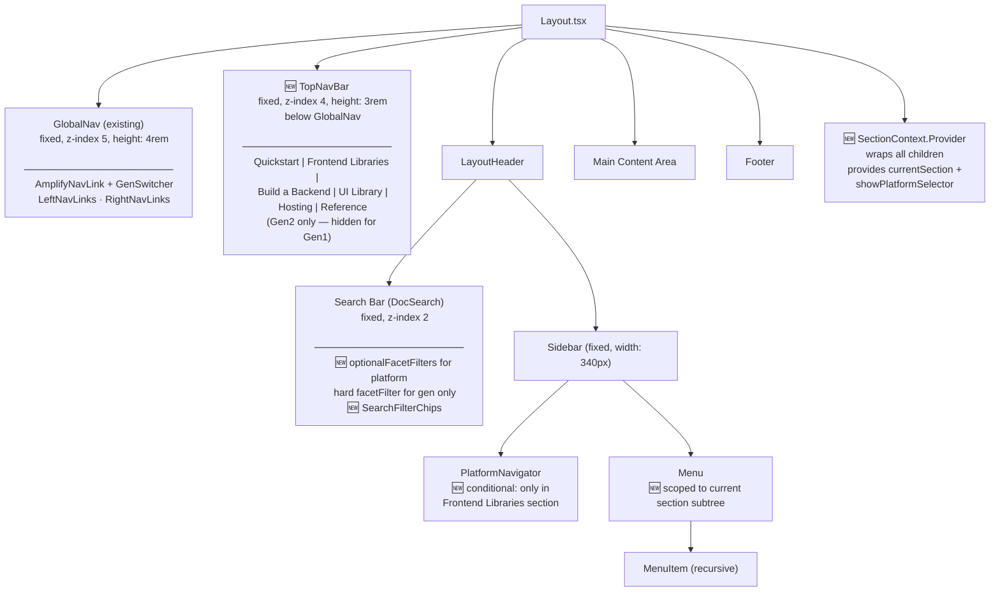
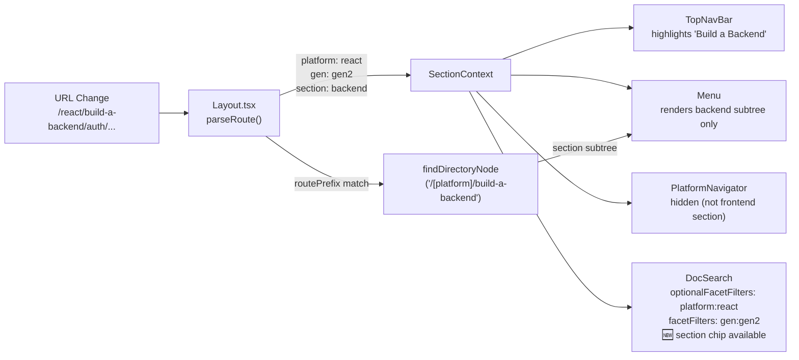
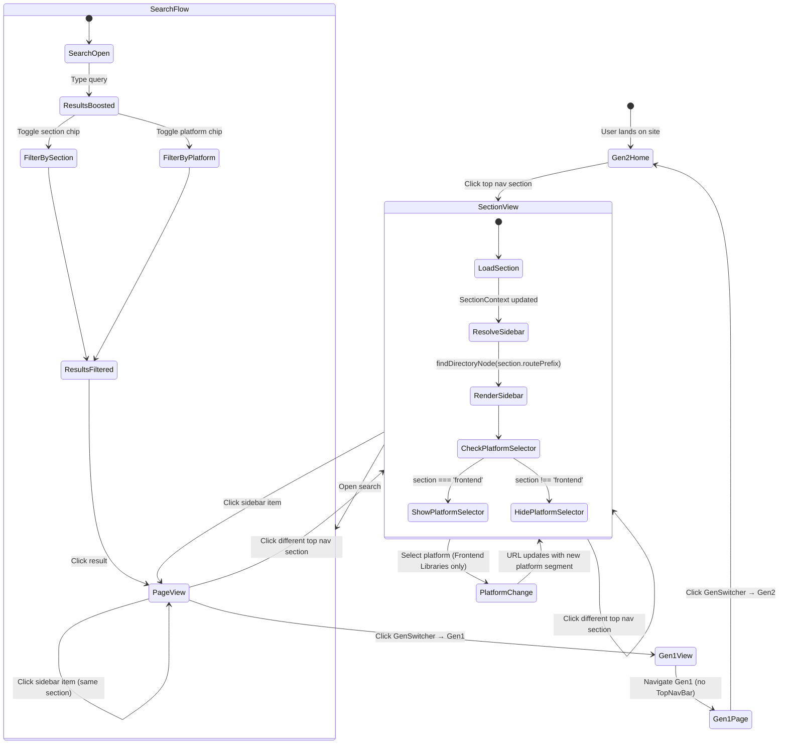
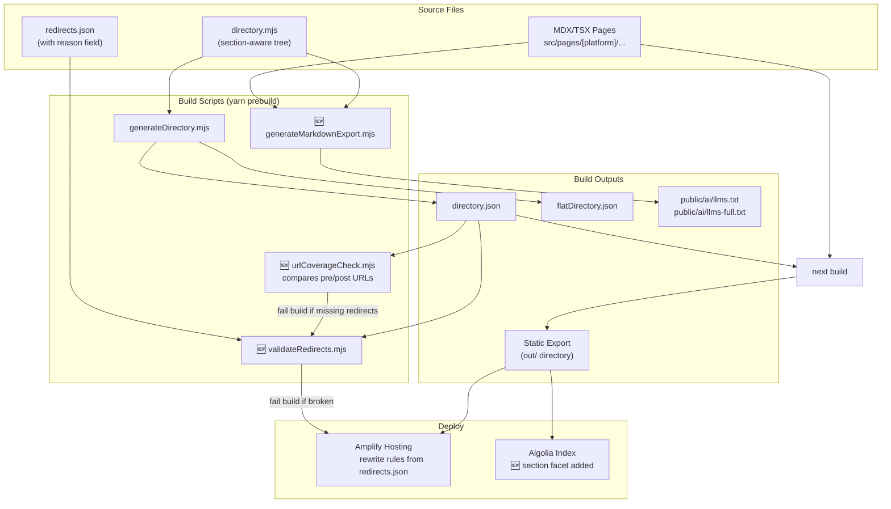
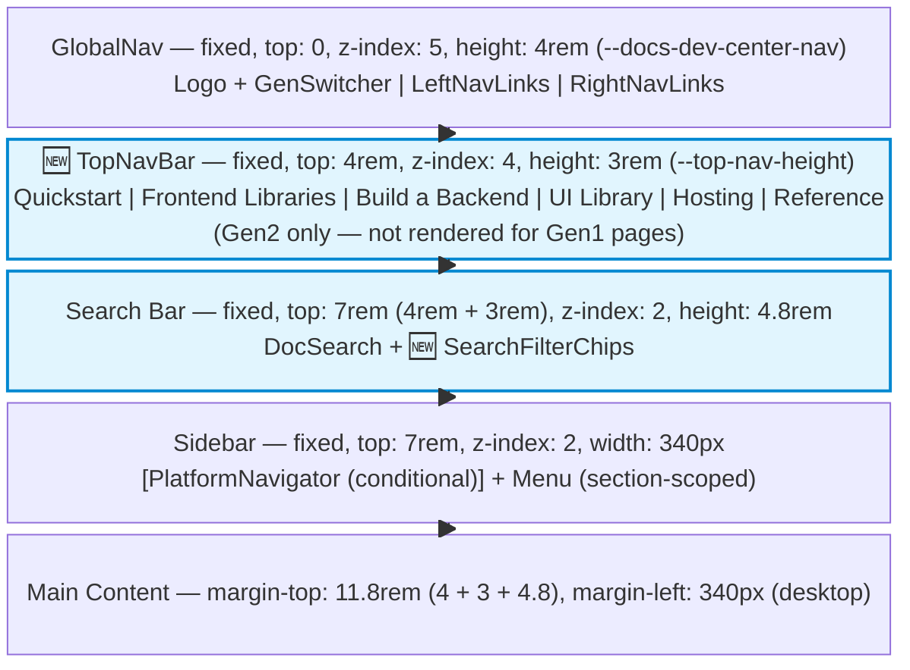

# Design Document: Amplify Docs Restructuring

## Overview

This design restructures the AWS Amplify Gen2 documentation site to replace the current framework-first navigation with a capability-first top navigation bar and feature-organized sidebar. The restructuring separates backend infrastructure content from frontend client library content into distinct top-level sections, scopes the platform selector to the "Frontend Libraries" section, and adds search filtering, markdown export for AI agents, and comprehensive URL redirect coverage.

Gen1 documentation remains untouched. All changes target the Gen2 experience only.

### Current Architecture Summary

The site is a statically exported Next.js application (`output: 'export'`) hosted on AWS Amplify Hosting. Key architectural elements:

- **Navigation source of truth**: `src/directory/directory.mjs` defines a single tree of `PageNode` objects. At build time, `generateDirectory.mjs` traverses this tree, extracts `meta` objects from each MDX/TSX file, and writes `directory.json` + `flatDirectory.json`.
- **Routing**: Next.js dynamic route `src/pages/[platform]/...` uses the `[platform]` segment as a content filter. The `PlatformNavigator` component in the sidebar lets users switch platforms, which changes the URL segment and filters `InlineFilter` blocks within pages.
- **Layout**: `Layout.tsx` renders `GlobalNav` (top bar with external links), `LayoutHeader` (search + sidebar with `PlatformNavigator` + `Menu`), main content, and `Footer`.
- **Sidebar**: `Menu.tsx` calls `findDirectoryNode` to get the root node for either `/[platform]` or `/gen1/[platform]`, then renders `MenuItem` components recursively.
- **Gen switching**: `GenSwitcher` component toggles between `/[platform]/...` (Gen2) and `/gen1/[platform]/...` (Gen1) routes.
- **Redirects**: `redirects.json` contains source→target→status entries. These are deployed as Amplify Hosting rewrite rules.
- **Search**: Algolia DocSearch with hard `facetFilters` for `platform` and `gen` — currently restricts results to only the selected platform and gen version.
- **Build pipeline**: `yarn prebuild` generates directory JSON files → `next build` produces static export → `next-image-export-optimizer` optimizes images.

### Current Layout Structure

```
GlobalNav (fixed, z-index 5, height: 4rem, --docs-dev-center-nav)
├── AmplifyNavLink (logo + GenSwitcher popover)
├── LeftNavLinks (UI Library, Contribute)
└── RightNavLinks (About AWS Amplify, Pricing)

LayoutHeader (below GlobalNav)
├── Search bar (DocSearch, fixed, z-index 2, top: var(--docs-dev-center-nav))
│   └── DocSearch with facetFilters: [platform:X, gen:Y]  ← hard filter, excludes non-matching
└── Sidebar (fixed, z-index 2, width: 340px)
    ├── PlatformNavigator (always rendered, unconditional)
    └── Menu (recursive MenuItem tree from directory.mjs)

Main content (offset by GlobalNav + search bar heights)
Footer
```

## Architecture

### Design Diagrams

#### 1. Full Component Hierarchy

Shows every component and how they nest. New components are marked with `🆕`.



#### 2. Data Flow Diagram

Shows how a URL change propagates through the system to update all dependent components.



#### 3. Navigation State Machine

Shows how user interactions change application state.



#### 4. Build-Time Pipeline

Shows how source files are processed into the final static output.



#### 5. CSS Layout Layers (Vertical Stack)

Shows the fixed positioning layers and how the new TopNavBar fits between GlobalNav and the search bar.



### Design Decisions

1. **Section-based directory tree over multiple directory files**: Rather than splitting `directory.mjs` into separate files per section, we add a `section` property to top-level Gen2 nodes. This keeps the single-source-of-truth pattern and avoids breaking the existing `generateDirectory.mjs` pipeline. The `Menu` component uses the current URL to determine which section subtree to render.

2. **TopNavBar as a separate row below GlobalNav (not replacing it)**: The existing `GlobalNav` contains external links (About AWS Amplify, Pricing), the Amplify logo, and the GenSwitcher. These serve a different purpose than internal section navigation. The `TopNavBar` is a new, separate component rendered as a second fixed row below `GlobalNav`. This preserves the existing GlobalNav behavior for Gen1 pages (which don't show TopNavBar) and avoids disrupting the GenSwitcher or external link placement.

3. **Platform selector conditionally rendered**: `PlatformNavigator` is currently rendered unconditionally in `LayoutHeader`. The new design wraps it in a condition that checks whether the current route falls within the "Frontend Libraries" section. For other sections, the platform selector is hidden.

4. **Static export compatible redirects**: Since the site uses `output: 'export'`, server-side redirects aren't available at the Next.js level. Redirects are handled by Amplify Hosting rewrite rules via `redirects.json`. This pattern is preserved.

5. **Markdown export as build-time script**: The llms.txt export is generated as a build step (similar to `generateDirectory.mjs`) that traverses all MDX files, strips JSX components, and outputs structured markdown. This avoids runtime overhead and works with static export.

6. **Search boosts current platform instead of filtering to it**: The current implementation uses hard `facetFilters` that exclude results not matching the current platform. This is changed to use Algolia's `optionalFacetFilters` for platform, which boosts matching results to the top without excluding non-matching ones. The `gen` filter remains hard (users should only see Gen1 or Gen2 results, not both). This lets developers discover relevant content across all platforms while still seeing their current platform's results first.

## Detailed Navbar Design

### Visual Hierarchy: Two-Row Navigation

The navigation consists of two distinct fixed rows for Gen2 pages:

```
┌──────────────────────────────────────────────────────────────────────────────┐
│ ROW 1: GlobalNav (existing, unchanged)                                       │
│  [Amplify Logo] [Gen2 ▾]          UI Library  Contribute  About  Pricing    │
│  height: 4rem, z-index: 5, background: var(--amplify-colors-background)     │
├──────────────────────────────────────────────────────────────────────────────┤
│ ROW 2: TopNavBar (NEW, Gen2 only)                                            │
│  Quickstart  Frontend Libraries  Build a Backend  UI Library  Hosting  Ref  │
│  height: 3rem, z-index: 4, border-bottom: 1px solid var(--border-color)     │
│  Active section has underline indicator (2px, brand color)                   │
└──────────────────────────────────────────────────────────────────────────────┘
```

For Gen1 pages, only Row 1 (GlobalNav) renders. The TopNavBar is not shown.

### TopNavBar Integration with GlobalNav

The `TopNavBar` is rendered by `Layout.tsx` as a sibling of `GlobalNav`, not as a child of it. This keeps the two components independent:

```tsx
// In Layout.tsx (simplified)
<>
  <GlobalNav />                          {/* existing, unchanged */}
  {!isGen1 && <TopNavBar                 {/* NEW: only for Gen2 */}
    sections={GEN2_SECTIONS}
    currentSection={currentSection}
  />}
  <LayoutHeader ... />                   {/* search + sidebar */}
  <main>{children}</main>
  <Footer />
</>
```

### CSS Variable Changes

The introduction of TopNavBar requires updating CSS variables that control vertical offsets:

```css
/* Existing */
--docs-dev-center-nav: 4rem;        /* GlobalNav height — unchanged */
--layout-search-height: 4.8rem;     /* Search bar height — unchanged */
--layout-sidebar-width: 340px;      /* Sidebar width — unchanged */

/* New */
--top-nav-height: 3rem;             /* TopNavBar height */
--nav-total-height: 7rem;           /* GlobalNav + TopNavBar (4rem + 3rem) */

/* Gen1 override: no TopNavBar */
--top-nav-height: 0rem;             /* Set to 0 when isGen1 */
--nav-total-height: 4rem;           /* Falls back to just GlobalNav */
```

Components that currently use `--docs-dev-center-nav` for their `top` offset (search bar, sidebar) need to switch to `--nav-total-height` so they sit below both rows on Gen2 pages and below just GlobalNav on Gen1 pages.

### Active State Indicator

The currently active section gets an underline indicator, following the existing pattern used by `navbar-menu-item--current:after` in GlobalNav:

```css
.top-nav-item--active::after {
  content: '';
  position: absolute;
  bottom: 0;
  left: 0;
  right: 0;
  height: 2px;
  background-color: var(--amplify-colors-brand-primary);
}
```

Active state is determined by matching `router.pathname` against each section's `routePrefix`. The matching logic uses a prefix check: if the current path starts with the section's `routePrefix` (after replacing `[platform]` with the actual platform), that section is active.

### Mobile / Responsive Behavior

The existing desktop breakpoint is `975px`. The TopNavBar adapts:

- **Desktop (≥975px)**: All section links displayed horizontally in a single row. Active section has underline indicator.
- **Mobile (<975px)**: TopNavBar becomes a horizontally scrollable strip with `overflow-x: auto` and `-webkit-overflow-scrolling: touch`. No wrapping — all items stay in a single row that scrolls. This avoids adding another hamburger menu (GlobalNav already has one for its links).

```css
@media (max-width: 974px) {
  .top-nav-bar {
    overflow-x: auto;
    white-space: nowrap;
    -webkit-overflow-scrolling: touch;
    scrollbar-width: none; /* hide scrollbar on Firefox */
  }
  .top-nav-bar::-webkit-scrollbar {
    display: none; /* hide scrollbar on Chrome/Safari */
  }
}
```

On mobile, the active section is auto-scrolled into view using `scrollIntoView({ inline: 'center', behavior: 'smooth' })` on mount and section change.

### Interaction with Sidebar

When a user clicks a section link in the TopNavBar:

1. The URL changes to the section's landing page (e.g., `/react/build-a-backend`)
2. `Layout.tsx` re-evaluates the route and updates `SectionContext`
3. `SectionContext` change triggers:
   - `TopNavBar` updates active underline
   - `Menu` calls `findDirectoryNode(section.routePrefix)` to get the new section's subtree
   - `PlatformNavigator` shows/hides based on `section.hasPlatformSelector`
4. Sidebar scroll position resets to top for the new section

### Gen1 Behavior

Gen1 pages (`/gen1/[platform]/...`) do not render the TopNavBar at all. The `isGen1` flag (derived from `router.pathname.startsWith('/gen1')`) controls this:

- `--top-nav-height` is set to `0rem`
- `--nav-total-height` equals `--docs-dev-center-nav` (4rem)
- All downstream offsets (search bar, sidebar, main content) automatically adjust
- The GenSwitcher stays in GlobalNav (Row 1) for both Gen1 and Gen2

## Detailed Search Design

### Problem with Current Implementation

The current search uses hard `facetFilters` in the DocSearch configuration:

```typescript
// Current (PROBLEM): excludes all results not matching current platform
searchParameters={{
  facetFilters: [
    `platform:${currentPlatform}`,
    `gen:${isGen1 ? 'gen1' : 'gen2'}`
  ]
}}
```

This means a React developer searching for "authentication" will never see results from the Swift or Flutter docs, even if those pages contain relevant architectural concepts or API patterns. The user wants search to cover the entire site, with results from the current platform ranked higher.

### Solution: `optionalFacetFilters` for Platform Boosting

Algolia supports `optionalFacetFilters` which boost matching results in ranking without excluding non-matching ones. The fix:

```typescript
// New: platform is boosted, not filtered. Gen remains a hard filter.
searchParameters={{
  facetFilters: [
    `gen:${isGen1 ? 'gen1' : 'gen2'}`   // HARD filter: only current gen
  ],
  optionalFacetFilters: [
    `platform:${currentPlatform}`         // BOOST: current platform ranked higher
  ]
}}
```

- **`gen` stays as a hard filter**: Gen1 and Gen2 docs are fundamentally different APIs. Mixing them in results would confuse users. Users explicitly choose their gen via the GenSwitcher.
- **`platform` becomes a boost**: Results matching the current platform appear first, but results from other platforms still appear below. This helps developers discover cross-platform content.

### User-Controlled Filter Chips

Below the search input, visible filter chips let users optionally narrow results:

```typescript
interface SearchFilterChipsProps {
  /** Hard filter — always applied */
  currentGen: 'gen1' | 'gen2';
  /** Boost by default, can be toggled to hard filter */
  currentPlatform: Platform;
  /** Optional section filter — off by default */
  currentSection?: string;
}
```

The filter chips work as follows:

1. **Gen chip**: Always active, shows "Gen2" or "Gen1". Not toggleable (determined by current page context).
2. **Platform chip**: Shows current platform (e.g., "React"). Default state: boost only. User can click to toggle between:
   - "Prioritize React" (boost — `optionalFacetFilters`) — default
   - "Only React" (hard filter — `facetFilters`)
   - "All platforms" (no platform filter at all)
3. **Section chip**: Shows available sections (Frontend Libraries, Build a Backend, etc.). Off by default. User can click to add a hard section filter to narrow results to a specific section.

### Search Result Badges

Each search result displays visual badges indicating:
- Gen version badge: "Gen1" or "Gen2"
- Section badge: "Frontend", "Backend", "Hosting", etc.
- Platform badges: icons for applicable platforms

This helps users quickly assess relevance without clicking through.

### Algolia Index Configuration

The Algolia crawler configuration is updated to index a `section` facet:

```javascript
// Algolia crawler config addition
attributesForFaceting: [
  'searchable(platform)',
  'searchable(gen)',
  'searchable(section)'    // NEW
]
```

The `section` value is derived from the URL path structure during indexing:
- `/[platform]/start/...` → `quickstart`
- `/[platform]/frontend/...` → `frontend`
- `/[platform]/build-a-backend/...` → `backend`
- `/[platform]/build-ui/...` → `ui`
- `/[platform]/deploy-and-host/...` → `hosting`
- `/[platform]/reference/...` → `reference`

## Components and Interfaces

### New Components

#### 1. `TopNavBar`

Renders the Gen2 section navigation bar as a fixed row below GlobalNav with active state highlighting.

```typescript
// src/components/TopNavBar/TopNavBar.tsx

interface TopNavSection {
  label: string;
  /** Route prefix used to match active state and resolve sidebar tree */
  routePrefix: string;
  /** Whether this section shows the platform selector */
  hasPlatformSelector: boolean;
}

interface TopNavBarProps {
  sections: TopNavSection[];
  currentSection: string;
  isGen1: boolean; // if true, component returns null
}

const GEN2_SECTIONS: TopNavSection[] = [
  { label: 'Quickstart', routePrefix: '/[platform]/start', hasPlatformSelector: false },
  { label: 'Frontend Libraries', routePrefix: '/[platform]/frontend', hasPlatformSelector: true },
  { label: 'Build a Backend', routePrefix: '/[platform]/build-a-backend', hasPlatformSelector: false },
  { label: 'UI Library', routePrefix: '/[platform]/build-ui', hasPlatformSelector: false },
  { label: 'Hosting', routePrefix: '/[platform]/deploy-and-host', hasPlatformSelector: false },
  { label: 'Reference', routePrefix: '/[platform]/reference', hasPlatformSelector: false },
];
```

**Rendering behavior**:
- Returns `null` when `isGen1` is true
- Renders a `<nav>` element with `role="navigation"` and `aria-label="Section navigation"`
- Each section link is an `<a>` with `aria-current="page"` when active
- Active section determined by prefix-matching `router.asPath` against `routePrefix`
- On mobile, auto-scrolls active item into view

**Rationale**: Defined as data so the active-state logic and sidebar resolution can share the same section definitions. `hasPlatformSelector` drives conditional rendering in `LayoutHeader`.

#### 2. `SectionContext`

React context that provides the current section to child components.

```typescript
// src/components/SectionContext/SectionContext.tsx

interface SectionContextValue {
  currentSection: TopNavSection | null;
  /** Whether the platform selector should be shown */
  showPlatformSelector: boolean;
}
```

**Rationale**: Avoids prop-drilling the current section through Layout → LayoutHeader → PlatformNavigator. The section is determined once from the URL path in `Layout.tsx` and provided via context.

#### 3. `SearchFilterChips`

Renders filter chip controls below the DocSearch input.

```typescript
// src/components/SearchFilterChips/SearchFilterChips.tsx

interface SearchFilterChipsProps {
  currentGen: 'gen1' | 'gen2';
  currentPlatform: Platform;
  currentSection?: string;
  onPlatformFilterChange: (mode: 'boost' | 'hard' | 'none') => void;
  onSectionFilterChange: (section: string | null) => void;
}
```

#### 4. `MarkdownExportScript`

Build-time Node.js script that generates the AI-consumable markdown export.

```typescript
// tasks/generateMarkdownExport.mjs

/**
 * Traverses all MDX files in src/pages/[platform]/
 * For each file:
 *   1. Reads the MDX source
 *   2. Extracts the meta object (title, description, platforms)
 *   3. Strips JSX components (InlineFilter, Callout, etc.) leaving text content
 *   4. Writes frontmatter + markdown body to output directory
 *   5. Generates index file at /ai/llms.txt with links to all pages
 */
```

#### 5. `RedirectValidator`

Build-time script that validates all redirect entries.

```typescript
// tasks/validateRedirects.mjs

/**
 * For each entry in redirects.json:
 *   1. Verify the target path corresponds to an existing page in directory.json
 *   2. Report any broken redirect targets
 *   3. Exit with non-zero code if any validation fails
 */
```

### Modified Components

#### `GlobalNav` (unchanged)

The existing `GlobalNav` is **not modified**. It continues to render the Amplify logo, GenSwitcher, LeftNavLinks, and RightNavLinks exactly as before. The `TopNavBar` is a separate sibling component rendered by `Layout.tsx`, not a child of `GlobalNav`.

#### `LayoutHeader` (modified)

- Consume `SectionContext` to determine whether to render `PlatformNavigator`
- Pass section info to `Menu` so it can resolve the correct sidebar subtree
- Update `top` CSS offset from `var(--docs-dev-center-nav)` to `var(--nav-total-height)` to account for TopNavBar
- Update DocSearch `searchParameters` to use `optionalFacetFilters` for platform and add `SearchFilterChips`

#### `Menu` (modified)

- Accept an optional `section` prop
- When a section is provided, call `findDirectoryNode` with the section's route prefix instead of the full `/[platform]` root
- This scopes the sidebar to only show pages within the current top-nav section

#### `Layout` (modified)

- Determine current section from `router.pathname` by matching against `GEN2_SECTIONS[].routePrefix`
- Wrap children in `SectionContext.Provider`
- Render `TopNavBar` between `GlobalNav` and `LayoutHeader` (Gen2 only)
- Set CSS custom property `--top-nav-height` to `3rem` (Gen2) or `0rem` (Gen1)

#### `PlatformNavigator` (modified)

- No structural changes, but conditionally rendered only when `SectionContext.showPlatformSelector` is true

### Modified Data Files

#### `directory.mjs` (modified)

The Gen2 subtree is reorganized. Key changes:

1. **"Frontend Libraries" section**: New top-level node at `src/pages/[platform]/frontend/index.mdx` containing:
   - Auth client pages (currently under `build-a-backend/auth/connect-your-frontend/`)
   - Data client pages (query, mutate, subscribe, optimistic-ui)
   - Storage client pages (upload, download, list, remove operations)
   - Analytics, Geo, PubSub, REST API client pages (from `add-aws-services/`)
   - "Connect to Existing Resources" subsection

2. **"Build a Backend" section**: Retains infrastructure-focused pages:
   - Auth setup, concepts, CDK customization, user management
   - Data modeling, authorization rules, custom business logic, data sources
   - Storage bucket configuration
   - Functions setup and configuration
   - AI backend setup

3. **Cross-links**: Pages that were split add `relatedPages` metadata pointing to their counterpart in the other section.

#### `redirects.json` (modified)

Every URL that changes gets a 301 redirect entry. Example entries:

```json
[
  {
    "source": "/<platform>/build-a-backend/auth/connect-your-frontend/sign-in/",
    "target": "/<platform>/frontend/auth/sign-in/",
    "status": "301",
    "reason": "Auth frontend pages moved to Frontend Libraries section"
  },
  {
    "source": "/<platform>/build-a-backend/data/query-data/",
    "target": "/<platform>/frontend/data/query-data/",
    "status": "301",
    "reason": "Data query pages moved to Frontend Libraries section"
  }
]
```

#### Algolia Search Configuration

Update the Algolia crawler configuration to add a `section` facet attribute derived from the URL path structure. Update `searchParameters` in `LayoutHeader` to use `optionalFacetFilters` for platform boosting and add `SearchFilterChips` for user-controlled filtering.

## Data Models

### PageNode (extended)

```typescript
export type PageNode = {
  title: string;
  description: string;
  isExternal?: boolean;
  platforms: Platform[];
  path?: string;
  route: string;
  children?: PageNode[];
  url?: string;
  lastUpdated?: string;
  hideFromNav?: boolean;
  hideChildrenOnBase?: boolean;
  isNew?: boolean;

  // New fields
  /** The top-nav section this page belongs to */
  section?: 'quickstart' | 'frontend' | 'backend' | 'ui' | 'hosting' | 'reference';
  /** Related pages in other sections (for cross-linking) */
  relatedPages?: string[];
  /** Gen version: 1, 2, or both */
  genVersion?: 'gen1' | 'gen2' | 'both';
};
```

### TopNavSection

```typescript
interface TopNavSection {
  label: string;
  routePrefix: string;
  hasPlatformSelector: boolean;
}
```

### RedirectEntry (extended)

```typescript
interface RedirectEntry {
  source: string;
  target: string;
  status: '301' | '302' | '404-200';
  /** Audit trail: why this redirect exists */
  reason?: string;
}
```

### MarkdownExportPage

```typescript
interface MarkdownExportPage {
  title: string;
  section: string;
  platforms: string[];
  genVersion: string;
  lastUpdated: string;
  url: string;
  content: string;
}
```

### SearchFacets (Algolia)

```typescript
interface SearchFacets {
  platform: Platform;
  gen: 'gen1' | 'gen2';
  section: 'quickstart' | 'frontend' | 'backend' | 'ui' | 'hosting' | 'reference';
}
```


## Correctness Properties

*A property is a characteristic or behavior that should hold true across all valid executions of a system — essentially, a formal statement about what the system should do. Properties serve as the bridge between human-readable specifications and machine-verifiable correctness guarantees.*

### Property 1: Section-to-sidebar mapping

*For any* Gen2 top navigation section and any page URL within that section's route prefix, the sidebar navigation should render only pages from that section's subtree in the directory tree, and no pages from other sections.

**Validates: Requirements 1.3, 1.5, 1.6**

### Property 2: URL-to-active-section mapping

*For any* valid Gen2 page URL, exactly one top navigation section should be marked as active, and it should be the section whose `routePrefix` matches the URL path.

**Validates: Requirements 1.4**

### Property 3: Cross-link integrity

*For any* page in the directory tree that has a `relatedPages` array, every entry in that array should resolve to an existing page in the directory tree, and that target page should belong to a different top-nav section than the source page.

**Validates: Requirements 1.8, 2.3**

### Property 4: Sidebar depth limit

*For any* section's sidebar tree, the maximum nesting depth of any page node should not exceed 4 levels, ensuring all content is discoverable without excessive click depth.

**Validates: Requirements 1.11**

### Property 5: Gen1 directory preservation

*For any* page node in the Gen1 subtree (`/gen1/[platform]/...`) of the directory tree, the node's route, title, children structure, and platforms should be identical before and after the restructuring.

**Validates: Requirements 1.14, 5.8**

### Property 6: Search metadata completeness

*For any* page in the directory tree, the corresponding search index entry should contain a `gen` facet (gen1 or gen2), a `platform` facet with all applicable platforms, and a `section` facet matching the page's top-nav section.

**Validates: Requirements 3.1**

### Property 7: Search platform boosting preserves all results

*For any* search query and any selected platform, the set of result URLs returned with platform boosting (`optionalFacetFilters`) should be a superset of (or equal to) the results returned with a hard platform filter (`facetFilters`). No results should be excluded due to platform mismatch — only ranking should change.

**Validates: Requirements 3.3**

### Property 8: Markdown export completeness

*For any* page in the Gen2 directory tree, the markdown export should contain a corresponding file with frontmatter including all required fields: title, section, platforms (non-empty array), genVersion, and lastUpdated (valid ISO date string).

**Validates: Requirements 4.1, 4.2**

### Property 9: Markdown code block preservation

*For any* MDX page containing fenced code blocks with language annotations, the markdown export of that page should preserve every code block with its original language annotation and content intact.

**Validates: Requirements 4.5**

### Property 10: Feature-based sidebar organization

*For any* Gen2 section's sidebar tree, none of the top-level children should have a title matching a platform name (React, Angular, Vue, Next.js, React Native, Swift, Flutter, Android). Top-level children should be feature names (Auth, Data, Storage, Functions, etc.).

**Validates: Requirements 5.1**

### Property 11: Feature uniqueness in sidebar

*For any* Gen2 feature name (Auth, Data, Storage, Functions, AI), that feature should appear as a top-level sidebar entry in at most one section's sidebar tree (either "Frontend Libraries" or "Build a Backend", not both at the top level — though the feature name may appear in both sections with different sub-content).

**Validates: Requirements 5.4**

### Property 12: Platform as content filter

*For any* Gen2 section's sidebar tree and any two valid platforms, the set of page routes visible in the sidebar should be identical regardless of which platform is selected. Platform selection should only affect in-page content filtering, not page visibility.

**Validates: Requirements 5.2**

### Property 13: Platform persistence in Frontend Libraries

*For any* sequence of page navigations within the "Frontend Libraries" section, if the user selects a platform on one page, subsequent page loads within the same section should preserve that platform selection in the URL.

**Validates: Requirements 5.7**

### Property 14: Gen1-to-Gen2 switcher links

*For any* Gen1 page that has a corresponding Gen2 page (determined by route structure), the GenSwitcher component should produce a link that resolves to a valid Gen2 page URL.

**Validates: Requirements 6.3**

### Property 15: Gen1 legacy banner presence

*For any* page URL matching the `/gen1/...` pattern, the rendered page should include the Gen1Banner component with text indicating "Gen1 (Legacy)" status and a link to the Gen2 alternative.

**Validates: Requirements 6.6**

### Property 16: Gen1 orphan page notice

*For any* Gen1 page whose route has no corresponding Gen2 equivalent in the directory tree, the page should display a notice indicating the feature's status in Gen2 (planned, not available, or replaced).

**Validates: Requirements 6.7**

### Property 17: Zero 404s for pre-existing URLs

*For any* URL that existed in the pre-restructuring site (derived from the pre-restructuring directory tree across all platforms), that URL should either still resolve to a page (200) or have a redirect entry in `redirects.json` pointing to a valid target (301).

**Validates: Requirements 8.1, 8.6**

### Property 18: Redirect entry validity

*For any* redirect entry in `redirects.json` that was added as part of the restructuring, the entry should: (a) have status "301", (b) have a target that resolves to an existing page in the post-restructuring directory tree, (c) include all platform-specific variants of the source URL if the source contains a platform segment, and (d) include a non-empty `reason` field.

**Validates: Requirements 8.2, 8.4, 8.5, 8.8, 8.9**

### Property 19: Gen1 URL preservation

*For any* URL path starting with `/gen1/`, the path should exist unchanged in the post-restructuring site with no redirect entry needed — Gen1 URLs are never moved or modified.

**Validates: Requirements 8.3**

## Error Handling

### Navigation Errors

- **Unknown section in URL**: If a Gen2 URL doesn't match any `TopNavSection.routePrefix`, fall back to rendering the full Gen2 sidebar (current behavior) rather than showing an empty sidebar. Log a warning during build if any page in `directory.mjs` doesn't map to a known section.
- **Missing directory node**: `findDirectoryNode` already returns `null` for unresolvable routes. The `Menu` component should handle `null` gracefully by rendering an empty sidebar with a "Page not found" message rather than crashing.
- **TopNavBar on Gen1**: The `TopNavBar` component returns `null` when `isGen1` is true. No error state needed — it simply doesn't render.

### Redirect Errors

- **Broken redirect target**: The `validateRedirects.mjs` script runs during build. If any redirect target doesn't resolve to an existing page, the build fails with a descriptive error listing all broken entries. This is a hard failure — no broken redirects ship.
- **Missing redirect for moved page**: The pre-restructuring URL snapshot (captured before changes) is compared against the post-restructuring directory. Any URL present in the snapshot but absent in the new directory without a redirect entry causes a build failure.

### Search Errors

- **Missing facets**: If a page lacks `section` or `genVersion` metadata, the Algolia indexing script logs a warning and assigns defaults (`section: 'reference'`, `genVersion: 'gen2'`) to prevent search index gaps.
- **Zero results**: The `SearchFilterChips` component displays suggested pages (popular pages from the current section) when Algolia returns zero results.
- **Platform boost fallback**: If `optionalFacetFilters` is not supported by the Algolia plan, fall back to the current hard `facetFilters` behavior and log a warning. The filter chips should still work with hard filters.

### Markdown Export Errors

- **MDX parsing failure**: If an MDX file contains JSX that the markdown stripper can't handle, the export script logs the file path and skips it rather than failing the entire build. A summary of skipped files is printed at the end.
- **Missing frontmatter fields**: If a page's `meta` object is missing required fields (title, description, platforms), the export script uses fallback values from the directory tree and logs a warning.

### Platform Selector Errors

- **Invalid platform in URL**: If the `[platform]` segment doesn't match any known platform, the existing behavior (defaulting to `react`) is preserved. No changes needed.
- **Platform not available for page**: When a page doesn't support the selected platform, display an inline notice ("This feature is not available for {platform}") instead of a 404 or empty page.

## Testing Strategy

### Dual Testing Approach

This feature requires both unit tests and property-based tests:

- **Unit tests**: Verify specific examples, edge cases, integration points, and rendering behavior
- **Property tests**: Verify universal properties across all valid inputs using randomized generation

### Property-Based Testing Configuration

- **Library**: [fast-check](https://github.com/dubzzz/fast-check) for JavaScript/TypeScript property-based testing
- **Minimum iterations**: 100 per property test
- **Tag format**: Each test is tagged with a comment: `// Feature: amplify-docs-restructuring, Property {N}: {title}`
- **Each correctness property is implemented by a single property-based test**

### Unit Tests

Unit tests cover specific examples and edge cases:

1. **TopNavBar rendering**: Verify all 6 section labels render, verify Gen1 pages don't show TopNavBar, verify TopNavBar renders as a separate row below GlobalNav
2. **TopNavBar mobile behavior**: Verify horizontal scroll container renders on mobile breakpoint
3. **TopNavBar active state**: Verify underline indicator appears on the correct section for known URLs
4. **Section context**: Verify `SectionContext` provides correct values for known URLs
5. **PlatformNavigator conditional rendering**: Verify it renders in Frontend Libraries, hidden in Build a Backend
6. **GenSwitcher preservation**: Verify GenSwitcher component behavior is unchanged, stays in GlobalNav row
7. **Redirect format validation**: Verify redirect entries have required fields
8. **Markdown export for a known page**: Verify a specific page produces correct frontmatter and content
9. **Search filter chips rendering**: Verify filter chips render with boost/hard/none toggle for platform
10. **Search optionalFacetFilters**: Verify DocSearch config uses `optionalFacetFilters` for platform and hard `facetFilters` for gen
11. **404 page behavior**: Verify 404 page renders correctly for unknown URLs
12. **Gen1Banner rendering**: Verify banner text and link on Gen1 pages
13. **Connect to Existing Resources**: Verify the subsection exists in Frontend Libraries sidebar
14. **CSS variable updates**: Verify `--nav-total-height` is `7rem` for Gen2 and `4rem` for Gen1

### Property Tests

Each correctness property maps to one property-based test:

1. **Property 1 test**: Generate random section + URL pairs, verify sidebar content matches section subtree
2. **Property 2 test**: Generate random Gen2 URLs, verify exactly one section is active and correct
3. **Property 3 test**: Generate random pages with relatedPages, verify all links resolve and cross sections
4. **Property 4 test**: Generate random directory subtrees, verify max depth ≤ 4
5. **Property 5 test**: Generate random Gen1 page routes, verify directory nodes unchanged
6. **Property 6 test**: Generate random pages, verify search index entries have all required facets
7. **Property 7 test**: Generate random search queries with platform context, verify boosted results are a superset of hard-filtered results
8. **Property 8 test**: Generate random Gen2 pages, verify markdown export has all frontmatter fields
9. **Property 9 test**: Generate random MDX with code blocks, verify export preserves blocks
10. **Property 10 test**: Generate random section sidebar trees, verify no platform names at top level
11. **Property 11 test**: Generate random feature names, verify each appears in at most one section
12. **Property 12 test**: Generate random platform pairs, verify sidebar routes identical
13. **Property 13 test**: Generate random navigation sequences in Frontend Libraries, verify platform persists
14. **Property 14 test**: Generate random Gen1 routes with Gen2 equivalents, verify switcher links resolve
15. **Property 15 test**: Generate random Gen1 URLs, verify banner renders with legacy text
16. **Property 16 test**: Generate random Gen1 orphan pages, verify notice renders
17. **Property 17 test**: Generate random pre-restructuring URLs, verify 200 or 301 redirect exists
18. **Property 18 test**: Generate random restructuring redirect entries, verify all validity criteria
19. **Property 19 test**: Generate random Gen1 URLs, verify they exist unchanged post-restructuring

### Integration Tests

- **Build pipeline**: Run `yarn build` and verify it completes without errors, redirect validation passes, and markdown export is generated
- **URL crawl test**: Script that loads the pre-restructuring URL list and verifies each URL against the post-restructuring build output (either file exists or redirect entry exists)
- **Search index verification**: After build, verify the Algolia index configuration includes the new `section` facet and that `optionalFacetFilters` is used for platform
- **CSS layout verification**: Verify that `--nav-total-height` correctly accounts for TopNavBar presence/absence across Gen1 and Gen2 pages
