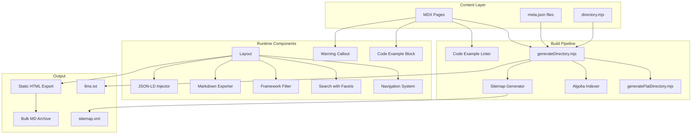
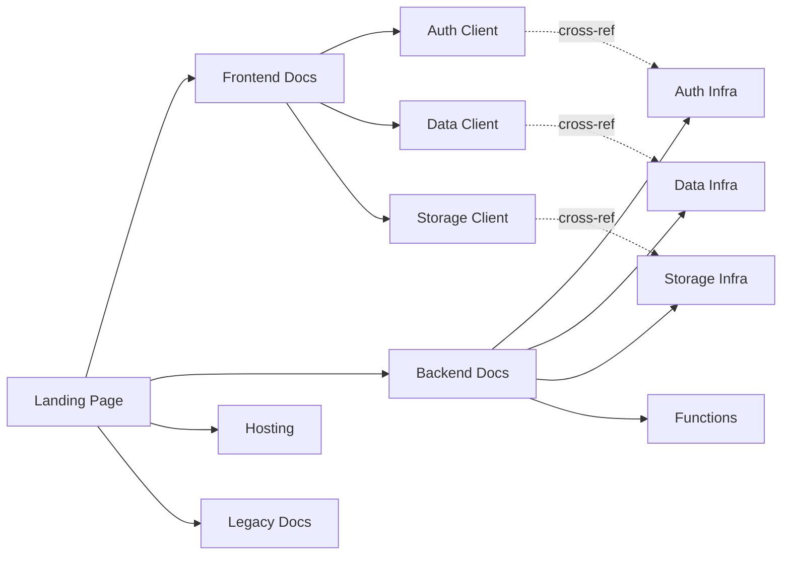

# Design Document: Amplify Docs Restructuring

## Overview

This design covers the restructuring of the Amplify documentation site (`amplify-docs`) — a statically exported Next.js 16 application using MDX, SCSS, and TypeScript. The site currently serves ~915 legacy pages under `/legacy/` and a nascent new structure at the top level (`/auth/`, `/data/`, `/storage/`, `/configure/`).

The restructuring addresses 10 requirements spanning P0–P3 priorities:

- **P0**: Backend/Frontend separation (Req 1), Search improvement (Req 2), Code example quality (Req 3), Markdown export for AI agents (Req 4)
- **P1**: Remove framework top-level nav (Req 6)
- **P2**: Agent SEO/AEO (Req 5)
- **P3**: Custom infrastructure config (Req 7), Gen1/Gen2 migration (Req 8)
- **Bonus**: Safety warnings for destructive operations (Req 9)

The existing infrastructure provides a solid foundation: `useIsLegacy` hook for dual-mode rendering, `directory.mjs` for navigation tree generation, Algolia DocSearch for search, `InlineFilter` for framework-specific content, and a component library built on `@aws-amplify/ui-react`.

### Key Design Decisions

1. **Static export preserved**: The site uses `output: 'export'` — all features must work without a server runtime. The Markdown exporter and search filtering operate client-side.
2. **Incremental adoption**: New docs coexist with legacy docs. The `useIsLegacy` hook and dual navigation trees allow gradual migration.
3. **Algolia facets for search scoping**: Rather than separate indices, we use Algolia facet filters to scope search by section (frontend/backend), content type, and legacy/new status.
4. **MDX as source of truth**: The Markdown exporter transforms rendered MDX content client-side rather than requiring a separate content pipeline.

## Architecture

The restructured site follows a layered architecture that extends the existing Next.js/MDX pipeline:



### Page Structure

```
src/pages/
├── index.tsx                    # Landing page (Frontend / Backend / Hosting cards)
├── frontend/                    # NEW: Frontend_Docs section
│   ├── index.mdx
│   ├── meta.json
│   ├── auth/                    # Client-side auth (Amplify JS)
│   ├── data/                    # Client-side data (AppSync client)
│   ├── storage/                 # Client-side storage (S3 client)
│   └── ui/                      # Amplify UI components
├── backend/                     # NEW: Backend_Docs section
│   ├── index.mdx
│   ├── meta.json
│   ├── auth/                    # Auth infrastructure (Cognito setup)
│   ├── data/                    # Data infrastructure (AppSync/DDB setup)
│   ├── storage/                 # Storage infrastructure (S3 setup)
│   ├── functions/               # Lambda functions
│   └── hosting/                 # Hosting configuration
├── configure/                   # Shared configuration
├── legacy/                      # All existing docs (unchanged)
│   ├── [platform]/
│   └── gen1/[platform]/
└── reference/                   # API references
```

### Navigation Flow



## Components and Interfaces

### 1. Navigation System Updates

**Modified: `src/directory/directory.mjs`**

The directory tree gains two new top-level branches: `frontend` and `backend`. The existing `auth/`, `data/`, `storage/`, `configure/` top-level pages are reorganized under these branches.

```typescript
// New directory structure additions
{
  path: 'src/pages/frontend/index.mdx',
  children: [
    { path: 'src/pages/frontend/auth/index.mdx', children: [...] },
    { path: 'src/pages/frontend/data/index.mdx', children: [...] },
    { path: 'src/pages/frontend/storage/index.mdx', children: [...] },
  ]
},
{
  path: 'src/pages/backend/index.mdx',
  children: [
    { path: 'src/pages/backend/auth/index.mdx', children: [...] },
    { path: 'src/pages/backend/data/index.mdx', children: [...] },
    { path: 'src/pages/backend/storage/index.mdx', children: [...] },
    { path: 'src/pages/backend/functions/index.mdx', children: [...] },
  ]
}
```

**Modified: `src/components/Menu/Menu.tsx`**

The Menu component already handles non-legacy routes by filtering out `/legacy` children. The new `frontend/` and `backend/` branches will appear automatically in the sidebar once added to `directory.mjs`.

### 2. Search System (`SearchWithFacets`)

**New: `src/components/Search/SearchWithFacets.tsx`**

Wraps `@docsearch/react` with section-aware facet filtering. Replaces the current `DocSearch` usage in `LayoutHeader.tsx` and `RightNavLinks.tsx`.

```typescript
interface SearchWithFacetsProps {
  currentSection: 'frontend' | 'backend' | 'hosting' | 'legacy' | 'all';
  currentPlatform?: Platform;
  isGen1?: boolean;
}
```

Key behaviors:
- Default facet filter excludes legacy content when searching from new docs
- Provides UI toggles for section, content type, and framework filters
- Groups results by section with clear labels
- Shows "Try new docs" banner when searching from legacy section

**Modified: Algolia indexing configuration**

Each indexed page gets additional metadata facets:
- `section`: `frontend` | `backend` | `hosting` | `legacy`
- `contentType`: `guide` | `api-reference` | `tutorial` | `migration`
- `framework`: array of applicable frameworks
- `isLegacy`: boolean

### 3. Markdown Exporter (`MarkdownExporter`)

**New: `src/components/MarkdownExporter/MarkdownExporter.tsx`**

A client-side component that converts the current page's rendered content to Markdown and copies it to the clipboard.

```typescript
interface MarkdownExporterProps {
  pageTitle: string;
  pageDescription: string;
  section: string;
  lastUpdated: string;
}

// Core export function (testable independently)
function htmlToMarkdown(htmlElement: HTMLElement, pageUrl: string): string;
function generateFrontMatter(meta: PageMeta): string;
function resolveInternalLinks(markdown: string, baseUrl: string): string;
```

Implementation approach:
- Reads from the rendered `.main` DOM element (same selector used by TOC generation)
- Strips navigation, feedback widgets, copy buttons, and site chrome
- Preserves headings, code blocks (with language), lists, tables, links, and `Callout` components
- Converts internal relative links to absolute URLs using `docs.amplify.aws` base
- Prepends YAML front matter with title, description, section, and lastUpdated

### 4. Code Example Enhancements

**Modified: `src/components/MDXComponents/MDXCode.tsx`**

Extended with:
- `bestPractice?: boolean` prop — renders a "Recommended" badge
- `context?: string` prop — renders a context/prerequisites note above the code block
- `warning?: boolean` prop — renders a destructive operation warning label

**New: `scripts/lint-code-examples.mjs`**

Build-time script that extracts code blocks from MDX files and validates syntax using language-specific parsers (e.g., `acorn` for JS/TS, basic JSON parse for JSON). Runs as part of `yarn prebuild`.

### 5. JSON-LD Structured Data

**New: `src/components/SEO/JsonLd.tsx`**

Injects `<script type="application/ld+json">` into the page head for new docs pages.

```typescript
interface JsonLdProps {
  title: string;
  description: string;
  url: string;
  lastUpdated: string;
  codeExamples?: { language: string; code: string }[];
}
```

### 6. Framework Filter (Session-Persisted)

**Modified: `src/components/InlineFilter/index.tsx`** and new **`src/utils/useFrameworkFilter.ts`**

```typescript
// Persists framework selection in sessionStorage
function useFrameworkFilter(): {
  selectedFramework: Platform | null;
  setFramework: (platform: Platform | null) => void;
};
```

- URL query parameter `?framework=react` takes precedence (for shareable links)
- Falls back to sessionStorage for cross-page persistence
- Falls back to `null` (framework-agnostic view) when neither is set

### 7. Safety Warning Component

**Modified: `src/components/Callout/Callout.tsx`**

Extended with a `destructive` variant:

```typescript
interface CalloutProps {
  info?: boolean;
  warning?: boolean;
  destructive?: boolean;  // NEW: red/danger styling for data loss warnings
  children?: React.ReactNode;
}
```

### 8. Static File Generators

**New: `scripts/generate-llms-txt.mjs`**

Reads `directory.json` and produces `public/llms.txt` with section index and entry point URLs.

**New: `scripts/generate-sitemap.mjs`**

Reads `directory.json` and produces `public/sitemap.xml` with metadata attributes.

**New: `scripts/generate-bulk-markdown.mjs`**

Post-build script that walks the exported HTML in `client/www/next-build/` and converts each page to Markdown, producing a `.tar.gz` archive.

### 9. Gen1/Gen2 Indicators

**New: `src/components/GenIndicator/GenIndicator.tsx`**

Visual badge component showing "Gen1", "Gen2", or "Gen1 & Gen2" on legacy pages. Uses the existing `useIsGen1Page` hook and extends it with metadata from `meta.json`.

**Modified: `src/components/legacy/Gen1Banner/`**

Extended to show deprecation notices with links to Gen2 equivalents when a mapping exists in a new `gen1-to-gen2-map.json` data file.

## Data Models

### Page Metadata (`meta.json`)

Extended schema for new docs pages:

```typescript
interface PageMeta {
  title: string;
  description: string;
  url?: string;
  route?: string;

  // New fields
  section?: 'frontend' | 'backend' | 'hosting' | 'configure';
  contentType?: 'guide' | 'api-reference' | 'tutorial' | 'migration';
  frameworks?: Platform[];           // Applicable frameworks
  crossRefs?: string[];              // Routes to related pages in other sections
  genVersion?: 'gen1' | 'gen2' | 'both';
  gen2Equivalent?: string;           // Route to Gen2 equivalent (for legacy pages)
}
```

### Directory Node (`directory.d.ts`)

Extended type:

```typescript
interface PageNode {
  path?: string;
  route?: string;
  title?: string;
  description?: string;
  children?: PageNode[];
  platforms?: Platform[];
  isExternal?: boolean;
  lastUpdated?: string;
  isUnfilterable?: boolean;
  hideChildrenOnBase?: boolean;

  // New fields
  section?: string;
  contentType?: string;
  frameworks?: Platform[];
  crossRefs?: string[];
}
```

### Algolia Index Record

Extended facets for search:

```typescript
interface AlgoliaRecord {
  objectID: string;
  url: string;
  title: string;
  content: string;
  platform: string;
  gen: 'gen1' | 'gen2';

  // New facets
  section: 'frontend' | 'backend' | 'hosting' | 'legacy';
  contentType: 'guide' | 'api-reference' | 'tutorial' | 'migration';
  frameworks: string[];
  isLegacy: boolean;
}
```

### Gen1-to-Gen2 Mapping

```typescript
// src/data/gen1-to-gen2-map.json
interface GenMapping {
  [gen1Route: string]: {
    gen2Route: string;
    migrationGuide?: string;  // Route to migration guide if one exists
  };
}
```

### Framework Filter State

```typescript
interface FrameworkFilterState {
  selectedFramework: Platform | null;
  source: 'url' | 'session' | 'default';
}
```

## Correctness Properties

*A property is a characteristic or behavior that should hold true across all valid executions of a system — essentially, a formal statement about what the system should do. Properties serve as the bridge between human-readable specifications and machine-verifiable correctness guarantees.*

### Property 1: Section isolation in navigation

*For any* page route under `/frontend/` or `/backend/`, the sidebar menu generated by the `Menu` component should contain only child routes belonging to that same section — no routes from the other section should appear.

**Validates: Requirements 1.2, 1.3**

### Property 2: Cross-reference route validity

*For any* page with a `crossRefs` array in its `meta.json`, every route in that array should correspond to an existing page in the generated `directory.json`.

**Validates: Requirements 1.4**

### Property 3: Directory generator produces separate section trees

*For any* valid `directory.mjs` configuration containing `frontend` and `backend` top-level entries, the generated `directory.json` should contain two distinct subtrees rooted at `/frontend/` and `/backend/` with no overlapping child routes.

**Validates: Requirements 1.7**

### Property 4: Search facet filter correctness

*For any* search context (current section and legacy/new status), the constructed Algolia facet filters should: (a) exclude legacy content when searching from new docs, (b) scope to legacy content when searching from legacy docs, and (c) include the current section as a facet boost when a section is active.

**Validates: Requirements 2.1, 2.2, 2.6**

### Property 5: Search result grouping by section

*For any* set of search results containing items from multiple sections, the grouping function should partition results into groups where each group has a section label and all items in that group belong to that section.

**Validates: Requirements 2.4**

### Property 6: Algolia index record completeness

*For any* page with a valid `meta.json` containing section, contentType, and frameworks fields, the generated Algolia index record should include all of: `section`, `contentType`, `frameworks`, `isLegacy`, and `gen` facets.

**Validates: Requirements 2.5, 8.4**

### Property 7: Code example rendering with optional props

*For any* code example component with a combination of `bestPractice`, `context`, `warning`, and `codeString` props, the rendered output should contain: (a) the "Recommended" badge when `bestPractice` is true, (b) the context note when `context` is provided, (c) a warning label when `warning` is true, (d) a copy-to-clipboard button, and (e) syntax-highlighted code.

**Validates: Requirements 3.1, 3.3, 3.5, 9.4**

### Property 8: Code example syntax linter

*For any* syntactically valid code string in a supported language (JavaScript, TypeScript, JSON), the linter should return zero errors. *For any* syntactically invalid code string, the linter should return at least one error.

**Validates: Requirements 3.7**

### Property 9: Framework filter controls content visibility

*For any* page containing framework-specific content blocks (via `InlineFilter`) and any selected framework, only blocks whose filter list includes the selected framework should be visible. When no framework is selected, shared/conceptual content should be visible.

**Validates: Requirements 3.8, 6.4**

### Property 10: Markdown export round-trip

*For any* valid New_Docs page content (containing headings, code blocks, lists, tables, links, and callouts), exporting to Markdown via `htmlToMarkdown` and then parsing the Markdown back should produce content structurally equivalent to the original — preserving heading levels, code block languages, list nesting, table structure, and link targets.

**Validates: Requirements 4.3, 4.7**

### Property 11: Markdown front matter completeness

*For any* page metadata with title, description, section, and lastUpdated fields, the `generateFrontMatter` function should produce YAML front matter containing all four fields with their correct values.

**Validates: Requirements 4.4**

### Property 12: Internal link resolution to absolute URLs

*For any* Markdown string containing internal relative links (paths starting with `/`), the `resolveInternalLinks` function should convert every internal link to an absolute URL using the `docs.amplify.aws` base domain, while leaving external URLs unchanged.

**Validates: Requirements 4.5**

### Property 13: Markdown export excludes site chrome

*For any* rendered page HTML, the `htmlToMarkdown` function should produce output that does not contain elements with navigation, feedback, copy-button, or site-chrome CSS classes/selectors.

**Validates: Requirements 4.6**

### Property 14: JSON-LD structured data completeness

*For any* New_Docs page with valid metadata (title, description, url, lastUpdated), the `JsonLd` component should produce a valid JSON-LD script tag containing all required fields conforming to the schema.org TechArticle or SoftwareSourceCode type.

**Validates: Requirements 5.1**

### Property 15: Sitemap completeness

*For any* set of pages in the generated directory, the sitemap generator should produce valid XML containing one `<url>` entry per non-legacy page, each with `<loc>`, `<lastmod>`, and custom metadata attributes.

**Validates: Requirements 5.2**

### Property 16: llms.txt section coverage

*For any* generated directory containing frontend, backend, and hosting sections, the `generate-llms-txt` script should produce output listing all section names with their entry point URLs.

**Validates: Requirements 5.3**

### Property 17: Bulk Markdown export completeness

*For any* set of exported HTML pages in the build output, the bulk Markdown export script should produce an archive containing exactly one Markdown file per New_Docs page, with no legacy pages included.

**Validates: Requirements 5.6**

### Property 18: Framework filter state resolution

*For any* valid framework value, the `useFrameworkFilter` hook should: (a) return the framework from the URL query parameter `?framework=X` when present, (b) fall back to the sessionStorage value when no URL parameter exists, and (c) return `null` when neither source has a value. Setting a framework should persist it to sessionStorage.

**Validates: Requirements 6.3, 6.6**

### Property 19: Gen version indicator correctness

*For any* legacy page with a `genVersion` field in its metadata, the `GenIndicator` component should render a badge displaying "Gen1", "Gen2", or "Gen1 & Gen2" matching the field value exactly.

**Validates: Requirements 8.1**

### Property 20: Gen1-to-Gen2 deprecation banner

*For any* Gen1 legacy page route that exists in the `gen1-to-gen2-map.json` mapping, the deprecation banner should render with a link whose `href` matches the mapped `gen2Route` value.

**Validates: Requirements 8.2, 8.5**

### Property 21: Destructive warning callout styling

*For any* `Callout` component rendered with `destructive=true`, the output should use the danger/error color theme, visually distinct from the standard `warning` and `info` variants.

**Validates: Requirements 9.3**

## Error Handling

### Build-Time Errors

| Error Scenario | Handling |
|---|---|
| `meta.json` missing required fields (section, contentType) | `generateDirectory.mjs` logs a warning and skips the page from section-specific navigation. Page still renders but won't appear in filtered search. |
| Code example linter finds syntax errors | Build logs warnings with file path and line number. Does not fail the build (configurable via `--strict` flag). |
| `gen1-to-gen2-map.json` references a non-existent Gen2 route | Build validation script logs an error. The deprecation banner renders without a link. |
| `crossRefs` in `meta.json` references a non-existent route | Build validation logs a warning. The cross-reference link is omitted from the rendered page. |
| Sitemap/llms.txt generation fails | Build continues; files are omitted from output with a logged error. |

### Runtime Errors

| Error Scenario | Handling |
|---|---|
| Markdown export fails (DOM parsing error) | `htmlToMarkdown` catches the error, shows a toast notification "Unable to copy Markdown. Please try again.", and logs the error to console. |
| Clipboard API unavailable (older browsers, non-HTTPS) | Falls back to a textarea-based copy mechanism. If that also fails, shows a modal with the Markdown text for manual copy. |
| sessionStorage unavailable (private browsing in some browsers) | `useFrameworkFilter` catches the error and falls back to in-memory state (framework selection won't persist across page loads). |
| Algolia search request fails | DocSearch handles this internally with a "Something went wrong" message. No additional handling needed. |
| JSON-LD generation receives incomplete metadata | `JsonLd` component renders only the fields that are available. Missing optional fields (codeExamples) are omitted from the output. |

### Content Authoring Errors

| Error Scenario | Handling |
|---|---|
| MDX page uses `<Callout destructive>` without content | Callout renders empty with the warning icon. No crash. |
| Code example missing `language` prop | `MDXCode` defaults to `js` (existing behavior). |
| `InlineFilter` with empty `filters` array | Returns empty fragment (existing behavior). |

## Testing Strategy

### Property-Based Testing

Property-based tests use **fast-check** (`fc`) as the PBT library for TypeScript/JavaScript. Each property test runs a minimum of 100 iterations.

Properties to implement as PBT:

| Property | Test Target | Generator Strategy |
|---|---|---|
| P1: Section isolation | `Menu` component + directory data | Generate random directory trees with frontend/backend branches and random page routes |
| P4: Search facet correctness | `buildFacetFilters()` function | Generate random search contexts (section, isLegacy combinations) |
| P5: Search result grouping | `groupResultsBySection()` function | Generate random arrays of search result objects with random section values |
| P6: Index record completeness | `buildAlgoliaRecord()` function | Generate random PageMeta objects with all required fields |
| P7: Code example rendering | `MDXCode` component | Generate random combinations of boolean props and code strings |
| P8: Code linter | `lintCodeExample()` function | Generate random valid/invalid code strings using fast-check string generators |
| P9: Framework filter visibility | `InlineFilter` + `useFrameworkFilter` | Generate random filter arrays and framework selections |
| P10: Markdown round-trip | `htmlToMarkdown()` + Markdown parser | Generate random HTML structures with headings, code blocks, lists, tables |
| P11: Front matter completeness | `generateFrontMatter()` | Generate random PageMeta objects |
| P12: Link resolution | `resolveInternalLinks()` | Generate random Markdown strings with mixed internal/external links |
| P13: Chrome exclusion | `htmlToMarkdown()` | Generate random HTML with navigation/feedback elements injected |
| P14: JSON-LD completeness | `JsonLd` component | Generate random metadata objects |
| P15: Sitemap completeness | `generateSitemap()` | Generate random directory trees |
| P18: Framework filter state | `useFrameworkFilter` hook | Generate random framework values and state sources |
| P19: Gen indicator | `GenIndicator` component | Generate random genVersion values |
| P20: Deprecation banner | `Gen1Banner` + mapping data | Generate random gen1-to-gen2 mappings and page routes |

Each test must be tagged with: `Feature: amplify-docs-restructuring, Property {N}: {title}`

### Unit Testing

Unit tests complement PBT by covering specific examples and edge cases:

- Landing page renders Frontend and Backend entry points (Req 1.6)
- Search shows "Try new docs" banner in legacy context (Req 2.6)
- Zero search results shows suggestions (Req 2.7)
- Markdown exporter button appears on new docs pages, not legacy (Req 4.1)
- Framework-agnostic default view (Req 6.5)
- Manual configuration pages exist for Auth, Data, Storage (Req 7.1)
- Migration guide page exists (Req 8.3)

### Integration Testing

- End-to-end build pipeline: `yarn build` completes without errors with new page structure
- Algolia indexing produces valid records for sample pages
- Sitemap and llms.txt are present in build output
- Static export contains all expected pages

### Test Configuration

```javascript
// jest.config.js additions
{
  testMatch: [
    '**/__tests__/**/*.test.ts',
    '**/__tests__/**/*.property.test.ts'  // PBT files
  ]
}
```

```javascript
// Example PBT test structure
// Feature: amplify-docs-restructuring, Property 11: Markdown front matter completeness
import fc from 'fast-check';
import { generateFrontMatter } from '../MarkdownExporter/frontMatter';

describe('generateFrontMatter', () => {
  it('should include all metadata fields', () => {
    fc.assert(
      fc.property(
        fc.record({
          title: fc.string({ minLength: 1 }),
          description: fc.string({ minLength: 1 }),
          section: fc.constantFrom('frontend', 'backend', 'hosting', 'configure'),
          lastUpdated: fc.date().map(d => d.toISOString())
        }),
        (meta) => {
          const frontMatter = generateFrontMatter(meta);
          expect(frontMatter).toContain(`title: ${meta.title}`);
          expect(frontMatter).toContain(`description: ${meta.description}`);
          expect(frontMatter).toContain(`section: ${meta.section}`);
          expect(frontMatter).toContain(`lastUpdated: ${meta.lastUpdated}`);
        }
      ),
      { numRuns: 100 }
    );
  });
});
```
