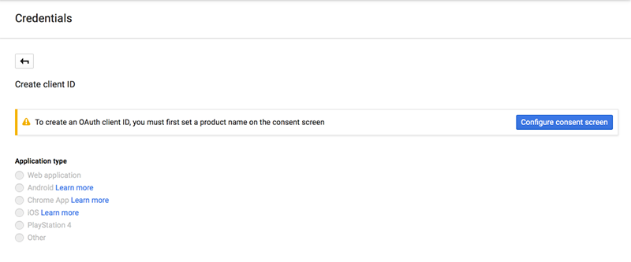

# Auth Google Setup

## Create a Google Developers Project and OAuth Web Client ID

To enable Google Sign-In in your mobile or web app, create a project in the Google Developers
Console. If you are making versions of your mobile app for more than one platform
(iOS, Android, or web), create a single Google project to manage Google authentication for all of the platform instances.

For all platforms, enable the Google+ API for and an OAuth web client ID for your Google project. Amazon Cognito federates the web client ID to enable your app(s) to use Google authentication to grant access to your AWS resources.

### To create a Google Developers project and OAuth web client ID

1. Go to the Google Developers Console at https://console.developers.google.com.

2. If you have not created a project yet, choose `Select a project` from the menu bar, and
   then choose `Create a project...`.

       

3. Complete the form that is displayed to create your new project.

4. In the `Dashboard` for your project, go to the `Use Google APIs` section and
   then choose `Enable and manage APIs`.

    

5. In the API Manager, in the `Social APIs` section, choose `Google+ API`.

    

6. In the `Overview` for Google+ API, choose `Enable API`.

    

7. A message appears to inform you that the API is enabled but that it requires credentials before
   you can use it. Choose `Go to Credentials`.

    

8. Your Mobile Hub sample app authenticates users through Amazon Cognito Identity, so you need an OAuth web
   application client ID for Amazon Cognito. In `Credentials`, choose `client ID` from
   the links in the first step.

    

9. A message appears to inform you that you must set a product name. Choose `Configure
   consent screen`.

    

10. In `OAuth consent screen`, enter the name of your app in `Product name shown
   to users`. Leave the remaining fields blank. Then choose `Save`.

    

11. In `Create client ID`, choose `Web application`.

    

12. In `Name`, enter a name for the web client credentials for your app. Leave the
   `Authorized JavaScript origins` and `Authorized Redirect URIs` fields blank.
   Mobile Hub configures this information indirectly through Amazon Cognito Identity integration. Choose
   `Create`.

    

13. In the `OAuth client` pop-up, copy and save the value that was generated for your
   client ID. You need the client ID to implement Google Sign-In in your Mobile Hub app. After you
   copy the client ID, choose `OK`.

    

14. Paste the web application client ID value into the Mobile Hub `Google Web App Client ID`
   field for your project.

    

## Create an OAuth Android Client ID

To enable Google Sign-In for your Android app, create an Android OAuth client
ID in the Google Developers Console. This enables your app that can access Google APIs directly and manage token lifecycle through Amazon Cognito Identity. This Android OAuth client ID is in addition to the
Web application OAuth client ID you created when following steps to `auth-google-create-google-project`. You will provide this client ID to Mobile Hub during the Google
Sign-In configuration.

### To create an OAuth Android client ID

1. Go to the Google Developers Console at https://console.developers.google.com.

2. In the `Dashboard` for your project, go to the `Use Google APIs` section and
   then choose `Enable and manage APIs`.

    

3. In the API Manager, choose `Credentials` in the left side menu.

    

4. Choose `New credentials` and then choose `OAuth client ID`.

    

5. In `Create client ID`, choose `Android`.

    

6. In `Name`, enter a name in the format `com.amazon.mysampleapp Android client ID`.

7. In `Signing-certificate fingerprint`, enter the SHA-1 fingerprint. For more information
   about Google's process for obtaining your SHA-1 fingerprint, see [this Google support article](https://support.google.com/cloud/answer/6158849?hl=en#android).

    

8. Use your SHA-1 fingerprint to ensure that your apps APK are associated with your Google app.
   See instructions at [Generate a key and keystore](https://developer.android.com/studio/publish/app-signing.html#generate-key).

9. In `Package name`, enter the package name in the format
   `com.amazon.YOUR-PACKAGE-NAME`.

10. Choose `Create`.

11. In the `OAuth client` pop-up, copy and save the value generated for your Android client
   ID. You need this client ID to implement Google Sign-In in your Mobile Hub app. After you copy
   the client ID, choose `OK`.

    

12. Paste the Android client ID value into the Mobile Hub `Google Android Client ID` field for
   your project.

    

## Create an OAuth iOS Client ID

To enable Google Sign-In for your iOS app, create an iOS OAuth client ID in the Google Developers Console. This enables your app to access Google APIs directly and to manage token lifecycle through Amazon Cognito Identity. This iOS OAuth client ID is in addition to the web application OAuth client ID that you created when following steps above. You will provide this client ID to Mobile Hub during the Google Sign-In configuration.

### To create an OAuth iOS client ID

1. Go to the Google Developers Console at https://console.developers.google.com.

2. In the `Dashboard` for your project, go to the `Use Google APIs` section and
  then choose `Enable and manage APIs`.

    

3. In the API Manager, choose `Credentials` in the left side menu.

    

4. Choose `New Credentials` and then choose `OAuth client ID`.

    

5. In `Create client ID`, choose `iOS`.

    

6. In `Name`, enter a name in the format `com.amazon.YOUR-APP-NAME YOUR-iOS-CLIENT-ID`.

7. In `Bundle ID`, enter the bundle name in the format `com.amazon.YOUR-APP-NAME`.

    

8. Choose `Create`.

9. In the `OAuth client` pop-up, copy and save the value that was generated for your iOS
  client ID. You need these values to implement Google Sign-In in your Mobile Hub app. After you
  copy the client ID, choose `OK`.

    

10. Paste the iOS client ID value into the Mobile Hub `Google iOS Client ID` field for your
  project.

    

## Verify All Platform Client IDs

If your app supports both Android and iOS platforms, then your app project in the Google Developers
Console will now have three client IDs: one for web application, one for Android, and one for iOS.
You can verify that you have all of the credentials for all of the platforms by looking at the
`Credentials` panel in the API Manager for your app, as shown in the following.

