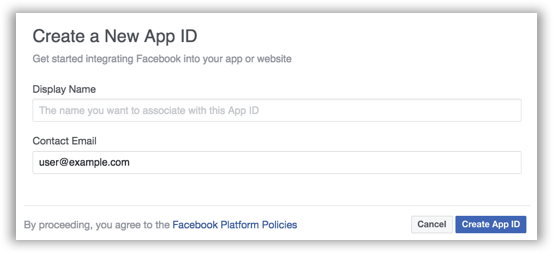

# Authentication

<div class="nav-tab create" data-group='create'>
<ul class="tabs">
    <li class="tab-link java current" data-tab="java">Java</li>
    <li class="tab-link kotlin" data-tab="kotlin">Kotlin</li>
</ul>

## Add User Sign-in to Your Mobile App with Amazon Cognito

Enable your users to sign-in using credentials from Facebook, Google, or your own custom user directory. The CLI deploys [Amazon Cognito identity pool](https://docs.aws.amazon.com/cognito/latest/developerguide/cognito-identity.html) and [user pools](https://docs.aws.amazon.com/cognito/latest/developerguide/cognito-user-identity-pools.html) to create your backend.

### Set Up Your Backend

**Prerequisite** Complete the [Get Started](./get-started) steps before you proceed.

#### Email & Password

This default auth configuration sets up a custom user pool for your app.

**To set up email and password sign-in**

1. In a terminal window, navigate to the root of your app files and add the auth category to your app. The CLI will prompt you for configuration parameters.

    ```bash
    $ cd ./YOUR_PROJECT_FOLDER
    $ amplify add auth
    ```

2. Choose the default configuration.

    ```
    ❯ Yes, use the default configuration.
    ```

3. When configuration for email and password sign-in is complete, a message appears confirming that you have configured local CLI metadata for this category. You can confirm this by viewing status.

    ```bash
    $ amplify status
      | Category | Resource name   | Operation | Provider plugin   |
      | -------- | --------------- | --------- | ----------------- |
      | Auth     | cognitoabcd0123 | Create    | awscloudformation |
    ```

4. To create your backend AWS resources run the following:

    ```bash
    $ amplify push
    ```

5. Follow the [Set up Email & Password Login](#set-up-email-and-password) steps to connect to your backend from your app.

#### Facebook

**To set up Facebook sign-in**

1. In a terminal window, navigate to the root of your app files and add the auth category to your app. The CLI prompts you for configuration parameters.

    ```bash
    $ cd ./YOUR_PROJECT_FOLDER
    $ amplify add auth
    ```

2. Choose to set up your own configuration.

    ```
    ❯ No, I will set up my own configuration.
    ```

3. Choose to set up authentication flow using AWS IAM access controls.

    ```
    ❯ User Sign-Up, Sign-In, connected with AWS IAM controls
    ```

4. Choose yes, to: `? Allow unauthenticated logins?`.

5. Choose yes, to: `? Do you want to enable 3rd party authentication providers in your identity pool?`.

6. Choose Facebook and then provide your Facebook app ID. To retrieve or create your Facebook app ID, see [Setting Up Facebook Authentication](http://docs.aws.amazon.com/aws-mobile/latest/developerguide/auth-facebook-setup.html).

7. When configuration for Facebook sign-in is complete, the CLI displays a message confirming that you have configured local CLI metadata for this category. You can confirm this by viewing status.

    ```
    $ amplify status
    | Category  | Resource name   | Operation | Provider plugin   |
    | --------- | --------------- | --------- | ----------------- |
    | Auth      | cognitoa7cbb553 | Create    | awscloudformation |
    ```

8. To create your backend AWS resources run the following:

```
$ amplify push
```

9. Follow the steps at [Set Up Facebook Login](#set-up-facebook) to connect to your backend from your app.

#### Google

**To set up Google sign-in**

1. In a terminal window, navigate to the root of your app files and add the auth category to your app. The CLI prompts you for configuration parameters.

	```
	$ cd ./YOUR_APP_ROOT
	$ amplify add auth
	```

2. Choose to set up your own configuration.

	```
	❯ No, I will set up my own configuration.
	```

3. Choose to set up authentication flow using AWS IAM access controls.

	```
	❯ User Sign-Up, Sign-In, connected with AWS IAM controls ...
	```

4. Choose yes, to: `? Allow unauthenticated logins?`.

5. Choose yes, to: `? Do you want to enable 3rd party authentication providers in your identity pool?`.

6. Choose Google and then provide your Google client ID. To retrieve or create your Google app ID, see [Setting Up Google Authentication](http://docs.aws.amazon.com/aws-mobile/latest/developerguide/auth-google-setup.html).

7. When configuration for Google sign-in is complete, the CLI displays a message confirming that you have configured local CLI metadata for this category. You can confirm this by viewing status.

	```
	$ amplify status
	| Category  | Resource name   | Operation | Provider plugin   |
	| --------- | --------------- | --------- | ----------------- |
	| Auth      | cognitoa7cbb553 | Create    | awscloudformation |
	```

8. To create your backend AWS resources run the following:

	```
	$ amplify push
	```

9. Follow the steps at [Set Up Google Login](#set-up-google) to connect to your backend from your app.

Note that the CLI allows you to select more than one identity provider for your app. You can also run `amplify auth update` to add an identity provider to an existing auth configuration.

### Set Up Email and Password Login in Your Mobile App

<div id="java" class="tab-content current">
> **Use Android API level 23 or higher** The AWS Mobile SDK library for Android sign-in (`aws-android-sdk-auth-ui`) provides the activity and view for presenting a `SignInUI` for the sign-in providers you configure. This library depends on the Android SDK API Level 23 or higher.

1. Add the following permissions to the `AndroidManifest.xml` file:

```xml
<uses-permission android:name="android.permission.INTERNET"/>
<uses-permission android:name="android.permission.ACCESS_NETWORK_STATE"/>
```

2. Add the following dependencies to the `app/build.gradle` file:

```groovy
 dependencies {
      // Mobile Client for initializing the SDK
      implementation ('com.amazonaws:aws-android-sdk-mobile-client:2.6.+@aar') { transitive = true }

      // Cognito UserPools for SignIn
      implementation 'com.android.support:support-v4:24.+'
      implementation ('com.amazonaws:aws-android-sdk-auth-userpools:2.6.+@aar') { transitive = true }

      // Sign in UI Library
      implementation 'com.android.support:appcompat-v7:24.+'
      implementation ('com.amazonaws:aws-android-sdk-auth-ui:2.6.+@aar') { transitive = true }
 }
```

  Note: When you add the dependencies, make sure that the major version of appcompat and support libraries match. In the previous example, we're using version 24.

3. Create an activity that will present your sign-in screen.

	In Android Studio, choose `File > New > Activity > Basic Activity` and type an activity name, such as `AuthenticatorActivity`. If you want to make this your starting activity, move the intent filter block containing `.LAUNCHER` to the `AuthenticatorActivity` in your app's `AndroidManifest.xml`.

```xml
<activity android:name=".AuthenticatorActivity">
    <intent-filter>
        <action android:name="android.intent.action.MAIN" />
        <category android:name="android.intent.category.LAUNCHER" />
    </intent-filter>
</activity>
```

4. Update the `onCreate` function of your `AuthenticatorActivity` to call `AWSMobileClient`. This component provides the functionality to resume a signed-in authentication session. It makes a network call to retrieve the AWS credentials that allow users to access your AWS resources and registers a callback for when that transaction is complete.
If the user is already signed in, the app switches to the `NextActivity`.  If the user isn't signed in, the user is presented with the AWS Mobile configurable sign-in UI.  After the user is authenticated, the app continues to the `NextActivity`.


```java
import android.app.Activity;
import android.os.Bundle;

import com.amazonaws.mobile.auth.ui.SignInUI;
import com.amazonaws.mobile.client.AWSMobileClient;
import com.amazonaws.mobile.client.AWSStartupHandler;
import com.amazonaws.mobile.client.AWSStartupResult;

public class AuthenticatorActivity extends Activity {
    @Override
    protected void onCreate(Bundle savedInstanceState) {
        super.onCreate(savedInstanceState);
        setContentView(R.layout.activity_authenticator);

        // Add a call to initialize AWSMobileClient
        AWSMobileClient.getInstance().initialize(this, new AWSStartupHandler() {
            @Override
            public void onComplete(AWSStartupResult awsStartupResult) {
                SignInUI signin = (SignInUI) AWSMobileClient.getInstance().getClient(
                      AuthenticatorActivity.this,
                      SignInUI.class);
                signin.login(
                      AuthenticatorActivity.this,
                      NextActivity.class).execute();
            }
        }).execute();
    }
}
```
Choose the run icon (|play|) in Android Studio to build your app and run it on your device/emulator. You should see the ready made sign-in UI for your app. Check out the next steps to learn how to `customize your UI <add-aws-mobile-user-sign-in-customize>`.

* API References
    * [AWSMobileClient](https://docs.aws.amazon.com/AWSAndroidSDK/latest/javadoc/com/amazonaws/mobile/client/AWSMobileClient.html)
    `A library that initializes the SDK, constructs CredentialsProvider and AWSConfiguration objects, fetches the AWS credentials, and creates a SDK SignInUI client instance.`

    * [Auth UserPools](https://docs.aws.amazon.com/AWSAndroidSDK/latest/javadoc/com/amazonaws/mobile/auth/userpools/CognitoUserPoolsSignInProvider.html)
    `A wrapper library for Amazon Cognito user pools that provides a managed email/password sign-in UI.`

    * [Auth Core](https://docs.aws.amazon.com/AWSAndroidSDK/latest/javadoc/com/amazonaws/mobile/auth/core/IdentityManager.html)
   `A library that caches and federates a login provider authentication token using Amazon Cognito federated identities, caches the federated AWS credentials, and handles the sign-in flow.`
</div>

<div id="kotlin" class="tab-content">
> **Use Android API level 23 or higher** The AWS Mobile SDK library for Android sign-in (`aws-android-sdk-auth-ui`) provides the activity and view for presenting a `SignInUI` for the sign-in providers you configure. This library depends on the Android SDK API Level 23 or higher.

1. Add the following permissions to the `AndroidManifest.xml` file:

```xml
<uses-permission android:name="android.permission.INTERNET"/>
<uses-permission android:name="android.permission.ACCESS_NETWORK_STATE"/>
```

2. Add the following dependencies to the `app/build.gradle` file:

```java
dependencies {
    // Mobile Client for initializing the SDK
    implementation ('com.amazonaws:aws-android-sdk-mobile-client:2.6.+@aar') { transitive = true }

    // Cognito UserPools for SignIn
    implementation 'com.android.support:support-v4:24.+'
    implementation ('com.amazonaws:aws-android-sdk-auth-userpools:2.6.+@aar') { transitive = true }

    // Sign in UI Library
    implementation 'com.android.support:appcompat-v7:24.+'
    implementation ('com.amazonaws:aws-android-sdk-auth-ui:2.6.+@aar') { transitive = true }
}
```
   Note: When you add the dependencies, make sure that the major version of appcompat and support libraries match. In the previous example, we're using version 24.

3. Create an activity that will present your sign-in screen.

   In Android Studio, choose `File > New > Activity > Basic Activity` and type an activity name, such as `AuthenticatorActivity`. If you want to make this your starting activity, move the intent filter block containing `.LAUNCHER` to the `AuthenticatorActivity` in your app's `AndroidManifest.xml`.

```xml
<activity android:name=".AuthenticatorActivity">
    <intent-filter>
        <action android:name="android.intent.action.MAIN" />
        <category android:name="android.intent.category.LAUNCHER" />
    </intent-filter>
</activity>
```

4. Update the `onCreate` function of your `AuthenticatorActivity` to call `AWSMobileClient`. This component provides the functionality to resume a signed-in authentication session. It makes a network call to retrieve the AWS credentials that allows users to access your AWS resources and registers a callback for when that transaction is complete.

If the user is already signed in, the app switches to the `NextActivity`.  If the user isn't signed in, the user is presented with the AWS Mobile configurable sign-in UI.  After the user is authenticated, the app continues to the `NextActivity`.

```kotlin
import android.app.Activity;
import android.os.Bundle;

import com.amazonaws.mobile.auth.ui.SignInUI;
import com.amazonaws.mobile.client.AWSMobileClient;
import com.amazonaws.mobile.client.AWSStartupHandler;
import com.amazonaws.mobile.client.AWSStartupResult;

class AuthenticatorActivity : Activity() {
  override fun onCreate(savedInstanceState: Bundle?) {
    super.onCreate(savedInstanceState)


  AWSMobileClient.getInstance().initialize(this) {
      val signInUI = AWSMobileClient.getInstance().getClient(
              this@AuthenticatorActivity,
              SignInUI::class.java) as SignInUI?
      signInUI?.login(
              this@AuthenticatorActivity,
              MainActivity::class.java)?.execute()
  }.execute()

}
```

Choose the run icon (|play|) in Android Studio to build your app and run it on your device/emulator. You should see the ready made sign-in UI for your app. Check out the next steps to learn how to [customize your UI](add-aws-mobile-user-sign-in-customize).

* API References
    * [AWSMobileClient](https://docs.aws.amazon.com/AWSAndroidSDK/latest/javadoc/com/amazonaws/mobile/client/AWSMobileClient.html)
    `A library that initializes the SDK, constructs CredentialsProvider and AWSConfiguration objects, fetches the AWS credentials, and creates a SDK SignInUI client instance.`

    * [Auth UserPools](https://docs.aws.amazon.com/AWSAndroidSDK/latest/javadoc/com/amazonaws/mobile/auth/userpools/CognitoUserPoolsSignInProvider.html)
    `A wrapper library for Amazon Cognito user pools that provides a managed email/password sign-in UI.`

    * [Auth Core](https://docs.aws.amazon.com/AWSAndroidSDK/latest/javadoc/com/amazonaws/mobile/auth/core/IdentityManager.html)
   `A library that caches and federates a login provider authentication token using Amazon Cognito federated identities, caches the federated AWS credentials, and handles the sign-in flow.`
</div>

### Set Up Facebook Login in Your Mobile App
<div id="java" class="tab-content current">
> **Use Android API level 23 or higher** The AWS Mobile SDK library for Android sign-in (`aws-android-sdk-auth-ui`) provides the activity and view for presenting a `SignInUI` for the sign-in providers you configure. This library depends on the Android SDK API Level 23 or higher.

1. Add or update your AWS backend configuration file to incorporate your new sign-in. For details, see the last steps in the `Get Started: Set Up Your Backend <add-aws-mobile-sdk-basic-setup>` section.

2. Add the following permissions and Activity to your `AndroidManifest.xml` file:

    ```xml
    <uses-permission android:name="android.permission.INTERNET"/>
    <uses-permission android:name="android.permission.ACCESS_NETWORK_STATE"/>
    ```

    ```xml
    <activity
        android:name="com.facebook.FacebookActivity"
        android:exported="true">
    <intent-filter>
        <action android:name="android.intent.action.VIEW" />
        <category android:name="android.intent.category.DEFAULT" />
        <category android:name="android.intent.category.BROWSABLE" />
        <data android:scheme="@string/fb_login_protocol_scheme" />
    </intent-filter>
    </activity>
    ```

    ```xml
    <meta-data android:name="com.facebook.sdk.ApplicationId" android:value="@string/facebook_app_id" />
    ```

3. Add the following dependencies to your `app/build.gradle` file:

    ```
    dependencies {
      // Mobile Client for initializing the SDK
      implementation ('com.amazonaws:aws-android-sdk-mobile-client:2.6.+@aar') { transitive = true }

      // Facebook SignIn
      implementation 'com.android.support:support-v4:24.+'
      implementation ('com.amazonaws:aws-android-sdk-auth-facebook:2.6.+@aar') { transitive = true }

      // Sign in UI
      implementation 'com.android.support:appcompat-v7:24.+'
      implementation ('com.amazonaws:aws-android-sdk-auth-ui:2.6.+@aar') { transitive = true }
    }
    ```

    > Note: When you add the dependencies, make sure that the major version of appcompat and support libraries match. In the previous example, we're using version 24.

4. In `strings.xml`, add string definitions for your Facebook app ID and login protocol scheme. The value for app_id is your Facebook app ID and the value for logic_protocol_scheme should be your Facebook app ID prefixed with `fb`.

    ```xml
    <string name="facebook_app_id">1231231231232123123</string>
    <string name="fb_login_protocol_scheme">fb1231231231232123123</string>
    ```
5. Create an activity that will present your sign-in screen.

    In Android Studio, choose `File > New > Activity > Basic Activity` and type an activity name, such as `AuthenticatorActivity`. If you want to make this your starting activity, move the intent filter block containing `.LAUNCHER` to the `AuthenticatorActivity` in your app's `AndroidManifest.xml`.

    ```xml
    <activity android:name=".AuthenticatorActivity">
        <intent-filter>
            <action android:name="android.intent.action.MAIN" />
            <category android:name="android.intent.category.LAUNCHER" />
        </intent-filter>
    </activity>
    ```
6. Update the `onCreate` function of your `AuthenticatorActivity` to call `AWSMobileClient`. This component provides the functionality to resume a signed-in authentication session. It makes a network call to retrieve the AWS credentials that allow users to access your AWS resources and registers a callback for when that transaction is complete.
If the user is already signed in, the app switches to the `NextActivity`.  If the user isn't signed in, the user is presented with the AWS Mobile configurable sign-in UI.  After the user is authenticated, the app continues to the `NextActivity`.


```java
import android.app.Activity;
import android.os.Bundle;

import com.amazonaws.mobile.auth.ui.SignInUI;
import com.amazonaws.mobile.client.AWSMobileClient;
import com.amazonaws.mobile.client.AWSStartupHandler;
import com.amazonaws.mobile.client.AWSStartupResult;

public class AuthenticatorActivity extends Activity {
    @Override
    protected void onCreate(Bundle savedInstanceState) {
        super.onCreate(savedInstanceState);
        setContentView(R.layout.activity_authenticator);

        // Add a call to initialize AWSMobileClient
        AWSMobileClient.getInstance().initialize(this, new AWSStartupHandler() {
            @Override
            public void onComplete(AWSStartupResult awsStartupResult) {
                SignInUI signin = (SignInUI) AWSMobileClient.getInstance().getClient(
                      AuthenticatorActivity.this,
                      SignInUI.class);
                signin.login(
                      AuthenticatorActivity.this,
                      NextActivity.class).execute();
            }
        }).execute();
    }
}
```
Choose the run icon (|play|) in Android Studio to build your app and run it on your device/emulator. You should see the ready made sign-in UI for your app. Check out the next steps to learn how to [customize your UI](./add-aws-mobile-user-sign-in-customize).

* API References
    * [AWSMobileClient](https://docs.aws.amazon.com/AWSAndroidSDK/latest/javadoc/com/amazonaws/mobile/client/AWSMobileClient.html)
    `A library that initializes the SDK, constructs CredentialsProvider and AWSConfiguration objects, fetches the AWS credentials, and creates a SDK SignInUI client instance.`

    * [Auth UserPools](https://docs.aws.amazon.com/AWSAndroidSDK/latest/javadoc/com/amazonaws/mobile/auth/userpools/CognitoUserPoolsSignInProvider.html)
    `A wrapper library for Amazon Cognito user pools that provides a managed email/password sign-in UI.`

    * [Auth Core](https://docs.aws.amazon.com/AWSAndroidSDK/latest/javadoc/com/amazonaws/mobile/auth/core/IdentityManager.html)
   `A library that caches and federates a login provider authentication token using Amazon Cognito federated identities, caches the federated AWS credentials, and handles the sign-in flow.`
</div>

<div id="kotlin" class="tab-content">
> **Use Android API level 23 or higher** The AWS Mobile SDK library for Android sign-in (`aws-android-sdk-auth-ui`) provides the activity and view for presenting a `SignInUI` for the sign-in providers you configure. This library depends on the Android SDK API Level 23 or higher.

1. Add or update your AWS backend configuration file to incorporate your new sign-in. For details, see the last steps in the [Get Started: Set Up Your Backend](./add-aws-mobile-sdk-basic-setup) section.

2. Add the following permissions and Activity to your `AndroidManifest.xml` file:

```xml
<uses-permission android:name="android.permission.INTERNET"/>
<uses-permission android:name="android.permission.ACCESS_NETWORK_STATE"/>
```

```xml
<activity
    android:name="com.facebook.FacebookActivity"
    android:exported="true">
    <intent-filter>
        <action android:name="android.intent.action.VIEW" />
        <category android:name="android.intent.category.DEFAULT" />
        <category android:name="android.intent.category.BROWSABLE" />
        <data android:scheme="@string/fb_login_protocol_scheme" />
    </intent-filter>
</activity>
```

```xml
<meta-data android:name="com.facebook.sdk.ApplicationId" android:value="@string/facebook_app_id" />
```

3. Add the following dependencies to your `app/build.gradle` file:

```groovy
dependencies {
  // Mobile Client for initializing the SDK
  implementation ('com.amazonaws:aws-android-sdk-mobile-client:2.6.+@aar') { transitive = true }

  // Facebook SignIn
  implementation 'com.android.support:support-v4:24.+'
  implementation ('com.amazonaws:aws-android-sdk-auth-facebook:2.6.+@aar') { transitive = true }

  // Sign in UI
  implementation 'com.android.support:appcompat-v7:24.+'
  implementation ('com.amazonaws:aws-android-sdk-auth-ui:2.6.+@aar') { transitive = true }
  }
```

4. In `strings.xml`, add string definitions for your Facebook app ID and login protocol scheme. The value for app_id is your Facebook app ID and the value for logic_protocol_scheme should be your Facebook app ID prefixed with `fb`.

```xml
<string name="facebook_app_id">1231231231232123123</string>
<string name="fb_login_protocol_scheme">fb1231231231232123123</string>
```

5. Create an activity that will present your sign-in screen.

   In Android Studio, choose `File > New > Activity > Basic Activity` and type an activity name, such as `AuthenticatorActivity`. If you want to make this your starting activity, move the intent filter block containing `.LAUNCHER` to the `AuthenticatorActivity` in your app's `AndroidManifest.xml`.

```xml
<activity android:name=".AuthenticatorActivity">
    <intent-filter>
        <action android:name="android.intent.action.MAIN" />
        <category android:name="android.intent.category.LAUNCHER" />
    </intent-filter>
</activity>
```

6. Update the `onCreate` function of your `AuthenticatorActivity` to call `AWSMobileClient`. This component provides the functionality to resume a signed-in authentication session. It makes a network call to retrieve the AWS credentials that allows users to access your AWS resources and registers a callback for when that transaction is complete.

If the user is already signed in, the app switches to the `NextActivity`.  If the user isn't signed in, the user is presented with the AWS Mobile configurable sign-in UI.  After the user is authenticated, the app continues to the `NextActivity`.

```kotlin
import android.app.Activity;
import android.os.Bundle;

import com.amazonaws.mobile.auth.ui.SignInUI;
import com.amazonaws.mobile.client.AWSMobileClient;
import com.amazonaws.mobile.client.AWSStartupHandler;
import com.amazonaws.mobile.client.AWSStartupResult;

class AuthenticatorActivity : Activity() {
  override fun onCreate(savedInstanceState: Bundle?) {
    super.onCreate(savedInstanceState)


  AWSMobileClient.getInstance().initialize(this) {
      val signInUI = AWSMobileClient.getInstance().getClient(
              this@AuthenticatorActivity,
              SignInUI::class.java) as SignInUI?
      signInUI?.login(
              this@AuthenticatorActivity,
              MainActivity::class.java)?.execute()
  }.execute()

}
```

Choose the run icon (|play|) in Android Studio to build your app and run it on your device/emulator. You should see the ready made sign-in UI for your app. Check out the next steps to learn how to [customize your UI](add-aws-mobile-user-sign-in-customize).

* API References
    * [AWSMobileClient](https://docs.aws.amazon.com/AWSAndroidSDK/latest/javadoc/com/amazonaws/mobile/client/AWSMobileClient.html)
    `A library that initializes the SDK, constructs CredentialsProvider and AWSConfiguration objects, fetches the AWS credentials, and creates a SDK SignInUI client instance.`

    * [Auth UserPools](https://docs.aws.amazon.com/AWSAndroidSDK/latest/javadoc/com/amazonaws/mobile/auth/userpools/CognitoUserPoolsSignInProvider.html)
    `A wrapper library for Amazon Cognito user pools that provides a managed email/password sign-in UI.`

    * [Auth Core](https://docs.aws.amazon.com/AWSAndroidSDK/latest/javadoc/com/amazonaws/mobile/auth/core/IdentityManager.html)
   `A library that caches and federates a login provider authentication token using Amazon Cognito federated identities, caches the federated AWS credentials, and handles the sign-in flow.`
</div>

### Set Up Google Login in Your Mobile App
<div id="java" class="tab-content current">
> **Use Android API level 23 or higher** The AWS Mobile SDK library for Android sign-in (`aws-android-sdk-auth-ui`) provides the activity and view for presenting a `SignInUI` for the sign-in providers you configure. This library depends on the Android SDK API Level 23 or higher.

1. Add or update your AWS backend configuration file to incorporate your new sign-in. For details, see the last steps in the [Get Started: Set Up Your Backend](./add-aws-mobile-sdk-basic-setup) section.

2. Add the following permissions to your `AndroidManifest.xml` file:

    ```xml
    <uses-permission android:name="android.permission.INTERNET"/>
    <uses-permission android:name="android.permission.ACCESS_NETWORK_STATE"/>
    ```
3. Add the following dependencies to your `app/build.gradle` file:

    ```java
    dependencies {
      // Mobile Client for initializing the SDK
      implementation ('com.amazonaws:aws-android-sdk-mobile-client:2.6.+@aar') { transitive = true }

      // Google SignIn
      implementation 'com.android.support:support-v4:24.+'
      implementation ('com.amazonaws:aws-android-sdk-auth-google:2.6.+@aar') { transitive = true }

      // Sign in UI Library
      implementation 'com.android.support:appcompat-v7:24.+'
      implementation ('com.amazonaws:aws-android-sdk-auth-ui:2.6.+@aar') { transitive = true }
    }
    ```

4. Create an activity that will present your sign-in screen.

    In Android Studio, choose `File > New > Activity > Basic Activity` and type an activity name, such as `AuthenticatorActivity`. If you want to make this your starting activity, move the intent filter block containing `.LAUNCHER` to the `AuthenticatorActivity` in your app's `AndroidManifest.xml`.

    ```xml
    <activity android:name=".AuthenticatorActivity">
        <intent-filter>
            <action android:name="android.intent.action.MAIN" />
            <category android:name="android.intent.category.LAUNCHER" />
        </intent-filter>
    </activity>
    ```
5. Update the `onCreate` function of your `AuthenticatorActivity` to call `AWSMobileClient`. This component provides the functionality to resume a signed-in authentication session. It makes a network call to retrieve the AWS credentials that allow users to access your AWS resources and registers a callback for when that transaction is complete.
If the user is already signed in, the app switches to the `NextActivity`.  If the user isn't signed in, the user is presented with the AWS Mobile configurable sign-in UI.  After the user is authenticated, the app continues to the `NextActivity`.


```java
import android.app.Activity;
import android.os.Bundle;

import com.amazonaws.mobile.auth.ui.SignInUI;
import com.amazonaws.mobile.client.AWSMobileClient;
import com.amazonaws.mobile.client.AWSStartupHandler;
import com.amazonaws.mobile.client.AWSStartupResult;

public class AuthenticatorActivity extends Activity {
    @Override
    protected void onCreate(Bundle savedInstanceState) {
        super.onCreate(savedInstanceState);
        setContentView(R.layout.activity_authenticator);

        // Add a call to initialize AWSMobileClient
        AWSMobileClient.getInstance().initialize(this, new AWSStartupHandler() {
            @Override
            public void onComplete(AWSStartupResult awsStartupResult) {
                SignInUI signin = (SignInUI) AWSMobileClient.getInstance().getClient(
                      AuthenticatorActivity.this,
                      SignInUI.class);
                signin.login(
                      AuthenticatorActivity.this,
                      NextActivity.class).execute();
            }
        }).execute();
    }
}
```
Choose the run icon (|play|) in Android Studio to build your app and run it on your device/emulator. You should see the ready made sign-in UI for your app. Check out the next steps to learn how to [customize your UI](./add-aws-mobile-user-sign-in-customize).

* API References
    * [AWSMobileClient](https://docs.aws.amazon.com/AWSAndroidSDK/latest/javadoc/com/amazonaws/mobile/client/AWSMobileClient.html)
    `A library that initializes the SDK, constructs CredentialsProvider and AWSConfiguration objects, fetches the AWS credentials, and creates a SDK SignInUI client instance.`

    * [Auth UserPools](https://docs.aws.amazon.com/AWSAndroidSDK/latest/javadoc/com/amazonaws/mobile/auth/userpools/CognitoUserPoolsSignInProvider.html)
    `A wrapper library for Amazon Cognito user pools that provides a managed email/password sign-in UI.`

    * [Auth Core](https://docs.aws.amazon.com/AWSAndroidSDK/latest/javadoc/com/amazonaws/mobile/auth/core/IdentityManager.html)
   `A library that caches and federates a login provider authentication token using Amazon Cognito federated identities, caches the federated AWS credentials, and handles the sign-in flow.`
</div>

<div id="kotlin" class="tab-content">
> **Use Android API level 23 or higher** The AWS Mobile SDK library for Android sign-in (`aws-android-sdk-auth-ui`) provides the activity and view for presenting a `SignInUI` for the sign-in providers you configure. This library depends on the Android SDK API Level 23 or higher.

1. Add or update your AWS backend configuration file to incorporate your new sign-in. For details, see the last steps in the [Get Started: Set Up Your Backend](./add-aws-mobile-sdk-basic-setup) section.

2. Add the following permissions to your `AndroidManifest.xml` file:

```xml
<uses-permission android:name="android.permission.INTERNET"/>
<uses-permission android:name="android.permission.ACCESS_NETWORK_STATE"/>
```

3. Add the following dependencies to your `app/build.gradle` file:

```groovy
dependencies {
    // Mobile Client for initializing the SDK
    implementation ('com.amazonaws:aws-android-sdk-mobile-client:2.6.+@aar') { transitive = true }

    // Google SignIn
    implementation 'com.android.support:support-v4:24.+'
    implementation ('com.amazonaws:aws-android-sdk-auth-google:2.6.+@aar') { transitive = true }

    // Sign in UI Library
    implementation 'com.android.support:appcompat-v7:24.+'
    implementation ('com.amazonaws:aws-android-sdk-auth-ui:2.6.+@aar') { transitive = true }
}
```

4. Create an activity that will present your sign-in screen.

In Android Studio, choose `File > New > Activity > Basic Activity` and type an activity name, such as `AuthenticatorActivity`. If you want to make this your starting activity, move the intent filter block containing `.LAUNCHER` to the `AuthenticatorActivity` in your app's `AndroidManifest.xml`.

```xml
<activity android:name=".AuthenticatorActivity">
    <intent-filter>
        <action android:name="android.intent.action.MAIN" />
        <category android:name="android.intent.category.LAUNCHER" />
    </intent-filter>
</activity>
```

5. Update the `onCreate` function of your `AuthenticatorActivity` to call `AWSMobileClient`. This component provides the functionality to resume a signed-in authentication session. It makes a network call to retrieve the AWS credentials that allows users to access your AWS resources and registers a callback for when that transaction is complete.

If the user is already signed in, the app switches to the `NextActivity`.  If the user isn't signed in, the user is presented with the AWS Mobile configurable sign-in UI.  After the user is authenticated, the app continues to the `NextActivity`.

```kotlin
import android.app.Activity;
import android.os.Bundle;

import com.amazonaws.mobile.auth.ui.SignInUI;
import com.amazonaws.mobile.client.AWSMobileClient;
import com.amazonaws.mobile.client.AWSStartupHandler;
import com.amazonaws.mobile.client.AWSStartupResult;

class AuthenticatorActivity : Activity() {
  override fun onCreate(savedInstanceState: Bundle?) {
    super.onCreate(savedInstanceState)


  AWSMobileClient.getInstance().initialize(this) {
      val signInUI = AWSMobileClient.getInstance().getClient(
              this@AuthenticatorActivity,
              SignInUI::class.java) as SignInUI?
      signInUI?.login(
              this@AuthenticatorActivity,
              MainActivity::class.java)?.execute()
  }.execute()

}
```

Choose the run icon (|play|) in Android Studio to build your app and run it on your device/emulator. You should see the ready made sign-in UI for your app. Check out the next steps to learn how to [customize your UI](add-aws-mobile-user-sign-in-customize).

* API References
    * [AWSMobileClient](https://docs.aws.amazon.com/AWSAndroidSDK/latest/javadoc/com/amazonaws/mobile/client/AWSMobileClient.html)
    `A library that initializes the SDK, constructs CredentialsProvider and AWSConfiguration objects, fetches the AWS credentials, and creates a SDK SignInUI client instance.`

    * [Auth UserPools](https://docs.aws.amazon.com/AWSAndroidSDK/latest/javadoc/com/amazonaws/mobile/auth/userpools/CognitoUserPoolsSignInProvider.html)
    `A wrapper library for Amazon Cognito user pools that provides a managed email/password sign-in UI.`

    * [Auth Core](https://docs.aws.amazon.com/AWSAndroidSDK/latest/javadoc/com/amazonaws/mobile/auth/core/IdentityManager.html)
   `A library that caches and federates a login provider authentication token using Amazon Cognito federated identities, caches the federated AWS credentials, and handles the sign-in flow.`
</div>

### Enable Sign-out

To enable a user to sign-out of your app, register a callback for sign-in events by adding a `SignInStateChangeListener` to `IdentityManager`. The listener captures both `onUserSignedIn` and `onUserSignedOut` events.
<div id="java" class="tab-content current">
```java
IdentityManager.getDefaultIdentityManager().addSignInStateChangeListener(new SignInStateChangeListener() {
   @Override
   // Sign-in listener
   public void onUserSignedIn() {
       Log.d(TAG, "User Signed In");
   }

   // Sign-out listener
   @Override
   public void onUserSignedOut() {
      Log.d(TAG, "User signed out");
   }
});
```
</div>

<div id="kotlin" class="tab-content">
```kotlin
IdentityManager.getDefaultIdentityManager().addSignInStateChangeListener(
        object : SignInStateChangeListener {
            override fun onUserSignedIn() {
                Log.d(TAG, "User signed in")
            }

            override fun onUserSignedOut() {
                Log.d(TAG, "User signed out")
            }
        }
)
```
</div>
To initiate a sign-out, call the `signOut` method of `IdentityManager`.
<div id="java" class="tab-content current">
```java
IdentityManager.getDefaultIdentityManager().signOut();
```
</div>

<div id="kotlin" class="tab-content">
```kotlin
IdentityManager.getDefaultIdentityManager().signOut()
```
</div>

## Customize the SDK Sign-In UI

By default, the SDK presents sign-in UI for each sign in provider you enable in your Mobile Hub project (Email and Password, Facebook, Google) with a default look and feel. It knows which provider(s) you chose by reading the `awsconfiguration.json` file you integrated with your app.

To override the defaults, and modify the behavior, look, and feel of the sign-in UI, create an `AuthUIConfiguration` object and set the appropriate properties.

<div id="java" class="tab-content current">

Create and configure an `AuthUIConfiguration` object and set its properties.

* To present the Email and Password user `SignInUI`, set `userPools` to `true`.

* To present Facebook or Google  user `SignInUI`, add `signInButton(FacebookButton.class)` or `signInButton(GoogleButton.class)`.

* To change the logo, use the `logoResId`.

* To change the background color, use `backgroundColor`.

* To cancel the sign-in flow, set `.canCancel(true)`.

* To change the font in the sign-in views, use the `fontFamily` method and pass in the string that represents a font family.

* To draw the `backgroundColor` full screen, use `fullScreenBackgroundColor`.

```java
import android.app.Activity;
import android.graphics.Color;
import android.os.Bundle;

import com.amazonaws.mobile.auth.facebook.FacebookButton;
import com.amazonaws.mobile.auth.google.GoogleButton;
import com.amazonaws.mobile.auth.ui.AuthUIConfiguration;
import com.amazonaws.mobile.auth.ui.SignInUI;

import com.amazonaws.mobile.client.AWSMobileClient;
import com.amazonaws.mobile.client.AWSStartupHandler;
import com.amazonaws.mobile.client.AWSStartupResult;

public class YourMainActivity extends Activity {
    @Override
    protected void onCreate(Bundle savedInstanceState) {
        super.onCreate(savedInstanceState);

        AWSMobileClient.getInstance().initialize(this, new AWSStartupHandler() {
            @Override
            public void onComplete(final AWSStartupResult awsStartupResult) {
                AuthUIConfiguration config =
                    new AuthUIConfiguration.Builder()
                        .userPools(true)  // true? show the Email and Password UI
                        .signInButton(FacebookButton.class) // Show Facebook button
                        .signInButton(GoogleButton.class) // Show Google button
                        .logoResId(R.drawable.mylogo) // Change the logo
                        .backgroundColor(Color.BLUE) // Change the backgroundColor
                        .isBackgroundColorFullScreen(true) // Full screen backgroundColor the backgroundColor full screenff
                        .fontFamily("sans-serif-light") // Apply sans-serif-light as the global font
                        .canCancel(true)
                        .build();
                SignInUI signinUI = (SignInUI) AWSMobileClient.getInstance().getClient(YourMainActivity.this, SignInUI.class);
                signinUI.login(YourMainActivity.this, YourNextActivity.class).authUIConfiguration(config).execute();
            }
        }).execute();
    }
}
```
</div>

<div id="kotlin" class="tab-content">

Create and configure an `AuthUIConfiguration` object and set its properties.

* To present the Email and Password user `SignInUI`, set `userPools` to `true`.

* To present Facebook or Google  user `SignInUI`, add `signInButton(FacebookButton.class)` or `signInButton(GoogleButton.class)`.

* To change the logo, use the `logoResId`.

* To change the background color, use `backgroundColor`.

* To cancel the sign-in flow, set `.canCancel(true)`.

* To change the font in the sign-in views, use the `fontFamily` method and pass in the string that represents a font family.

* To draw the `backgroundColor` full screen, use `fullScreenBackgroundColor`.

```java
import android.app.Activity;
import android.graphics.Color;
import android.os.Bundle;

import com.amazonaws.mobile.auth.facebook.FacebookButton;
import com.amazonaws.mobile.auth.google.GoogleButton;
import com.amazonaws.mobile.auth.ui.AuthUIConfiguration;
import com.amazonaws.mobile.auth.ui.SignInUI;

import com.amazonaws.mobile.client.AWSMobileClient;
import com.amazonaws.mobile.client.AWSStartupHandler;
import com.amazonaws.mobile.client.AWSStartupResult;

class MainActivity : AppCompatActivity() {
    override fun onCreate(savedInstanceState : Bundle?) {
        super.onCreate()
        AWSMobileClient.getInstance().initialize(this) {
            val config = AuthUIConfiguration.Builder()
                    .userPools(true) // show the Email and Password UI
                    .signInButton(FacebookButton.class) // Show Facebook
                    .signInButton(GoogleButton.class) // Show Google
                    .logoResId(R.drawable.mylogo) // Change the logo
                    .backgroundColor(Color.BLUE) // Change the background color
                    .isBackgroundColorFullScreen(true) // Full screen background color
                    .fontFamily("sans-serif-light") // font
                    .canCancel(true) // Add a cancel/back button
                    .build()
            val signInUI = AWSMobileClient.getInstance().getClient(this@MainActivity, SignInUI::class.java) as SignInUI
            signInUI.login(this@MainActivity, NextActivity::class.java).authUIConfiguration(config).execute()
        }.execute()
    }
}
```
</div>

## Set Up Facebook Authentication

To use the following Facebook service configuration steps to federate Facebook as a user sign-in provider for AWS services called in your app, try the AWS Amplify [User Sign-in feature](./add-aws-mobile-user-sign-in).

You must first register your application with Facebook by using the [Facebook Developers portal](https://developers.facebook.com/).

AWS Amplify generates code that enables you to use Facebook to provide federated authentication for your mobile app users. This topic explains how to set up Facebook as an identity provider for your app.

If you already have a Facebook app ID, copy and paste it into the `Facebook App ID` field
when configuring authentication using the AWS Amplify CLI.

**To get a Facebook app ID**

1. In the [Facebook Developers portal](https://developers.facebook.com/), sign in with your
   Facebook credentials.

2. From `Create App`, choose `Add a New App` (note: this menu label will be
   `My Apps` if you have previously created an app.


3. If asked, choose the platform of your app that will use Facebook sign-in, and `basic
   setup`.

4. Type a display name for your app, select a category for your app from the `Category`
   drop-down list, and then choose `Create App ID`.




5. Complete the `Security Check` that appears. Your new app then appears in the
   `Dashboard`.


6. Copy the App ID and paste it into the `Facebook App ID` field in the Mobile Hub console.


7. In the Facebook Developer portal's left hand navigation list, choose `Settings`, then
   choose `+ Add Platform`.


8. Choose your platform and provide information about your app that Facebook will use for
   integration during credential validation.

   `For Android:`

      1. Provide your app's `Google Play Package Name`. (ie. `com.yourprojectname`).

      2. Provide your `Class Name` that handles deep links (ie.
        `com.yourprojectname.MainActivity`).


      3. Provide your app's Facebook development `Key Hashes`. This is a value that you
        generate via a terminal in your development environment, and is unique to that environment.

        To generate a development key for your Android environment on Mac, run the following command
        line.

        ```bash
            keytool -exportcert -alias androiddebugkey -keystore ~/.android/debug.keystore | openssl sha1 -binary | openssl base64
        ```

        To generate a development key for your Android environment on Windows, run the following
        command line.

        ```bash
            keytool -exportcert -alias androiddebugkey -keystore %HOMEPATH%\.android\debug.keystore | openssl sha1 -binary | openssl base64
        ```

        For more information, choose the `Quick Start` button in the upper left of the
        Facebook Developer Portal Add Platform dialog.

9. In the Facebook Developers portal, choose `Save changes`, then `Use this
   package name` if a dialog appears saying that Google Play has an issue with your package name.

10. Only users with roles assigned in the Facebook portal will be able to authenticate through your
   app while it is in development (not yet published).

    To authorize users, in the Facebook Developer portal's left hand navigation list, choose
    `Roles`, then `Add Testers`. Provide a valid Facebook ID.


11. In the Mobile Hub console, choose `Save changes`.

For more information about integrating with Facebook Login, see the [Facebook Getting Started Guide](https://developers.facebook.com/docs/facebook-login).

## Set Up Google Authentication

To use the following Google service configuration steps to federate Google as a user sign-in provider for AWS services called in your app, try the AWS Amplify [User Sign-in feature](./add-aws-mobile-user-sign-in).

With AWS Amplify, you can configure a working Google Sign-In feature for both Android and iOS apps. To fully integrate Google Sign-In with your app, AWS Amplify needs information that comes from Google's setup process.

The following pages detail the Google Sign-In requirements ans steps to integrate Google Sign-In for both iOS and Android apps.

* `auth-google-create-google-project` (required for `all apps` regardless of platform)

* `auth-google-create-oauth-android-clientid` (required for all Android apps)

* `auth-google-create-oauth-ios-clientid` (required for all iOS apps)

## Next Steps

  * [Import Your Existing Amazon Cognito Identity Pool](./how-to-cognito-integrate-an-existing-identity-pool)
  * [Amazon Cognito Developer Guide](http://docs.aws.amazon.com/cognito/latest/developerguide/)
