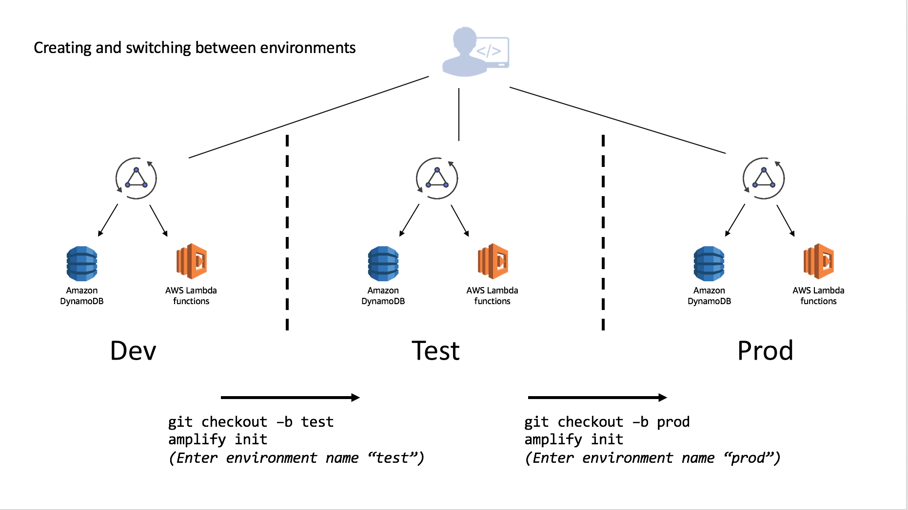

# Multiple environments and team workflows (beta)

This section outlines how you can manage multiple environments of your Amplify project (backend + frontend) as well as using a project within a team or outside a team using the Amplify CLI & Git. 
This functionality is still work in progress and you would have to install a beta version of the CLI to check out all the features mentioned in this section.

**Note**: The use of this newer version (@multienv) might cause existing projects initialized using a previous Amplify CLI version to no longer function when attempting to manage resources in the existing project, or have unexpected side effects. At this time only use this beta version of the CLI to initialize new projects requiring multiple environments and team workflow support as migrations are not yet supported. Migration support for existing Amplify projects is being actively working on.

Install the CLI using the following command:
```
npm install -g @aws-amplify/cli@multienv
```

## Concepts

Amplify fits into the standard Git workflow where you switch between different branches using the `env` command. Similarly to how you will run `git checkout BRANCHNAME` you will run `amplify env checkout ENVIRONMENT_NAME`. The below diagram shows a workflow of how to initialize new environments when creating new git branches.



You can independently add features to each environment allowing you to develop and test before moving them to different stages. This is contingent on which branch you ran a checkout from using Git. Using the same example above of **Dev** being the base which **Test** and **Prod** were derived, you could add (or remove) features and merge & deploy accordingly once you are comfortable with your setup.


This can be done in an iterative manner as you work through your deployment pipeline:


Multiple developers on a team can also share and manipulate the environment as well by using the credentials in the account. For instance suppose they wanted to test a change to the API without impacting the **Test** or **Prod** deployments. This will allow them to test the configured resources and, if they have been granted appropriate CloudFormation permissions, they can push resources as well to the backend with `amplify push`.


You can alternatively, have developers setup their own isolated replica of these environments in different AWS account. To do this simply:
1. Clone the existing project
2. Run `amplify init` and setup a new environment (e.g. "mydev") with that developer's account and AWS profile
3. Deploy with `amplify push`

This workflow can be used to share complete Amplify projects with people outside of your organization as well by committing the project into a Git repository. If you are doing this remove (or add to the .gitignore) the **team-provider-info.json** which is located in the `amplify` directory. You can learn more about this file [HERE](#teamprovider).

## Continuous deployment and Hosting with the Amplify Console

The Amplify CLI supports basic web application hosting with Amazon S3 and CloudFront. You can use the multi-environments feature with the Amplify Console for a fully managed web application hosting and continuous deployment solution. For more information please learn more in the [official documentation documentation](https://docs.aws.amazon.com/amplify/latest/userguide/deploy-backend.html)

## Setting up master and dev environments 

Create a Git repository for your project if you haven't already. It is recommended managing separate Git branches for different environments (try to have the same branch name as your environment name to avoid confusion).
From the root of your project, execute the following commands:

```
$ amplify init
? Enter a name for the environment master
// Provide AWS Profile info
// Add amplify categories using `amplify add <category>`
$ git init
$ git add <all project related files>
$ git commit -m <commit-message>
$ git remote add origin git@github.com:<repo-name>
$ git push -u origin master
```

**Note**: When you initialize a project using the Amplify CLI, it appends(if a gitignore file exists at the root of the project) or creates one for you (if a gitignore file doesn't exist at the root of your project), with a list of recommended files to check in from the Amplify CLI generated list of files, into your Git repository.

Once you have your 'master' branch setup in Git, set up a 'dev' environment in your Amplify project (which would be based on your 'master' environment), and then walk through the following steps to create a corresponding git branch for it.

```
$ amplify init
? Do you want to use an existing environment? No
? Enter a name for the environment dev
// Provide AWS Profile info
```

This will set up another environment for the project in the cloud. The backend-configs and resources are now cloned from the 'master' environment. Run `amplify push` to provision all the AWS resources for your new environment (dev).

Now push the changes to the 'master' branch (you would just see changes to the team-provider-info.json file - when running a `git status` command, which has cumulative stack information for all the project environments which are useful when you want to share the same backend within a team). After this, let's create a new git branch - 'dev' corresponding to the new environment we just created.

```
$ git add .
$ git commit -m "Creation of a master amplify environment"
$ git push -u origin master
$ git checkout -b dev
$ git push -u origin dev
```

## Team workflow

### Sharing a project within a team
There are two ways to work with Amplify projects within a team:
1. Team members working on their own sandbox environments (Recommended)
2. Team-members sharing the same dev backend to work on 

#### Team-members working on their own sandbox environments (Recommended)
Now you have two independent environments (master & dev) in the cloud and have corresponding git branches with your amplify backend infrastructure code on Git. Suppose a team member wants to work on the same Amplify project, add some features to it and then push changes to the dev environment to test some changes. They would perform the following steps:

```
$ git clone <git-repo>
$ cd <project-dir>
$ git checkout -b mysandbox
$ amplify init
? Do you want to use an existing environment? No
? Enter a name for the environment mysandbox
// Rest of init steps
// Add/update any backend configurations using amplify add/update <category>
$ amplify push
$ git push -u origin mysandbox
```

Next, suppose the team-member wants to move these changes to dev and master environments/branches: 

```
$ git checkout dev
$ amplify init
? Do you want to use an existing environment? true
? Choose the environment you would like to use: 
❯ dev 
 master
$ git merge mysandbox
$ amplify push
$ git push -u origin dev
```

After testing that everything works fine in the dev stage, you could now merge dev to the master git branch:

```
$ git checkout master
$ amplify init
? Do you want to use an existing environment? true
? Choose the environment you would like to use: 
 dev 
❯ master
$ git merge dev
$ amplify push
$ git push -u origin master
```

In this approach, you can consider the git branches (dev & master) as the source of truth and all the team members should work off the branches and keep their workspaces in sync.

#### Team-members sharing the same dev backend 
You have two independent environments (master & dev) in the cloud and have corresponding git branches with your amplify backend infrastructure code on Git. Suppose all team members want to work on the same Amplify project and push backend related changes to the same dev environment to test their changes. Each team member would run the following:

```
$ git clone <git-repo>
$ cd <project-dir>
$ git checkout dev
$ amplify init
? Do you want to use an existing environment? true
? Choose the environment you would like to use: 
❯ dev 
master
// The rest of init steps
// Add/update any backend configurations using amplify add/update <category>
$ amplify push
$ git push -u origin dev
```

Since the team is sharing the same dev backend, periodically team members would need to pull in changes which their team members pushed for the dev environment to be in sync. Let's pull in the changes from the dev branch & environment.

```
$ cd <your-project>
$ git checkout dev
$ $ amplify init
? Do you want to use an existing environment? true
? Choose the environment you would like to use: 
❯ dev 
master
$ amplify env pull
$ git pull origin dev
```

### Sharing projects outside the team <a name="teamprovider"></a>
Inside the amplify/ dir file-structure you will observe a **team-provider-info.json** file which contains a structure similar to the following:

```json
{
    "dev": {
        "awscloudformation": {
            "AuthRoleName": "multenvtest-20181115101929-authRole",
            "UnauthRoleArn": "arn:aws:iam::132393967379:role/multenvtest-20181115101929-unauthRole",
            "AuthRoleArn": "arn:aws:iam::132393967379:role/multenvtest-20181115101929-authRole",
            "Region": "us-east-1",
            "DeploymentBucketName": "multenvtest-20181115101929-deployment",
            "UnauthRoleName": "multenvtest-20181115101929-unauthRole",
            "StackName": "multenvtest-20181115101929",
            "StackId": "arn:aws:cloudformation:us-east-1:132393967379:stack/multenvtest-20181115101929/fc7b1010-e902-11e8-a9bd-50fae97e0835"
        }
    },
    "master": {
        "awscloudformation": {
            "AuthRoleName": "multenvtest-20181115102119-authRole",
            "UnauthRoleArn": "arn:aws:iam::345090917734:role/multenvtest-20181115102119-unauthRole",
            "AuthRoleArn": "arn:aws:iam::345090917734:role/multenvtest-20181115102119-authRole",
            "Region": "us-east-1",
            "DeploymentBucketName": "multenvtest-20181115102119-deployment",
            "UnauthRoleName": "multenvtest-20181115102119-unauthRole",
            "StackName": "multenvtest-20181115102119",
            "StackId": "arn:aws:cloudformation:us-east-1:345090917734:stack/multenvtest-20181115102119/3e907b70-e903-11e8-a18b-503acac41e61"
        }
    }
}
```

This file is to be shared between team members, so that they have the ability to push/provision resources to the same Cloudformation stack and that way teams can work in a push/pull way and can always be in sync with the latest state of the project in the cloud.

Note: Team members would only be able to push to a stack only if they have the correct credentials (access key/secret keys) to do so.

If you want to share a project publicly and open source your serverless infrastructure, you should remove or put the amplify/team-provider-info.json file in gitignore file.

## Quick Tips
* git and amplify cli should work hand in hand (ideally a CI tool should be used to automate this process - amplify CLI now provides headless support for its init/push commands. Check out https://github.com/aws-amplify/amplify-cli/tree/multienv/packages/amplify-cli/sample-headless-scripts for examples)
* git checkout <branch-name> & amplify init (to initialize the env based on the git branch) should go hand in hand 
* git pull & git env pull should go hand in hand
* git push & amplify push should go hand in hand

## Some other  helpful Environment related commands
* amplify env list [--details] [--json]
* amplify env add (to add an external CFN stack to the project)
* amplify env remove <env-name> (to remove an existing environment locally and from the cloud)
* amplify env get --name <env-name>
* amplify env pull --restore (to restore the local backend  configs to the current state of the environment/resources in the cloud)
