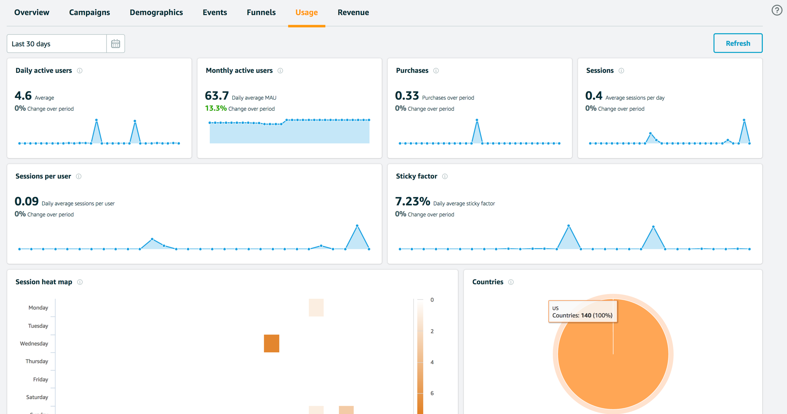

# Analytics

## Pinpoint

Gather the data that helps improve your app's usability, monetization, and engagement with your users. The CLI deploys your analytics backend using [Amazon Pinpoint](http://docs.aws.amazon.com/pinpoint/latest/developerguide/welcome.html).

### Set Up Your Backend

1. Complete the [Get Started TODO link](asdf) steps before you proceed.

2. Use the CLI to add analytics to your cloud-enabled backend and app.

    In a terminal window, navigate to your project folder (the folder that typically contains your project level `build.gradle`), and add the SDK to your app.

    ```bash
    $ cd ./YOUR_PROJECT_FOLDER
    $ amplify add analytics
    ```

    In a terminal window, navigate to your project folder (the folder contains your app `.xcodeproj` file), and add the SDK to your app.

    ```bash
    $ cd ./YOUR_PROJECT_FOLDER
    $ amplify add analytics
    ```

3. When configuration for analytics is complete, a message appears confirming that you have configured local CLI metadata for this category. You can confirm this by viewing status.

    ```bash
     $ amplify status
    | Category  | Resource name   | Operation | Provider plugin   |
    | --------- | --------------- | --------- | ----------------- |
    | Auth      | cognitoabcd0123 | Create    | awscloudformation |
    | Analytics | yourprojectname | Create    | awscloudformation |
    ```

4. To create your backend AWS resources run the following:

    ```bash
    $ amplify push
    ```

### Connect to Your Backend

Use the following steps to add analytics to your mobile app and monitor the results through Amazon Pinpoint.

#### Add Analytics

Set up AWS Mobile SDK components as follows.

1. The `Podfile` that you configure to install the AWS Mobile SDK must contain:

```

platform :ios, '9.0'
target :'YourAppName' do
 use_frameworks!

   pod 'AWSPinpoint', '~> 2.6.13'
   pod 'AWSMobileClient', '~> 2.6.13'

   # other pods

end
```

Run `pod install --repo-update` before you continue.

If you encounter an error message that begins `[!] Failed to connect to GitHub to update the CocoaPods/Specs . . .`, and your internet connectivity is working, you may need to [update openssl and Ruby](https://stackoverflow.com/questions/38993527/cocoapods-failed-to-connect-to-github-to-update-the-cocoapods-specs-specs-repo/48962041#48962041).

2. Classes that call Amazon Pinpoint APIs must use the following import statements:

    ```
    /** start code copy **/
    import AWSCore
    import AWSPinpoint
    import AWSMobileClient
    /** end code copy **/
    ```

3. Replace the return statement with following code into the `application(_:didFinishLaunchingWithOptions:)` method of your app's `AppDelegate.swift`.

    ```swift
    class AppDelegate: UIResponder, UIApplicationDelegate {

       /** start code copy **/
       var pinpoint: AWSPinpoint?
       /** end code copy **/

       func application(_ application: UIApplication, didFinishLaunchingWithOptions launchOptions:
       [UIApplicationLaunchOptionsKey: Any]?) -> Bool {

            //. . .

            // Initialize Pinpoint
            /** start code copy **/
            pinpoint = AWSPinpoint(configuration:
                AWSPinpointConfiguration.defaultPinpointConfiguration(launchOptions: launchOptions))

            // Create AWSMobileClient to connect with AWS
            return AWSMobileClient.sharedInstance().interceptApplication(application, didFinishLaunchingWithOptions: launchOptions)
            /** end code copy **/
       }
    }
    ```

#### Monitor Analytics

Build and run your app to see usage metrics in Amazon Pinpoint. When you run the previous code samples, the console shows a logged Session.

1. To see visualizations of the analytics coming from your app, open your project in the Amazon Pinpoint console by running the following:

    ```bash
    $ amplify console analytics
    ```

2. Choose `Analytics` from the icons on the left of the console, and view the graphs of your app's usage. It may take up to 15 minutes for metrics to become visible.

    

    [Learn more about Amazon Pinpoint](http://docs.aws.amazon.com/pinpoint/latest/developerguide/welcome.html).

### Enable Custom App Analytics

Instrument your code to capture app usage event information, including attributes you define.  Use graphs of your custom usage event data  in the Amazon Pinpoint console. Visualize how your users' behavior aligns with a model you design using [Amazon Pinpoint Funnel Analytics](https://docs.aws.amazon.com/pinpoint/latest/userguide/analytics-funnels.html), or use [stream the data](https://docs.aws.amazon.com/pinpoint/latest/userguide/analytics-streaming.html) for deeper analysis.

Use the following steps to implement Amazon Pinpoint custom analytics for your app.

```swift
// You can add this function in desired part of your app. It will be used to log events to the backend.
func logEvent() {

   let pinpointAnalyticsClient =
       AWSPinpoint(configuration:
           AWSPinpointConfiguration.defaultPinpointConfiguration(launchOptions: nil)).analyticsClient

   let event = pinpointAnalyticsClient.createEvent(withEventType: "EventName")
   event.addAttribute("DemoAttributeValue1", forKey: "DemoAttribute1")
   event.addAttribute("DemoAttributeValue2", forKey: "DemoAttribute2")
   event.addMetric(NSNumber.init(value: arc4random() % 65535), forKey: "EventName")
   pinpointAnalyticsClient.record(event)
   pinpointAnalyticsClient.submitEvents()

}
```

Build, run, and use your app. Then, view your custom events on the `Events` tab of the Amazon Pinpoint console (choose `Analytics`>`Events`). Look for the name of your event in the `Events` menu.

### Enable Revenue Analytics

Amazon Pinpoint supports the collection of monetization event data. Use the following steps to place
and design analytics related to purchases through your app.

```swift
func sendMonetizationEvent()
 {
     let pinpointClient = AWSPinpoint(configuration:
         AWSPinpointConfiguration.defaultPinpointConfiguration(launchOptions: nil))

     let pinpointAnalyticsClient = pinpointClient.analyticsClient

     let event =
         pinpointAnalyticsClient.createVirtualMonetizationEvent(withProductId:
             "DEMO_PRODUCT_ID", withItemPrice: 1.00, withQuantity: 1, withCurrency: "USD")
     pinpointAnalyticsClient.record(event)
     pinpointAnalyticsClient.submitEvents()
 }
```

## Kinesis

### Overview

Amazon Kinesis is a fully managed service for real-time processing of streaming data at massive
scale.

The SDK for iOS provides two high-level client classes, `AWSKinesisRecorder` and
`AWSFirehoseRecorder`, designed to help you interface with Amazon Kinesis and Amazon
Kinesis Firehose.

The Amazon Kinesis `AWSKinesisRecorder` client lets you store [PutRecord](http://docs.aws.amazon.com/kinesis/latest/APIReference/API_PutRecord.html) requests on disk and
then send them all at once. This is useful because many mobile applications that use Amazon Kinesis
will create multiple `PutRecord` requests per second. Sending an individual request for
each `PutRecord` action could adversely impact battery life. Moreover, the requests could
be lost if the device goes offline. Thus, using the high-level Amazon Kinesis client for batching
can preserve both battery life and data.

The Amazon Kinesis Firehose `AWSFirehoseRecorder` client lets you store [PutRecords](http://docs.aws.amazon.com/kinesis/latest/APIReference/API_PutRecords.html) requests on disk and
then send them using Kinesis Data Firehose`PutRecordBatch`.

For information about Amazon Kinesis Region availability, see  [AWS Service Region Availability](http://aws.amazon.com/about-aws/global-infrastructure/regional-product-services/).

### What is Amazon Kinesis?

[Amazon Kinesis](http://aws.amazon.com/kinesis/) is a fully managed service for real-time
processing of streaming data at massive scale. Amazon Kinesis can collect and process hundreds of
terabytes of data per hour from hundreds of thousands of sources, so you can write applications that
process information in real-time. With Amazon Kinesis applications, you can build real-time
dashboards, capture exceptions and generate alerts, drive recommendations, and make other real-time
business or operational decisions. You can also easily send data to other services such as Amazon
Simple Storage Service, Amazon DynamoDB, and Amazon Redshift.


### What is Amazon Kinesis Firehose?

[Amazon Kinesis Firehose](http://aws.amazon.com/kinesis/firehose/) is a fully managed service for
delivering real-time streaming data to destinations such as Amazon Simple Storage Service (Amazon
S3) and Amazon Redshift. With Firehose, you do not need to write any applications or manage any
resources. You configure your data producers to send data to Firehose and it automatically delivers
the data to the destination that you specified.

For more information about Amazon Kinesis Firehose, see [Amazon Kinesis Firehose](http://docs.aws.amazon.com/firehose/latest/dev/what-is-this-service.html).

You can also learn more about how the Amazon Kinesis services work together on the following page: [Amazon
Kinesis services](http://aws.amazon.com/kinesis/).


### Integrating Amazon Kinesis and Amazon Kinesis Firehose

To use the Amazon Kinesis mobile client, you'll need to integrate the SDK for iOS into your app
and import the necessary libraries. To do so, follow these steps:

If you haven't already done so, [download the SDK for iOS](http://aws.amazon.com/mobile/sdk/),
unzip it, and include it in your application as described at `setup-aws-sdk-for-ios`. The
instructions direct you to import the headers for the services you'll be
using. For this example, you need the following import.

```swift
import AWSKinesis
```

You can use Amazon Cognito to provide temporary AWS credentials to your application.

These credentials let the app access your AWS resources. To create a credentials provider, follow the instructions at [Cognito Identity Developer Guide](http://docs.aws.amazon.com/cognito/devguide/identity/).

To use Amazon Kinesis in an application, you must set the correct permissions. The
following IAM policy allows the user to submit records to a specific Amazon Kinesis
stream, which is identified by [ARN](http://docs.aws.amazon.com/general/latest/gr/aws-arns-and-namespaces.html).

```json
{
    "Statement": [{
        "Effect": "Allow",
        "Action": "kinesis:PutRecords",
        "Resource": "arn:aws:kinesis:us-west-2:111122223333:stream/mystream"
    }]
}
```

The following IAM policy allows the user to submit records to a specific Amazon Kinesis Firehose
stream.

```json
{
    "Statement": [{
        "Effect": "Allow",
        "Action": "firehose:PutRecordBatch",
        "Resource": "arn:aws:firehose:us-west-2:111122223333:deliverystream/mystream"
    }]
}
```

This policy should be applied to roles assigned to the Amazon Cognito
identity pool, but you need to replace the `Resource` value
with the correct ARN for your Amazon Kinesis or Amazon Kinesis Firehose stream. You can apply policies at the
[IAM console](https://console.aws.amazon.com/iam/). To
learn more about IAM policies, see [Using IAM](http://docs.aws.amazon.com/IAM/latest/UserGuide/IAM_Introduction.html).

To learn more about Amazon Kinesis-specific policies, see
[Controlling Access to Amazon Kinesis Resources with IAM](http://docs.aws.amazon.com/kinesis/latest/dev/kinesis-using-iam.html).

To learn more about Amazon Kinesis Firehose policies, see [Controlling Access with Amazon Kinesis Firehose](http://docs.aws.amazon.com/firehose/latest/dev/controlling-access.html).

Once you have credentials, you can use `AWSKinesisRecorder` with Amazon Kinesis. The
following snippet returns a shared instance of the Amazon Kinesis service client:

```swift
let kinesisRecorder = AWSKinesisRecorder.default()
```

You can use `AWSFirehoseRecorder` with Amazon Kinesis Firehose. The
following snippet returns a shared instance of the Amazon Kinesis Firehose service client:

```swift
let firehoseRecorder = AWSFirehoseRecorder.default()
```

You can configure `AWSKinesisRecorder` or `AWSFirehoseRecorder` through their properties:

```swift
kinesisRecorder.diskAgeLimit = TimeInterval(30 * 24 * 60 * 60); // 30 days
kinesisRecorder.diskByteLimit = UInt(10 * 1024 * 1024); // 10MB
kinesisRecorder.notificationByteThreshold = UInt(5 * 1024 * 1024); // 5MB
```

The `diskAgeLimit` property sets the expiration for cached requests.
When a request exceeds the limit, it's discarded. The default is no age limit. The
`diskByteLimit` property holds the limit of the disk cache size in
bytes. If the storage limit is exceeded, older requests are discarded. The default
value is 5 MB. Setting the value to 0 means that there's no practical limit. The
`notficationByteThreshold` property sets the point beyond which
Kinesis issues a notification that the byte threshold has been reached. The default
value is 0, meaning that by default Amazon Kinesis doesn't post the notification.

To see how much local storage is being used for Amazon Kinesis `PutRecord`
requests, check the `diskBytesUsed` property.

With `AWSKinesisRecorder` created and configured, you can use
`saveRecord:streamName:` to save records to local storage.

```swift
let yourData = "Test_data".data(using: .utf8)
kinesisRecorder.saveRecord(yourData, streamName: "YourStreamName")
```

In the preceding example, we create an NSData object and save it locally.
`YourStreamName` should be a string corresponding to the name of your
Kinesis stream. You can create new streams in the [Amazon Kinesis
console](https://console.aws.amazon.com/kinesis/).

Here is a similar snippet for Amazon Kinesis Firehose:

```swift
let yourData = "Test_data".data(using: .utf8)
firehoseRecorder.saveRecord(yourData, streamName: "YourStreamName")
```

To submit all the records stored on the device, call
`submitAllRecords`.

```swift
kinesisRecorder.submitAllRecords()
firehoseRecorder.submitAllRecords()
```

`submitAllRecords` sends all locally saved requests to the Amazon Kinesis
service. Requests that are successfully sent will be deleted from the device.
Requests that fail because the device is offline will be kept and submitted later.
Invalid requests are deleted.

Both `saveRecord` and `submitAllRecords` are asynchronous
operations, so you should ensure that `saveRecord` is complete before you
invoke `submitAllRecords`. The following code sample shows the methods
used correctly together.

```swift
// Create an array to store a batch of objects.
var tasks = Array<AWSTask<AnyObject>>()
for i in 0...100 {
    tasks.append(kinesisRecorder!.saveRecord(String(format: "TestString-%02d", i).data(using: .utf8), streamName: "YourStreamName")!)
}

AWSTask(forCompletionOfAllTasks: tasks).continueOnSuccessWith(block: { (task:AWSTask<AnyObject>) -> AWSTask<AnyObject>? in
    return kinesisRecorder?.submitAllRecords()
}).continueWith(block: { (task:AWSTask<AnyObject>) -> Any? in
    if let error = task.error as? NSError {
        print("Error: \(error)")
    }
    return nil
})
```

To learn more about working with Amazon Kinesis, see the [Amazon Kinesis Developer Resources](http://aws.amazon.com/kinesis/developer-resources/).

To learn more about the Amazon Kinesis classes, see the [class reference for AWSKinesisRecorder](http://docs.aws.amazon.com/AWSiOSSDK/latest/Classes/AWSKinesisRecorder.html).

For information about AWS service region availability, see  [AWS Service Region Availability](http://aws.amazon.com/about-aws/global-infrastructure/regional-product-services/).
