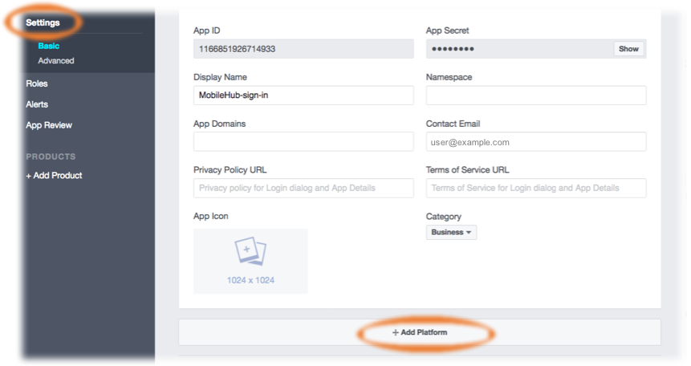
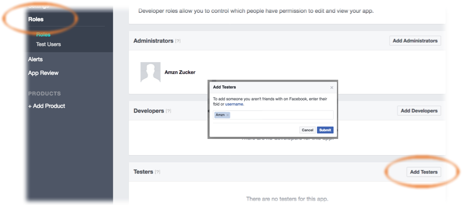

**WARNING**

**THIS IS PREVIEW DOCUMENTATION. NOT FOR PRODUCTION USE.**

# Authentication

The `AWSMobileClient` provides client APIs and building blocks for developers who want to create user authentication experiences. This includes declarative methods for performing authentication actions, a simple "drop-in auth" UI for performing common tasks, automatic token and credentials management, and state tracking with notifications for performing workflows in your application when users have authenticated.

**Amazon Cognito**

[Amazon Cognito User Pools](https://docs.aws.amazon.com/cognito/latest/developerguide/cognito-user-identity-pools.html) is a full-featured user directory service to handle user registration, storage, authentication, and account recovery. Cognito User Pools returns JWT tokens to your app and does not provide temporary AWS credentials for calling authorized AWS Services.
[Amazon Cognito Federated Identities](https://docs.aws.amazon.com/cognito/latest/developerguide/cognito-identity.html) on the other hand, is a way to authorize your users to use AWS services. With an identity pool, you can obtain temporary AWS credentials with permissions you define to access other AWS services directly or to access resources through Amazon API Gateway.

When working together, Cognito User Pools acts as a source of user identities (identity provider) for the Cognito Federated Identities. Other sources can be OpenID, Facebook, Google, etc. AWS Amplify uses User Pools to store your user information and handle authorization, and it leverages Federated Identities to manage user access to AWS Resources, for example allowing a user to upload a file to an S3 bucket.

Ensure you have [installed and configured the Amplify CLI and library]({{site.amplify.docs_baseurl}}/js/start).
{: .callout .callout--info}

## How it works

The AWSMobileClient manages your application session for authentication related tasks. The credentials it pulls in can be used by other AWS services when you call a `.default()` constructor. The Amplify category examples in this documentation use this by default, however [you can also use this with any AWS service via the generated SDK clients](manualsetup#direct-aws-service-access).

### State tracking

`AWSMobileClient` offers on-demand querying for the "login state" of a user in the application. For instance, you can check if the user is signed-in or not and present an appropriate screen. This is done through a couple of mechanisms:

- `isLoggedIn` property defined as a BOOLEAN for the most simple use cases
- `currentUserState` used for more advanced scenarios, such as determining if the user has Guest credentials, Authenticated with User Pools, has Federated credentials, or has signed out.

This allows you to write workflows in your application based on the state of the user and what you would like to present on different screens. The `AWSMobileClient` also offers realtime notifications on user state changes which you can register for in your application using `.addListener` as in the code below.

```swift
AWSMobileClient.sharedInstance().addListener(self) { (userState, info) in
            
            switch (userState) {
            case .guest:
                print("user is in guest mode.")
            case .signedOut:
                print("user signed out")
            case .signedIn:
                print("user is signed in.")
            case .signedOutUserPoolsTokenInvalid:
                print("need to login again.")
            case .signedOutFederatedTokensInvalid:
                print("user logged in via federation, but currently needs new tokens")
            default:
                print("unsupported")
            }
        }
```


### Token fetch and refresh

#### Cognito User Pool tokens
The `AWSMobileClient` will return valid JWT tokens from your cache immediately if they have not expired. If they have expired it will look for a **Refresh** token in the cache. If it is available and not expired it will be used to fetch a valid **IdToken** and **AccessToken** and store them in the cache.

If the Refresh tokens have expired and you then make call to any AWS service, such as a AppSync GraphQL request or S3 upload, the `AWSMobileClient` will dispatch a state notification that a re-login is required. At this point you can choose to present the user with a login screen, call `AWSMobileClient.sharedInstance().signIn()`, or perform custom business logic. For example:

```swift
AWSMobileClient.sharedInstance().addListener(self) { (userState, info) in
            
            switch (userState) {
            case .signedOut:
                // user clicked signout button and signedout
                print("user signed out")
            case .signedOutUserPoolsTokenInvalid:
                print("need to login again.")
                AWSMobileClient.sharedInstance().signIn(username: "username", password: "password", completionHandler: { (res, err) in
                    //...
                });
                //Alternatively call .showSignIn()
            default:
                print("unsupported")
            }
}
```

You can register to listen for this state change anywhere in your app with `.addListener`, such as in `viewDidLoad()` in the above example. If you want to cancel the re-login process, for instance if your application is shared among multiple users of the device or a user clicks "cancel" on the re-login attempt, you can call `releaseSignInWait()` to terminate the call and then call a `signOut()`.

#### AWS Credentials

AWS Credentials are used for signing requests to services that use AWS IAM, and for mobile clients they are provided by Amazon Cognito Identity Pools. Similar to JWT tokens, `AWSMobileClient` will return valid AWS Credentials from your cache immediately if they have not expired. If they are expired they will be refreshed using the JWT token that has been federated if the session is authenticated. For Guest scenarios they will be automatically refreshed. 

### Offline support

`AWSMobileClient` is optimized to account for applications transitioning from offline to online connectivity, and refreshing credentials at the appropriate time so that errors do not occur when actions are taken and connectivity is not available. In no cases will the `AWSMobileClient` automatically sign out a user if connectivity is not available. You must always make an explicit `signOut()` call for a user to be signed out of a session. 

In most cases if you are offline and make a service request, and your tokens are valid, the `AWSMobileClient` will pass the request directly to the service client. Therefore it is your responsibility to check network connectivity. In the case of the AWS AppSync client it supports offline operations and the request will be enqueued and automatically sent when connectivity is restored, refreshing credentials if necessary. [See the API guide for more information on AppSync](./api).

If you are offline and make a service request, and your tokens are **NOT** valid, the service request will be blocked and notifications for `signedOutUserPoolsTokenInvalid` or `signedOutFederatedTokensInvalid` will be sent to the listener. In the case of the AppSync client this can be ignored and the queries will come from cache or mutations enqueued with credentials automatically refreshing upon reconnection. For all other services, if this happens and you are offline you should not make the service request until you come back online, at which point the `AWSMobileClient` will automatically re-enter the token refresh flow outlined above and then make the service call with the updated credentials.

## Install Dependencies

After initialization in your project directory with `amplify init`, edit your `Podfile` with the following:

```ruby
target 'MyApp' do             ##Replace MyApp with your application name
  use_frameworks!
  pod 'AWSMobileClient', '0.0.7'
  pod 'AWSUserPoolsSignIn', '0.0.2'
end
```

Next run the following command:

```terminal
amplify push
pod install --repo-update
```

Open the **.xcworkspace** file of your project (close the **.xcodeproj** file if you already have it open). Drag in the `awsconfiguration.json` file from finder into your **.xcworkspace**. Finally, build your project once to ensure all frameworks are pulled in and compile correctly.

## Automated Setup

Run the following command in your project's root folder:

```bash
$ amplify add auth
```

If you have previously enabled an Amplify category that uses Auth behind the scenes, e.g. API category, you may already have an Auth configuration. In such a case, run `amplify auth update` command to edit your configuration.
{: .callout .callout--info}

The CLI prompts will help you to customize your auth flow for your app. With the provided options, you can:
- Customize sign-in/registration flow 
- Customize email and SMS messages for Multi-Factor Authentication
- Customize attributes for your users, e.g. name, email
- Enable 3rd party authentication providers, e.g. Facebook, Twitter, Google and Amazon

After configuring your Authentication options, update your backend:

```bash
$ amplify push
```

A configuration file called `awsconfiguration.json` will be copied to your project source directory. In the Finder, drag the file into Xcode under the top Project Navigator folder. When the `Options` dialog box that appears, do the following:

* Clear the `Copy items if needed` check box.
* Choose `Create groups`, and then choose `Next`.

[Click here to learn more about this process.](./start#step-3-how-it-works)

## Manual Setup

For manual configuration without the CLI, you must have an `awsconfiguration.json` file with the following:
- Cognito User Pools: `CognitoUserPool : { Default: ...}`
- Cognito Identity Pools: `IdentityManager` and `CredentialsProvider: {CognitoIdentity: ...}`

```xml
    {
        "IdentityManager": {
            "Default": {}
        },
        "CredentialsProvider": {
            "CognitoIdentity": {
                "Default": {
                    "PoolId": "XX-XXXX-X:XXXXXXXX-XXXX-1234-abcd-1234567890ab",
                    "Region": "XX-XXXX-X"
                }
            }
        },
        "CognitoUserPool": {
            "Default": {
                "PoolId": "XX-XXXX-X_abcd1234",
                "AppClientId": "XXXXXXXX",
                "AppClientSecret": "XXXXXXXXX",
                "Region": "XX-XXXX-X"
            }
        }
    }
```

If you are using both Cognito User Pools and Identity Pools, such as in Federated scenarios, you will need all of the keys mentioned above.

## Initialization

Open the AppDelegate of your Xcode project, or optionally in your View Controller `viewDidLoad()` and invoke the `initialize` routine:

```swift
import AWSMobileClient

    override func viewDidLoad() {
        super.viewDidLoad()
        AWSMobileClient.sharedInstance().initialize { (userState, error) in
            if let userState = userState {
                print("UserState: \(userState.rawValue)")
            } else if let error = error {
                print("error: \(error.localizedDescription)")
            }
        }
    }
```

Build and run your program to see the initialized client in Xcode messages. Since you haven't logged in yet it will print a state of `signedOut`. The `userState` returns an ENUM which you can perform different actions in your workflow. For example:

```swift
    @IBOutlet weak var signInStateLabel: UILabel!
    
    override func viewDidLoad() {
        super.viewDidLoad()
        AWSMobileClient.sharedInstance().initialize { (userState, error) in
            if let userState = userState {
                switch(userState){
                case .signedIn:
                        DispatchQueue.main.async {
                            self.signInStateLabel.text = "Logged In"
                    }
                case .signedOut:
                    AWSMobileClient.sharedInstance().showSignInScreen(navigationController: self.navigationController!, { (userState, error) in
                            if(error == nil){       //Successful signin
                                DispatchQueue.main.async {
                                    self.signInStateLabel.text = "Logged In"
                                }
                            }
                        })
                default:
                    AWSMobileClient.sharedInstance().signOut();
                }
                
            } else if let error = error {
                print(error.localizedDescription)
            }
        }
    }
```

You might leverage the above workflow to perform other actions in the `signedIn` case, such as calling [GraphQL or REST APIs with AWS AppSync and Amazon API Gateway](./api) or uploading content with [Amazon S3](./storage).

## Guest access

Many applications have UX with "Guest" or "Unauthenticated" users. This is provided out of the box with `AWSMobileClient` through the initialization routine you have added. However, the Amplify CLI does not enable this by default with the `amplify add auth` flow. You can enable this by running `amplify update auth` and choosing `No, I will setup my own configuration` when prompted. Ensure you choose the **...connected with AWS IAM controls** which will allow you to select **Allow unauthenticated logins**.

When complete run `amplify push` and your `awsconfiguration.json` will work automatically with your updated Cognito settings. The `AWSMobileClient` user session will automatically have permissions configured for Guest/Unauthenticated users upon initialization. 

If you login in your app either using the [Drop-In Auth](#dropinui) or the [direct Auth APIs](#iosapis) then the `AWSMobileClient` user session will transition to an authenticated role.

## Drop-In Auth

The `AWSMobileClient` client supports easy "drop-in" UI for your application. You can add drop-in Auth UI like so:

```swift
AWSMobileClient.sharedInstance().showSignInScreen(navigationController: self.navigationController!, { (signInState, error) in
    if let signInState = signInState {
        print("logged in!")
    } else {
        print("error logging in: \(error.localizedDescription)")
    }
})
```

IMPORTANT: The drop-in UI requires the use of a navigation controller to anchor the view controller. Please make sure the app has an active navigation controller which is passed to the `navigationController` parameter.

### Customization

Currently, you can change the following properties of the drop-in UI with the `AWSMobileClient`:
- Logo: Any image file of png or jpg
- Background Color: Any iOS UIColor

```swift
AWSMobileClient.sharedInstance()
    .showSignInScreen(navigationController: self.navigationController!,
                      signInUIOptions: SignInUIOptions(
                            canCancel: false,
                            logoImage: UIImage(named: "MyCustomLogo"),
                            backgroundColor: UIColor.black)) { (result, err) in
                            //handle results and errors               
}
```

You can also dismiss the sign in process by setting the `canCancel` property. 

## Working with the API

### SignUp

Creates a new user in your User Pool:

```swift
AWSMobileClient.sharedInstance().signUp(username: "your_username",
                                        password: "Abc@123!",
                                        userAttributes: ["email":"john@doe.com", "phone_number": "+1973123456"]) { (signUpResult, error) in
    if let signUpResult = signUpResult {
        switch(signUpResult.signUpConfirmationState) {
        case .confirmed:
            print("User is signed up and confirmed.")
        case .unconfirmed:
            print("User is not confirmed and needs verification via \(signUpResult.codeDeliveryDetails!.deliveryMedium) sent at \(signUpResult.codeDeliveryDetails!.destination!)")
        case .unknown:
            print("Unexpected case")
        }
    } else if let error = error {
        if let error = error as? AWSMobileClientError {
            switch(error) {
            case .usernameExists(let message):
                print(message)
            default:
                break
            }
        }
        print("\(error.localizedDescription)")
    }
}
```

### User Attributes

You can provide custom user attributes in the `signUp()` method by passing them into the `userAttributes` argument as key-value pairs. For instance if you had a `nickname` or a `badge_number` in your Cognito User Pool:

```swift
AWSMobileClient.sharedInstance().signUp(
    username: "your_username",
    password: "Abc@123!",
    userAttributes: ["nickname":"Johnny", "badge_number": "ABC123XYZ"]) { (signUpResult, error) in
    //Use results as before
}
```

### Confirm SignUp

Confirms a new user after signing up in a User Pool:

```swift
AWSMobileClient.sharedInstance().confirmSignUp(username: "your_username", confirmationCode: signUpCodeTextField.text!) { (signUpResult, error) in
    if let signUpResult = signUpResult {
        switch(signUpResult.signUpConfirmationState) {
        case .confirmed:
            print("User is signed up and confirmed.")
        case .unconfirmed:
            print("User is not confirmed and needs verification via \(signUpResult.codeDeliveryDetails!.deliveryMedium) sent at \(signUpResult.codeDeliveryDetails!.destination!)")
        case .unknown:
            print("Unexpected case")
        }
    } else if let error = error {
        print("\(error.localizedDescription)")
    }
}
```

### Re-send Confirmation Code

```swift
AWSMobileClient.sharedInstance().resendSignUpCode(username: "your_username", completionHandler: { (result, error) in
    if let signUpResult = result {
        print("A verification code has been sent via \(signUpResult.codeDeliveryDetails!.deliveryMedium) at \(signUpResult.codeDeliveryDetails!.destination!)")
    } else if let error = error {
        print("\(error.localizedDescription)")
    }
})
```

### SignIn

Sign in with user credentials:

```swift
AWSMobileClient.sharedInstance().signIn(username: "your_username", password: "Abc@123!") { (signInResult, error) in
    if let error = error  {
        print("\(error.localizedDescription)")
    } else if let signInResult = signInResult {
        switch (signInResult.signInState) {
        case .signedIn:
            print("User is signed in.")
        case .smsMFA:
            print("SMS message sent to \(signInResult.codeDetails!.destination!)")
        default:
            print("Sign In needs info which is not et supported.")
        }
    }
}
```

### Confirm SignIn

```swift
AWSMobileClient.sharedInstance().confirmSignIn(code: "code_here") { (signInResult, error) in
    if let error = error  {
        print("\(error.localizedDescription)")
    } else if let signInResult = signInResult {
        switch (signInResult.signInState) {
        case .signedIn:
            print("User is signed in.")
        default:
            print("\(signInResult.signInState.rawValue)")
        }
    }
}
```

### SignOut

```swift
AWSMobileClient.sharedInstance().signOut()
```

### Utility Properties

The `AWSMobileClient` provides several property "helpers" that are automatically cached locally for you to use in your application.

```swift
AWSMobileClient.sharedInstance().username       //String
AWSMobileClient.sharedInstance().isSignedIn     //Boolean
AWSMobileClient.sharedInstance().identityId     //String
```

### Managing Security Tokens

**When using Authentication with `AWSMobileClient`, you don’t need to refresh Amazon Cognito tokens manually. The tokens are automatically refreshed by the library when necessary.**

#### OIDC Tokens

```swift
AWSMobileClient.sharedInstance().getTokens { (tokens, error) in
    if let error = error {
        print("Error getting token \(error.localizedDescription)")
    } else if let tokens = tokens {
        print(tokens.accessToken!.tokenString!)
    }
}
```

#### AWS Credentials

```swift
AWSMobileClient.sharedInstance().getAWSCredentials { (credentials, error) in
    if let error = error {
        print("\(error.localizedDescription)")
    } else if let credentials = credentials {
        print(credentials.accessKey)
    }
}
```

## Federated Identities (Social Sign-in)

**Availability Note**
Currently, the federation feature in the AWSMobileClient supports Cognito Identity Pools only.
{: .callout .callout--info}

### Federated Sign In

```swift
AWSMobileClient.sharedInstance().federatedSignIn(providerName: "graph.facebook.com", token: "FACEBOOK_TOKEN_HERE") { (userState, err)  in
    if let error = error {
        print("Federated Sign In failed: \(error.localizedDescription)")
    }
}
```

`federatedSignIn()` can be used to obtain federated "Identity ID" using external providers like Google, Facebook or Twitter. If the tokens are expired and new tokens are needed, a notification will be dispatched on the `AWSMobileClient` listener with the user state `signedOutFederationTokensInvalid`. You can give the updated tokens via the same `federatedSignIn()` method. 

The API calls to get AWS credentials will be asynchronously blocked until you fetch the social provider's token and give it to `AWSMobileClient`. Once you pass the tokens, the `AWSMobileClient` will fetch AWS Credentials using the new tokens and unblock all waiting calls. It will then use the new credentials.

#### Facebook with Cognito Identity

To federate Facebook as a user sign-in provider for AWS services called in your app, you will pass tokens to `AWSMobileClient.sharedInstance().federatedSignIn()`. You must first register your application with Facebook by using the [Facebook Developers portal](https://developers.facebook.com/) and configure this with Amazon Cognito Identity Pools.

AWS Amplify helps set this up for you but first this topic explains how to set up Facebook as an identity provider for your app.

If you already have a Facebook app ID, you can copy and paste it into the `Facebook App ID` field
when configuring authentication using the AWS Amplify CLI.
{: .callout .callout--info}

**To get a Facebook app ID**

1. In the [Facebook Developers portal](https://developers.facebook.com/), sign in with your
   Facebook credentials.

2. From `Create App`, choose `Add a New App` (note: this menu label will be
   `My Apps` if you have previously created an app.


3. If asked, choose the platform of your app that will use Facebook sign-in, and `basic
   setup`.

4. Type a display name for your app, select a category for your app from the `Category`
   drop-down list, and then choose `Create App ID`.


5. Complete the `Security Check` that appears. Your new app then appears in the
   `Dashboard`.


6. Copy the App ID and note it for later when using the Amplify CLI.


7. In the Facebook Developer portal's left hand navigation list, choose `Settings`, then
   choose `+ Add Platform`.



8. Choose your platform and provide information about your app that Facebook will use for
   integration during credential validation.

   `For iOS:`

      1. Add your app's Bundle ID. (for example, com.amazon.YourProjectName).


9. In the Facebook Developers portal, choose `Save changes`, then `Use this
   package name` if a dialog appears saying that Google Play has an issue with your package name.

10. Only users with roles assigned in the Facebook portal will be able to authenticate through your
   app while it is in development (not yet published).

    To authorize users, in the Facebook Developer portal's left hand navigation list, choose
    `Roles`, then `Add Testers`. Provide a valid Facebook ID.




For more information about integrating with Facebook Login, see the [Facebook Getting Started Guide](https://developers.facebook.com/docs/facebook-login).

**Amplify CLI Configuration - Facebook**

In a terminal window, navigate to the root of your app files and add the auth category to your app. The CLI prompts you for configuration parameters. Choose **I will setup my own configuration** and **AWS IAM controls** when prompted.

```terminal
$ cd ./YOUR_PROJECT_FOLDER
$ amplify add auth
❯ No, I will set up my own configuration.
❯ User Sign-Up, Sign-In, connected with AWS IAM controls
```

Choose **YES** to `? Allow unauthenticated logins?` and **YES** to `? Do you want to enable 3rd party authentication providers in your identity pool?`.

**Choose Facebook** and then provide your Facebook **App ID** that you saved earlier.

When configuration for Facebook sign-in is complete, the CLI displays a message confirming that you have configured local CLI metadata for this category. Run the following to update your changes in the cloud:

```terminal
$ amplify push
```

You can now [configure Facebook in your mobile app](./authentication#facebook-login-in-your-mobile-app).

Note that the CLI allows you to select more than one identity provider for your app. You can also run `amplify auth update` to add an identity provider to an existing auth configuration.

#### Google with Cognito Identity

To federate Google as a user sign-in provider for AWS services called in your app, you will pass tokens to `AWSMobileClient.sharedInstance().federatedSignIn()`. You must first register your application with Google Sign-In and then configure this with Amazon Cognito Identity Pools.

The following sections detail the Google Sign-In requirements and steps to integrate Google Sign-In for both iOS and Android apps:

* [Create a Google Developers Project and OAuth Web Client ID](./auth-google-setup#project) (required for `all apps` regardless of platform)

* [Create an OAuth Android Client ID]() (required for all Android apps)

* [Create an OAuth iOS Client ID]() (required for all iOS apps)

After completing the steps above, note your **Google Client ID** for the next section.

**Amplify CLI Configuration - Google**

In a terminal window, navigate to the root of your app files and add the auth category to your app. The CLI prompts you for configuration parameters. Choose **I will setup my own configuration** and **AWS IAM controls** when prompted.

```terminal
$ cd ./YOUR_PROJECT_FOLDER
$ amplify add auth
❯ No, I will set up my own configuration.
❯ User Sign-Up, Sign-In, connected with AWS IAM controls
```

Choose **YES** to `? Allow unauthenticated logins?` and **YES** to `? Do you want to enable 3rd party authentication providers in your identity pool?`.

Choose **Google** and then provide your Google **Client ID**.

When configuration for Facebook sign-in is complete, the CLI displays a message confirming that you have configured local CLI metadata for this category. Run the following to update your changes in the cloud:

```terminal
$ amplify push
```

You can now [configure Google in your mobile app](./authentication#google-login-in-your-mobile-app).

Note that the CLI allows you to select more than one identity provider for your app. You can also run `amplify auth update` to add an identity provider to an existing auth configuration.

### Facebook Login in Your Mobile App

1. Add or update your AWS backend configuration file to incorporate your new sign-in. For details, see the last steps in the [Get Started: Set Up Your Backend](./add-aws-mobile-sdk-basic-setup) section.

2. Add the following dependencies in your project's `Podfile`.

	```ruby
	platform :ios, '9.0'
	  target 'YOUR-APP-NAME' do
	    use_frameworks!
	    pod 'AWSMobileClient', '~> 2.6.33'
	    pod 'AWSFacebookSignIn', '~> 2.6.33'
	    pod 'AWSUserPoolsSignIn', '~> 2.6.33'
	    pod 'AWSAuthUI', '~> 2.6.33'
	    # other pods
	  end
	```

Run `pod install --repo-update`.

Note : `AWSFacebookSignIn` is only needed for using Facebook in your app and  `AWSAuthUI` is only necessary if using the "Drop-In UI".
{: .callout .callout--info}

3. Add Facebook meta data to `Info.plist`.

	To configure your Xcode project to use Facebook Login, right-choose `Info.plist` and then choose `Open As > Source Code`.

	Add the following entry, using your project name, Facebook ID and login scheme ID.

```xml
  <plist version="1.0">

  <dict>
  <!-- YOUR OTHER PLIST ENTRIES HERE -->

  <!-- START OF FACEBOOK PLIST ENTRIES HERE -->
  <!-- 0123456789012345 BELOW IS EQUIVALENT TO YOUR APP ID -->
  <key>FacebookAppID</key>
  <string>0123456789012345</string>
  <key>FacebookDisplayName</key>
  <string>YOUR-PROJECT-NAME</string>
  <key>LSApplicationQueriesSchemes</key>
  <array>
      <string>fbapi</string>
      <string>fb-messenger-api</string>
      <string>fbauth2</string>
      <string>fbshareextension</string>
  </array>
  <!-- END OF FACEBOOK PLIST ENTRIES HERE -->

  <!-- ADD AN ENTRY TO CFBundleURLTypes for Facebook -->
  <!-- IF YOU DO NOT HAVE CFBundleURLTypes, YOU CAN COPY THE WHOLE BLOCK BELOW -->
  <key>CFBundleURLTypes</key>
  <array>
      <dict>
          <key>CFBundleURLSchemes</key>
          <array>
              <string>fb0123456789012345</string>
          </array>
      </dict>
  </array>

  <!-- ... -->
  </dict>
```

### Google Login in Your Mobile App

1. Add or update your AWS backend configuration file to incorporate your new sign-in. For details, see the last steps in the [Get Started: Set Up Your Backend](./start) section.

2. Add the following dependencies in the Podfile.

	```ruby
	platform :ios, '9.0'
	target :'YOUR-APP-NAME' do
	  use_frameworks!
	  pod 'AWSMobileClient', '~> 2.6.33'
	  pod 'AWSGoogleSignIn', '~> 2.6.33'
	  pod 'AWSUserPoolsSignIn', '~> 2.6.33'
	  pod 'AWSAuthUI', '~> 2.6.33'
	  pod 'GoogleSignIn', '~> 4.0'
	  # other pods
	end
	```
	Run `pod install --repo-update` before you continue.

3. Add Google metadata to `Info.plist`.

	To configure your Xcode project to use Google Login, open its `Info.plist` file using **Right-click > Open As > Source Code.** Add the following entry. Substitute your project name for the placeholder string.

	```xml

	<plist version="1.0">
	<!-- YOUR OTHER PLIST ENTRIES HERE -->

	<!-- ADD AN ENTRY TO CFBundleURLTypes for Google -->
	<!-- IF YOU DO NOT HAVE CFBundleURLTypes, YOU CAN COPY THE WHOLE BLOCK BELOW -->
	<key>CFBundleURLTypes</key>
	<array>
	    <dict>
	    <key>CFBundleURLSchemes</key>
	    <array>
	        <string>com.googleusercontent.apps.xxxxxxxxxxxx-xxxxxxxxxxxxxxxxxxxxxxxxxxxxxxxx</string>
	    </array>
	    </dict>
	</array>

	<!-- ... -->
	```
