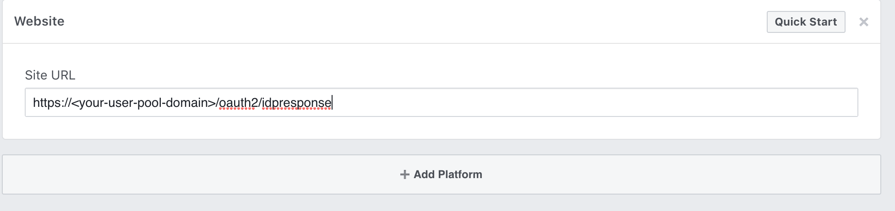

# Adding Social Identity Providers to a User Pool

## Facebook

1. Create a [developer account with Facebook](https://developers.facebook.com/docs/facebook-login)
2. [Sign In](https://developers.facebook.com/) with your Facebook credentials.
3. From the *My Apps* menu, choose *Add New App*.

4. Give your Facebook app a name and choose *Create App ID*.

5. On the left navigation bar, choose *Settings* and then *Basic*.

6. Note the *App ID* and the *App Secret*. You will use them in the next section.
7. Choose *+ Add Platform* from the bottom of the page and then choose *Website*.

8. Under Website, type your user pool domain with the /oauth2/idpresponse endpoint into *Site URL*

    ```https://<your-user-pool-domain>/oauth2/idpresponse```

    
9. Save changes.
10. Type your user pool domain into *App Domains*:

    ```https://<your-user-pool-domain>```
    
    
11. Save changes.
12. From the navigation bar choose *Products* and then *Set up* from *Facebook Login*.

13. From the navigation bar choose *Facebook Login* and then *Settings*.
14. Type your redirect URL into *Valid OAuth Redirect URIs*. It will consist of your user pool domain with the /oauth2/idpresponse endpoint.

    ```https://<your-user-pool-domain>/oauth2/idpresponse```

    
15. Save changes.

## Google

1. Go to [Google Developer Console](https://developers.google.com/identity/sign-in/web/sign-in)
2. Click *CONFIGURURE A PROJECT*

3. Type in a project name and choose *NEXT*.

4. Type in your product name and choose *NEXT*.
5. Choose *Web browser* from the *Where are you calling from?* drop-down list.

6. Type your user pool domain into *Authorized JavaScript origins*.

7. Click *CREATE*. You will not use the *Client ID* and *CLient Secret* from this step.
8. Click Done.
9. Go to the [Google developer console](https://console.developers.google.com).
10. On the left navigation bar, choose *Credentials*.

11. Create your OAuth2.0 credentials by choosing *OAuth client ID* from the *Create credentials* drop-down list.

12. Choose *Web application*.
13. Type your user pool domain into Authorized Javascript origins.
14. Type your user pool domain with the `/oauth2/idpresponse` endpoint into *Authorized Redirect URIs*.

    

    Note: If you saw an error message `Invalid Redirect: domain must be added to the authorized domains list before submitting.` when adding the endpoint, please go to the *authroized domains list* and add the doamin.
16. Click *Create* twice.
17. Note the *OAuth client ID* and *client secret*. You will need them for the next section.
18. Choose *OK*.