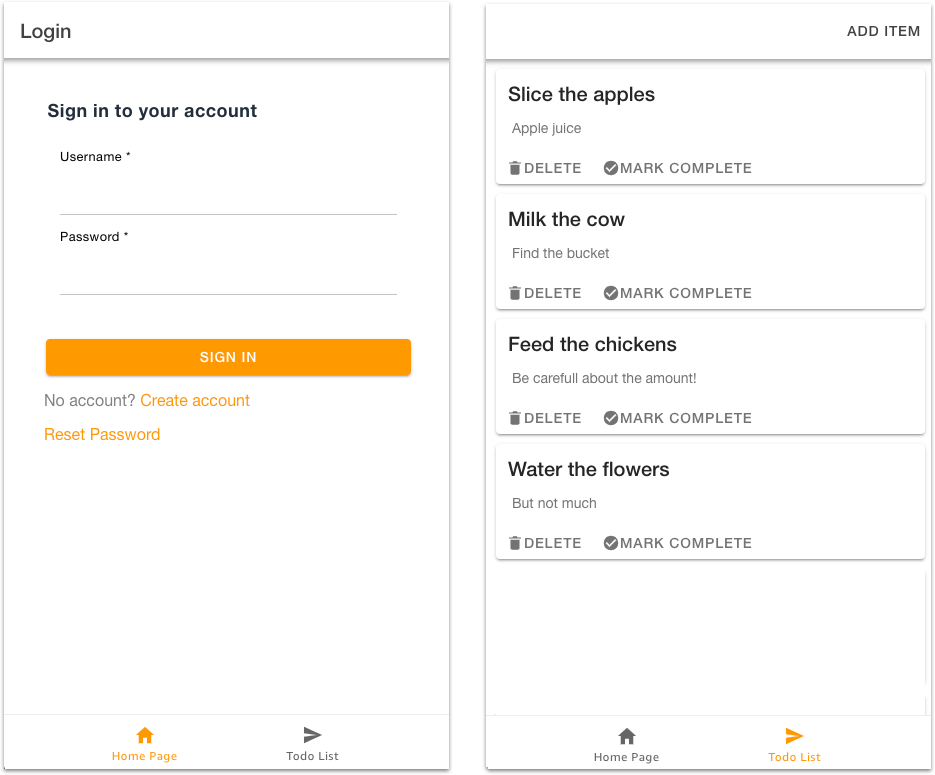
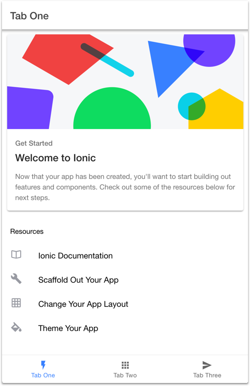
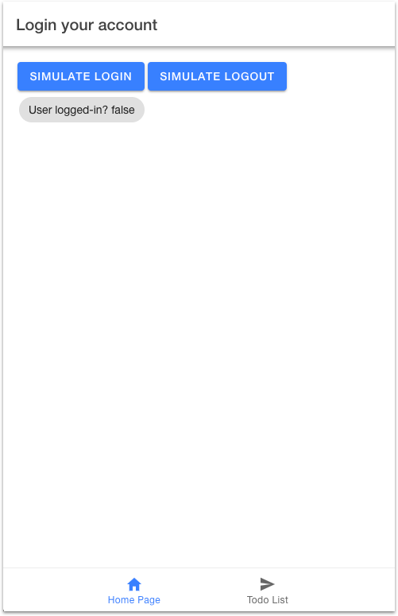
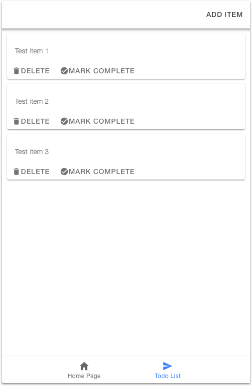
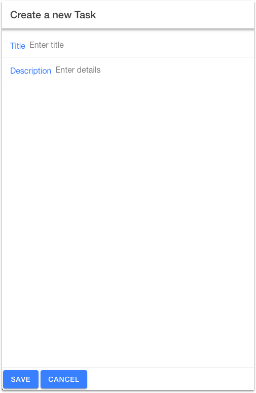
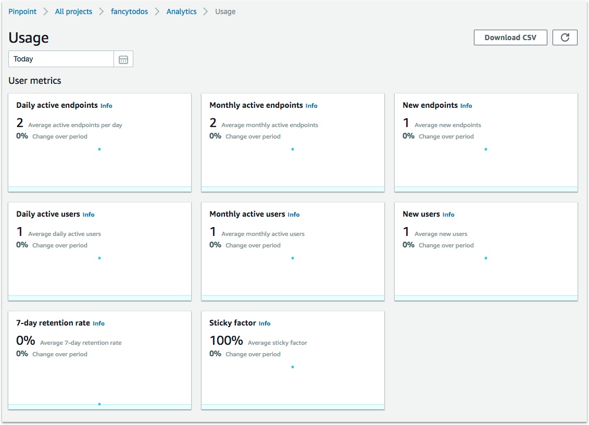
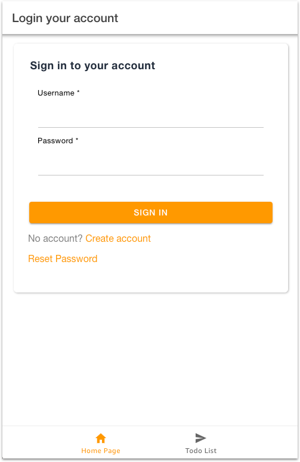
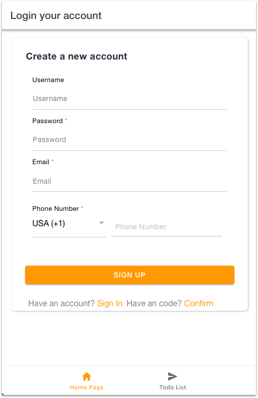
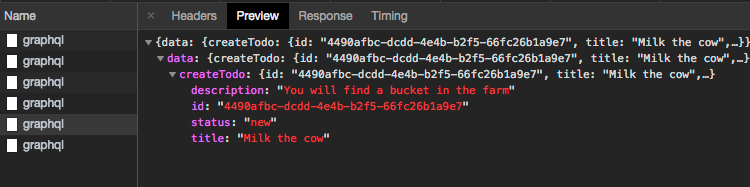

---
---

Building a 'Todo List' mobile app with Amplify Framework and Ionic 4
===========

Overview
--------

In this tutorial, you will create an Ionic 4 ‘Todo List’ app that connects to a serverless backend via the Amplify Framework. The app will provide user authentication with Amazon Cognito,  in-app analytics with Amazon Pinpoint, and it will be connected to a serverless GraphQL backend with AWS AppSync.

{: class="screencap" style="max-height:500px;"}

The Amplify Framework enables frontend developers to build apps quickly with a simplified workflow.  In this tutorial, you will learn how to create a cloud-enabled Ionic app from scratch using the Amplify Framework.

**By completing this tutorial, you will be able to:**
- Bootstrap an Ionic 4 app with Ionic CLI, and customize the starter app template
- Install and configure the Amplify Framework in your app
- Manage your app's backend with the Amplify CLI
- Add cloud-based authentication to your app
- Create and use a GraphQL backend to store data 

## {{site.data.concepts.prerequisites_js.header}}

{{site.data.concepts.prerequisites_js.html}}

## Source Code

You can directly copy and paste code snippets from the tutorial as you are following the steps. Alternatively, if you would like to get right to the source code for the final version of the tutorial's code, please visit the [Github Repo](https://github.com/aws-samples/aws-amplify-ionic-sample).  

## Content

Here is the sequence of the tutorial:
- [Part 1: Creating the App](#part-1-create-an-ionic-4-app)
- [Part 2: Adding Cloud Features](#part-2-adding-cloud-features)
- [Part 3: Enabling GraphQL Backend](#part-3-enabling-graphql-backend)

---

# Part 1: Create an Ionic 4 App

This section introduces Ionic basics. You will learn how to bootstrap a new Ionic app with the Ionic CLI. In subsequent parts of the tutorial, you will gradually add new cloud functionality to your application.

## What is Ionic?

Ionic is a web development framework that allows developers to create cross-platform applications that run on mobile platforms such as iOS and Android, on the desktop using Electron.js, or in the browser as a progressive web app. Ionic applications have the ‘look-and-feel’ of native apps and also offer the ability (via Apache Cordova plugins) to access mobile OS features such as cameras, contact lists, etc.

Apache Cordova is an open source mobile development platform that runs web code (HTML, CSS, and JavaScript) in a WebView wrapped in a mobile app shell.  Since it is native code, it can be distributed on the app stores just like any other mobile app and presented as an app on mobile platforms.

## Install the Ionic CLI and Create a Template Project

The easiest way to create an Ionic 4 application is with the Ionic Command Line Interface (CLI). To install the Ionic CLI, run the following command in your terminal:

```bash
$ npm install -g ionic cordova
```

After the installation, go to a location where you wish to start your new application project and execute the following command to create a new Ionic app with tabbed navigation app template:

```bash
$ ionic start fancy-todos tabs --type=angular
```
Ionic CLI will prompt some questions:

```bash
? Integrate your new app with Cordova to target native iOS and Android?
? Install the free Ionic Pro SDK and connect your app?  
```

If you want your application to run as an iOS or Android app as well as a browser-based one, select ‘y’ when asked for Cordova integration. You will then prompted for Ionic Pro SDK; you can select ‘y’ if you wish, but it is not necessary for this tutorial.

To be sure that you're using the correct version of Ionic, navigate into the project directory and execute 'ionic info'. The Ionic Framework value should be greater than 4.
{: .callout}

## Install Amplify Framework Libraries

Now, you have a new Ionic project called *fancy-todos*! You can switch to your project's root folder and install required Amplify Framework libraries.

```bash
$ cd fancy-todos 
```

Amplify Framework provides npm packages for installation. *aws-amplify* is the core package and *aws-amplify-angular* includes UI components and Angular modules that you will use when building you Ionic app. 

Run the following commands to install required packages:
```bash
$ npm install aws-amplify
$ npm install aws-amplify-angular
```

Note that you have installed required packages in this step, but you have not configured any backend services yet. 

## Working with Ionic

Before start working with Ionic, let's take a step back and define our app building strategy;  we will first build a fully working Ionic app (with local/mock data), and then we will connect it to the cloud. This strategy will help you better understand the building blocks of an Ionic app, and how you can quickly enable cloud features for new or existing applications.

**Angular Modules:**

Previous versions of Ionic made use of the Angular, and Ionic 4 is no exception. Angular provides a component-based architecture in which the application consists of *components*, and *components* are executed in the context of a *module*.

Each module typically has an HTML template, a module file, a component file, an .scss stylesheet, and a .spec file that includes tests. This file organization encourages developers to write code that is easy to understand, extend, and debug.

As an example, when we will build our HomeTab module, the  folder structure for the module will look like this:
```
/src
  /app
    /HomeTab
      - homeTab.module.ts
      - homeTab.page.html
      - homeTab.page.scss
      - homeTab.page.ts
```

Remember that you have created a ‘tabs’ starter app with Ionic CLI. So, each of our tabs will be a separate module, which in turn consists of one component each.  Check your *src/app/* folder to see what other modules are initially created by the Ionic CLI.

**Why do we use modules and components?**

Modules and components provide a nice abstraction for the different parts of your code, and they help you to organize your code as your application grows bigger. 

Through this tutorial, you will create the following modules and components for your Ionic app:
- **HomeTab** module where we will place Amplify Auth UI
- **ListTab** module where our todos will be listed  
- **ListItemModal** component which will provide the UI for creating and editing todo items  

**Testing your Ionic App**

You can test your Ionic app anytime in a browser by running:
```
$ ionic serve
```

To test your app in iOS simulator, run:
```bash
$ ionic cordova run ios -l
```

Note:  If you attempt to run your app in the iOS emulator but only see a blank screen, try running:

```bash
$ ionic cordova plugin rm cordova-plugin-ionic-webview
$ ionic cordova plugin add cordova-plugin-ionic-webview@2.0.0-beta.1
```

When you run your app at this stage, you will see the default view of the starter app:

{: class="screencap" style="max-height:500px;"}

Our goal is to customize the start app's tabs, so that first tab (Home Page) will be the login screen and the second tab (Todo List) will include the list of todo items. 

## Creating Common Utilities 

Before moving on to our modules, let's create some common utilities that will be shared among our modules.

### Creating the Data Model

It is an excellent idea to define the data model before start working with data. In our app, the main data structures are *ToDoItem* and *ToDoList*. *ToDoItem*  consists of an ID, a title, a description, and a status. *ToDoList* is the collection of all *ToDoItem*s. We will use a TypeScript class to define our data.  

Create a new directory *src/app/classes*, and copy the following code into a new file *src/app/classes/item.class.ts*.  

src/app/classes/item.class.ts
```javascript
import { v4 as uuid } from 'uuid';

export class ToDoList {
  userId: any;
  items: Array<ToDoItem>

  constructor(params){
    this.items = params.items || [];
    this.userId = params.userId;
  }
}

export class ToDoItem {
  id: string;
  title: string;
  description: string;
  status: any;

  constructor(params){
    this.id = uuid();
    this.title = params.title;
    this.description = params.description;
    this.status = 'new';
  }
}
```

### Creating a Helper Class for Auth State

Another helpful piece of code would be a class (or 'service' in Angular terminology) that returns the user authentication state. You can use this service to control what authenticated or authenticated users can do in your application. For example, in our Todo app, all unauthenticated users will access to *Home Tab*, but only authenticated users will access the *Todo List* tab. 

You can share the auth state in your app in many different ways, but in Ionic,  *Events* service provides a quite useful mechanism; a module can publish *data:AuthState* event messages and other modules can listen to *data:AuthState* events to take actions for state changes.

Let's implement a service which subscribes to auth state changes. We will use this service in different modules to retrieve the auth state.

Create the file  *src/app/services/auth-route-guard.ts* with the following code:

```javascript
import { Injectable } from '@angular/core';
import { Router, CanActivate } from '@angular/router';
import { Events } from '@ionic/angular'

@Injectable()
export class AuthGuardService implements CanActivate {

  signedIn: boolean = false;

  constructor(public router: Router, public events: Events) {
    this.events.subscribe('data:AuthState', async (data) => {
      if (data.loggedIn){
        this.signedIn = true;
      } else {
        this.signedIn =false
      }
    })
  }

  canActivate() {
    return this.signedIn;
  }
}
```

To use *AuthGuardService* in other modules, you need to import it explicitly. For example, we want to disable 'Todo List' tab for unauthenticated users.

Perform the following two modifications in  *src/app/tabs/tabs.module.ts* file:

  1 - Import `AuthGuardService`:
  ```javascript
    // 1 - Importing AuthGuardService
    import { AuthGuardService } from '../../services/auth-route-guard';
    //
  ```

  2 - Add *AuthGuardService* as a provider in the module definition:
  ```javascript

  @NgModule({
    imports: [
      IonicModule,
      CommonModule,
      FormsModule,
      TabsPageRoutingModule
    ],
    declarations: [TabsPage],
    providers: [AuthGuardService] // Add this line

  })
```

Now, *AuthGuardService* is available in the *Tabs* module. We will later use the service to disable 'Todo List' tab for the unauthenticated users. 

### Add Global Shim

Angular 6 has removed a shim for the global object used by many NPM modules, including some dependencies for Amplify. To accommodate for this change, add the following to your application's <HEAD> tag in *src/index.html*:

```html
<script>
    if (global === undefined) {
        var global = window;
    }
</script>
```

##  Creating Modules

In this section, you will create the modules that you will use in your Ionic app. 

### Creating the HomeTab Module

*HomeTab* is the first module you will create. You will use this module to display a sign-in/sign-up form. In this section, you will create temporary login/logout buttons to mock the app functionality. In Part 2, you will replace those buttons with Amplify Framework's UI components.

Remember that each module has its own folder structure. Create a new folder *src/app/homeTab*, and create a new module definition file  *src/app/homeTab/homeTab.page.ts* with the following code:

```javascript
import { Component, AfterContentInit } from '@angular/core';
import { Events } from '@ionic/angular';
import { AuthGuardService } from '../../services/auth-route-guard'

@Component({
  selector: 'app-page-home',
  templateUrl: 'homeTab.page.html',
  styleUrls: ['homeTab.page.scss']
})
export class HomePage implements AfterContentInit{

  authState: any;
  // including AuthGuardService here so that it's available to listen to auth events
  authService: AuthGuardService

  constructor(public events: Events, public guard: AuthGuardService) {
    this.authState = {loggedIn: false};
    this.authService = guard;
  }

  ngAfterContentInit(){
    this.events.publish('data:AuthState', this.authState)
  }

  login() {
    this.authState.loggedIn = true;
    this.events.publish('data:AuthState', this.authState)
  }

  logout() {
    this.authState.loggedIn = false;
    this.events.publish('data:AuthState', this.authState)
  }

}
```

Note that our *HomePage* component has authentication methods, but those methods do not yet provide a real authentication functionality; they just set the authentication state to *true* or *false*. In Part 2, we will replace them with Amplify Framework's high-level APIs for auth.

#### Creating the Home Page View

Our Home Page will display a user sign-in/sign-up form. In the final version of the app the UI will be generated by Amplify UI components, but for now, let's add some buttons to the view so that we can change the auth state.

Create the view file *src/app/homeTab/homeTab.page.html* with the following code:

```html
<ion-header>
  <ion-toolbar>
    <ion-title>Login</ion-title>
  </ion-toolbar>
</ion-header>
<ion-content padding>
  <ion-button (click)="login()">Login!</ion-button>
  <ion-button (click)="logout()">Logout!</ion-button>
  Logged In? {{authState.loggedIn}}
</ion-content>
```

#### Customizing Tabbed Navigation

You need to add two new tab buttons - 'Home Page' and 'Todo List' - to the tabbed navigation. This will enable users to navigate to our custom pages.

Replace the content of the page *src/app/tabs/tabs.page.html* with the following markup:
```html
<ion-tabs>
  <ion-tab-bar slot="bottom">
    <ion-tab-button tab="home">
      <ion-icon name="home"></ion-icon>
      <ion-label>Home Page</ion-label>
    </ion-tab-button>
    <ion-tab-button tab="list">
      <ion-icon name="send"></ion-icon>
      <ion-label>Todo List</ion-label>
    </ion-tab-button>
  </ion-tab-bar>
</ion-tabs>
```

Note that, although we have not created the *listTab* module yet, we replaced a tab button for it. The 'Todo List' tab will not work until we create the *listTab* module, and declare new routes for this module.

#### Updating Routes

To display our content in the 'Home Page' tab, we need to update the route configuration in the *Tabs* module.

Apply the following two modifications to *src/app/tabs/tabs.router.module* file:

  1-  Import *AuthGuardService*, so we can use our custom auth logic when working with tabs (like disabling a tab if the user is not signed in):
  ```javascript
  //...
  import { AuthGuardService } from '../services/auth-route-guard';
  //...
  ```
  2- Add a target for 'tabs/home' URL route:
  ```javascript
  //...
  const routes: Routes = [
    {
      path: 'tabs',
      component: TabsPage,
      children: [
        {
          path: 'home',
          children: [
            {
              path: '',
              loadChildren: '../homeTab/homeTab.module#HomeTabModule'
            }
          ]
        },
        {
  //...
  ```

Now, the app will display your new *HomeTab* module when you click *Home Page* tab. 

### ListTab Module

You will now create the *ListTab* module in the same way you created *HomeTab* module in the previous section. *ListTab* module will display the Todo List. In the list, the user will able to delete todo items and mark items as complete. The module will also allow users to create or edit  todo items through a modal UI.

Remember that each module has its own folder structure. 
So, let's start a new directory *src/app/listTab* for our module.

#### Creating ListTab Component

The *ListTab* component will include the logic for todo listing feature.

To define the component, create a new file *src/app/listTab/listTab.page.ts* with the following code: 

```javascript
import { Component, OnInit, Input } from '@angular/core';
import { ModalController, Events } from '@ionic/angular';
// We will un-comment this when ListItemModal is ready 
// import { ListItemModal } from './list.item.modal';
import { ToDoItem, ToDoList } from '../../classes/item.class';

@Component({
  selector: 'app-list-page',
  templateUrl: 'listTab.page.html',
  styleUrls: ['listTab.page.scss']
})
export class ListPage implements OnInit {

  modal: any;
  data: any;
  user: any;
  itemList: ToDoList;
  signedIn: boolean;

  constructor(
    public modalController: ModalController,
    events: Events

  ) {

    // Listen for changes to the AuthState in order to change item list appropriately
    events.subscribe('data:AuthState', async (data) => {
      if (data.loggedIn){
        this.getItems();
      } else {
        this.itemList.items = [];
      }
    })
  }

  async ngOnInit(){
    this.getItems();
  }

  async modify(item, i) {
    let props = {
      itemList: this.itemList,
      /*
        We pass in an item parameter only when the user clicks on an existing item
        and therefore populate an editItem value so that our modal knows this is an edit operation.
      */
      editItem: item || undefined
    };

    // Create the modal
    this.modal = await this.modalController.create({
      // We will un-comment this when ListItemModal is ready
      // component: ListItemModal,
      componentProps: props
    });
    // Listen for the modal to be closed...
    this.modal.onDidDismiss
    .then((result) => {
      if (result.data.newItem){
        // ...and add a new item if modal passes back newItem
        result.data.itemList.items.push(result.data.newItem)
      } else if (result.data.editItem){
        // ...or splice the items array if the modal passes back editItem
        result.data.itemList.items[i] = result.data.editItem
      }
      this.save(result.data.itemList);
    })
    return this.modal.present()
  }

  delete(i){
    this.itemList.items.splice(i, 1);
    // this.save(this.itemList);
  }

  complete(i){
    this.itemList.items[i].status = "complete";
    // this.save(this.itemList);
  }

  save(list){
    // Use AWS Amplify to save the list...
    // this.itemList = list;
  }

  getItems(){
    this.itemList = {
      userId: 1,
      items: [
        new ToDoItem({
          id: '1',
          title: 'Test item 1',
          description: 'my test item',
          status: 'complete'
        }),
        new ToDoItem({
          id: '2',
          title: 'Test item 2',
          description: 'my other test item',
          status: 'pending'
        }),
        new ToDoItem({
          id: '3',
          title: 'Test item 3',
          description: 'my other test item',
          status: 'pending'
        })
      ]
    }
  }
}
```

You may notice that we are using dummy data to populate our todo list. In Part 3, we will switch it with real backend data using a GraphQL query with AWS AppSync.

#### Creating listTab View

The *listTab* component needs an HTML template for listing todo items. 

Create a new file */src/app/listTab/listTab.page.html* with the following HTML markup:

```html
<ion-header>
  <ion-toolbar>
    <ion-title *ngIf="user">User</ion-title>
    <ion-buttons slot="end">
      <ion-button (click)="modify(null)">Add Item</ion-button>
    </ion-buttons>
  </ion-toolbar>
</ion-header>
<ion-content *ngIf="itemList">
    <ion-card *ngFor="let item of itemList.items; index as i">
      <ion-card-title class="hover card-title" (click)="modify(item)">{{item.title}}</ion-card-title>
      <ion-card-content>{{item.description}}</ion-card-content>
        <ion-buttons slot="end">
          <ion-button (click)="delete(item)">
              <ion-icon name="trash" size="small"></ion-icon>Delete</ion-button>
          <ion-button (click)="complete(item)">
              <ion-icon name="checkmark-circle"  size="small" [ngClass]="{'complete': item.status=='complete'}"></ion-icon>Mark Complete
          </ion-button>
        </ion-buttons>
    </ion-card>
</ion-content>
```

**Component styling**

You can also customize the style of the component by providing a style sheet file.

Create a new file *src/app/listTab/listTab.page.scss* with the following styles:
```css
.hover {
  cursor: pointer;
}
.complete {
  color: green;
}
.card-title {
  margin: 12px 0 0 12px !important;
}
```

#### Creating the Module Definition

A module definition exposes your components to the rest of the application. 

To create the *ListTabModule* definition, create a new file *src/app/listTab/listTab.module.ts* with the following code:

```javascript
import { IonicModule } from '@ionic/angular';
import { RouterModule } from '@angular/router';
import { NgModule } from '@angular/core';
import { CommonModule } from '@angular/common';
import { FormsModule } from '@angular/forms';
import { ListTab } from './listTab.page';

@NgModule({
  imports: [
    IonicModule,
    CommonModule,
    FormsModule,
    RouterModule.forChild([{ path: '', component: ListTab }])
  ],
  declarations: [ListTab],
  entryComponents: [ ListTab ]
})

export class ListTabModule {}
```

#### Enabling Routes for ListTabModule

Remember that we have added our tab buttons by editing the file */app/tabs/tabs.page.html*, but we did not define any route configurations yet. Until we do it, our module's content will not be displayed when the user clicks to the tab.

**How tab routing works?**

When the user clicks to the 'Todo List' tab button, your app's route will change to 'tabs/list'. So, you need to handle the route change, and let your module be rendered as the tab content. 

In a tabbed Ionic app, page routing is handled by *Tabs* module, and the routes are defined in *src/app/tabs/tabs.router.module* file.

Add your route definition in *src/app/tabs/tabs.router.module* file as follows:
```javascript
//...
const routes: Routes = [
  {
    path: 'tabs',
    component: TabsPage,
    children: [
      {
        path: 'home',
        children: [
          {
            path: '',
            loadChildren: '../homeTab/homeTab.module#HomeTabModule'
          }
        ]
      },
      // Add this part
      { 
        path: 'list',
        canActivate: [AuthGuardService],
        children: [
          {
            path: '',
            loadChildren: '../listTab/listTab.module#ListTabModule'
          }
        ]
      },
//...
//...
```

This modification will handle the 'tabs/list' route, and will load *ListTab* module when the route changes.

### Testing Your Modules

Now you are ready to test your modules in action! You should see your app with the tabs visible in the footer.

You will also see the buttons on the home page simulate login and logout functionality, and the auth state is updated across the app respectively. 

{: class="screencap" style="max-height:500px; float:none;"}

Note that 'Todo List' tab is only displayed when you click 'Simulate Login' button. This is the intended behavior, because we have set `canActivate` property with *AuthGuardService* in *app/tabs/tabs.router.module.ts* previously.

{: class="screencap" style="max-height:500px; float:none;"}

Since you have not connected your app to a cloud backend enabled yet, the app only lists items that are loaded statically in *ListTab* module with `getItems()` method. In Step 3, you will switch this method to work with AWS AppSync.

### Adding a Modal for Task Editing

We have one more missing part to complete our app's UI; we need a user interface to create and edit Todo items.

#### Create a Modal

To create a modal, you need to implement a component and a view for this component. Since the modal will be opened from *ListTab* (when user clicks 'Add Item' button), you can create the modal as a component in the *ListTab* module to keep the code organized.

First, create the file *src/app/listTab/listTab.item.modal.ts* with the following code:

```javascript
import { Component, OnInit } from '@angular/core';
import { ModalController } from '@ionic/angular';
import { ToDoItem, ToDoList } from '../classes/item.class';

@Component({
  selector: 'item-modal',
  templateUrl: 'list.item.modal.html',
})
export class ListItemModal implements OnInit {

  itemList: ToDoList;
  editItem: ToDoItem;
  user: string;
  item: ToDoItem;

  constructor(private modalController: ModalController) {}

  ngOnInit(){
    /*
      If you pass in an 'editItem' property, then you create a copy to store changes to the existing item
      so that the original is not modified unless the user saves.
    */
    this.item = this.editItem ? Object.assign({}, this.editItem) : new ToDoItem({})
  }

  save() {
    this.modalController.dismiss({
      itemList: this.itemList,
      /*
        You pass back either a newItem or editItem value depending on whether an edit operation is taking place
        so that the list module can decide whether to insert into the items array or splice into it.
      */
      newItem: !this.editItem ? this.item : null,
      editItem: this.editItem ? this.item : null
    });
  };

  cancel(){
    this.modalController.dismiss({itemList: this.itemList})
  }
}
```

Then create the view file for the modal *src/app/listTab/listTab.item.modal.html*:

```html
<ion-header>
    <ion-toolbar>
      <ion-title>Edit Item</ion-title>
    </ion-toolbar>
  </ion-header>
  <ion-content>
    <ion-list lines="true">
      <ion-item>
        <ion-label color="primary">ToDo Title </ion-label>
        <ion-input placeholder="title" [(ngModel)]="item.title"></ion-input>
      </ion-item>
      <ion-item>
        <ion-label color="primary">ToDo Description </ion-label>
        <ion-input placeholder="description" [(ngModel)]="item.description"></ion-input>
      </ion-item>
    </ion-list>
  </ion-content>
  <ion-footer>
    <ion-button class="save-btn" (click)="save()">Save</ion-button>
    <ion-button class="dismiss-btn" (click)="cancel()">Cancel</ion-button>
  </ion-footer>
```

#### Using modal in ListTab Module

To use your modal in ListTab module (remember that the modal will open when the user clicks 'Add Item' button in the ListTab), 
add make the following changes to *src/app/listTab/listTab.module.ts*:

1- Import ListItemModal:
```javascript
//..
import { ListItemModal } from './listTab.item.modal';
//..
```

2 - Add `ListItemModal` in *declarations* and *entryComponents*:
```js
@NgModule({
  imports: [
    IonicModule,
    CommonModule,
    FormsModule,
    RouterModule.forChild([{ path: '', component: ListTab }])
  ],
  declarations: [ListTab, ListItemModal],
  entryComponents: [ ListTab, ListItemModal ]
})
```

####  Import the Modal in listTab Page

To use your new modal in your list component, you also need to import the modal into your component in *src/app/listTab/listTab.page.ts* file.

To achieve this, just uncomment the following lines in *src/app/listTab/listTab.page.ts*:
```js
// We will un-comment this when ListItemModal is ready
import { ListItemModal } from './list.item.modal';

// We will un-comment this when ListItemModal is ready
component: ListItemModal,
```

#### Test Your App 

Now, run the app, click 'Simulate Login' button on the home page. Then click 'Add Item' button to add a new item, or click an item to edit. The todo data will not be saved yet, but you can test the UI.

{: class="screencap" style="max-height:500px; float:none;"}

Congratulations! You have created and Ionic app with basic functionality. In Part 2, you will be adding cloud features to your app.

# Part 2: Adding Cloud Features

In this section, you will cloud enable your Ionic app using the Amplify CLI. 

## Install Amplify CLI

Amplify CLI is the command line tool that you will use to create and manage the backend for your Ionic app. In the upcoming sections, you will use Amplify CLI to simplify various operations. The CLI enables you to create and configure your backend quickly, even without leaving the command line!

**Installing and Configuring the CLI:**

To use Amplify CLI with your Ionic project, you need to install it to your local development machine and configure it with your AWS credentials. Configuration is a one-time effort; once you configure the CLI, you can use it on multiple projects on your local machine. Because the CLI creates backend resources for you, it needs to utilize an AWS account with appropriate IAM permissions. During the configuration step, a new IAM role will be automatically created on your AWS account.  

To install and configure the Amplify CLI, run the following commands:
```bash
$ npm install -g @aws-amplify/cli
$ npm amplify configure
```

**Amplify CLI vs. AWS Console**

The backend resources that are created by the CLI is available to you through the AWS Console, e.g., you can access your Amazon Cognito User Pool on the AWS Console after you enable auth with Amplify CLI. 

To learn about Amplify CLI, visit the [CLI developer documentation](../cli/init){: target='_new'}.
{:.callout .callout--info}

## Initialize Your Backend

To initialize your backend, run the following command in your project's root folder:
```bash
$ amplify init  
```

The CLI guides you through the options for your project. Select 'Ionic' as your framework when prompted:
```console
  Please tell us about your project
  ? What javascript framework are you using
    react
    react-native
    angular
  ❯ ionic
    vue
    none
```

When the CLI successfully configures your backend, the backend configuration files are saved to '/amplify' folder. You don't need to manually edit the content of this folder as it is maintained by the CLI.

## Adding Analytics

Let's add our first backend feature to our app, Analytics. Adding Analytics won't change the user experience though, but it will provide valuable metrics that you can track in Amazon Pinpoint dashboard.  

While enabling Analytics, you will also learn how to use Amplify CLI and configure your app to work with various backend services.

**How Amplify CLI works?**

When you deploy your backend with Amplify CLI, here is what happens under the hood:

1. The CLI creates and provisions related resources on your account
2. The CLI updates your '/amplify' folder, which has all the relevant information about your backend on AWS
3. The CLI updates the configuration file `aws-exports.js` with the latest resource credentials

As a front-end developer, you need to import the auto generated *aws-exports.js* configuration file in your Ionic app, and configure your app with *Amplify.configure()* method call.

So, to enable analytics to your application, run the following commands:

```bash
$ amplify add analytics
$ amplify push
```

After successfully executing the *push* command, the CLI creates your configuration file *aws-exports.js* in your '/src' folder. 

### Working with The Configuration File 

The next step is to import `aws-exports.js` configuration file into your app.

Note that the file extension for the Amplify configuration file is '.js'. Since we are using TypeScript, you need to change the file extension from '.js' to '.ts' to be able to import the file. This can be a bit tricky when you are adding new cloud features; you need to rename the latest version of *aws-exports.js* every time your backend is updated. Consider using a task-runner that will make this operation for you.
{: .callout .callout--info}

To configure your app, open *src/main.ts* and make the following changes in code:

```javascript
import Amplify, { Analytics } from 'aws-amplify';
import aws_exports from './aws-exports';

Amplify.configure(aws_exports);
```

### Monitoring App Analytics

Refresh your application a couple of times, and then you will start receiving usage metrics in Amazon Pinpoint console. 

{: class="screencap" style="max-height:500px;"}

Since your application doesn’t have much functionality at the moment, only 'session start' events are displayed in Pinpoint Console. As you add more cloud features to your app - like authentication - Amplify will automatically report related analytics events to Amazon Pinpoint. So, you will know how your users are interacting with your app.

## Adding Authentication

Now that you know how to utilize Amplify CLI to enable backend services, you can add new features to your Ionic app easily.

User authentication will be the next cloud feature you will enable. Remember that our *HomeTab* module has login/logout buttons to control the auth state. Now, you will replace them with a secure and scalable auth experience. Doing that will be very easy with Amplify Authentication category and ready-to-use UI components. 

If you have been following the tutorial from the start and enabled Analytics in the previous step, *auth* is already enabled for your app (analytics needs secure credentials for reporting metrics). In this case, you just need to run *update auth* command to create a User Pool that will store your registered users:
```bash
$ amplify update auth
$ amplify push
```

If you have not enabled Analytics earlier, you will be using *auth* features for the first time.
Run the following command:

```bash
$ amplify add auth
$ amplify push
```

When prompted by the CLI, chose 'default configuration':

```console
 Do you want to use the default authentication and security configuration? (Use arrow keys)
❯ Yes, use the default configuration. 
```

AWS Amplify's Authentication category works with Amazon Cognito, a cloud-based authentication and federation service that enables you to manage user access to your applications. 
{:.callout .callout--info}

### Enabling the UI Components for Auth

One of the most important benefits of Amplify Framework is; you don't need to implement standard app features - like user authentication - from scratch. Amplify provides UI components that you can integrate into your app with just a few lines of code.

Note that UI components are bundled in *aws-amplify-angular* package, and the package should be installed beforehand.
{:.callout .callout--info}

Now, let's put the auth UI components in our home page. To do that, you need to import some Amplify modules in your *HomeTab* module.

Make the following changes in file *src/app/homeTab/homeTab.module.ts*:

  1- Import Amplify UI components:
  ```js
  //..
  // add necessary UI components and services 
  import { AmplifyAngularModule, AmplifyIonicModule, AmplifyService } from 'aws-amplify-angular'
  //...
  ```

  2- Add *AmplifyService* in *providers* section of the Module definition:
  ```js
  @NgModule({
    imports: [
      IonicModule,
      CommonModule,
      FormsModule,
      AmplifyAngularModule,
      AmplifyIonicModule,
      RouterModule.forChild([{ path: '', component: HomePage }])
    ],
    declarations: [HomePage],
    providers: [AmplifyService] // Add this line
    //
  })
  export class HomePageModule {}
  ```

This update enables your *HomeTab* module to use Amplify UI components.

### Rendering the Auth UI

Now, you can use Amplify UI components in your views. Auth UI component renders a pre-built sign-in and sign-up UI with full-fledged auth functionality like user registration, password reminders, and Multi-factor Authentication.

Previously, we have placed authentication buttons on the home page that changes the auth states. To replace these buttons with the actual auth UI, 
open *src/app/homeTab/homeTab.page.html* and replace the existing content with the following markup:

```html
<ion-header>
  <ion-toolbar>
    <ion-title>Login</ion-title>
  </ion-toolbar>
</ion-header>
<ion-content padding>
    <amplify-authenticator framework="ionic"></amplify-authenticator>
</ion-content>
```

The `amplify-authenticator` directive renders UI elements for auth. Now, refresh your app and visit the Home tab, you will see a login form that also provides sign-up options.

### Enabling the UI Styles

To change the look and feel of your Amplify UI components, you can update *src/global.scss* file, which includes global style rules for your app. 

Alternatively, Amplify provides a default styling theme your can use. You can import default styles from *aws-amplify-angular* module to make sure that your authenticator component (and other AWS Amplify UI components) are styled properly with the Amplify default theme.

Add the following import statement in *src/global.scss*:
```javascript
@import '../node_modules/aws-amplify-angular/theme.css'; 
```

### Updating Auth State 

Do you remember that we have modules that are listening to *data:AuthState* events? Now, it is time to publish those events accurately using Amplify auth. *HomePage* component is the place where we will publish *data:AuthState* messages.

It will work as follows:

1. When the auth state changes *HomePage* class will capture the event from Amplify auth and broadcast a new custom event *data:AuthState*
2. The other modules who listen to *data:AuthState* event will update their internal states accordingly

*Capturing auth state changes with Amplify:*

*amplifyService* provides a subscription to track auth state changes. Your code needs to subscribe to this service and get notified every time an auth event is fired; such as sign-in and sign-out. 

Replace the content of module *app/homeTab/homeTab.page.ts* with the following code: 

```js

import { Component, AfterContentInit } from '@angular/core';
import { Events } from '@ionic/angular';
import { AuthGuardService } from '../../services/auth-route-guard'
import { AmplifyService }  from 'aws-amplify-angular';


@Component({
  selector: 'app-page-home',
  templateUrl: 'homeTab.page.html',
  styleUrls: ['homeTab.page.scss']
})
export class HomePage implements AfterContentInit{

  authState: any;
  // including AuthGuardService here so that it's available to listen to auth events
  authService: AuthGuardService
  amplifyService: AmplifyService

  constructor(
    public events: Events,
    public guard: AuthGuardService,
    public amplify: AmplifyService
  ) {
    this.authState = {loggedIn: false};
    this.authService = guard;
    this.amplifyService = amplify;
    this.amplifyService.authStateChange$
    .subscribe(authState => {
      this.authState.loggedIn = authState.state === 'signedIn';
      this.events.publish('data:AuthState', this.authState)
    });
  }

  ngAfterContentInit(){
    this.events.publish('data:AuthState', this.authState)
  }
}

```

This update will integrate your app's auth states with Amplify auth feature. 

## Test Your Auth Flow

Once your application loads, on the ‘Home Page’ tab, and you will see login/signup controls.

{: class="screencap" style="max-height:500px;"}

Your app now authenticates users with Amazon Cognito!

**Where is the user data stored?**

When a new user registers through the Amplify auth UI component, the user data is stored in your Cognito User Pool. You can visit Amazon Cognito console and see the list of registered users by selecting the User Pool that is created for your app.

{: class="screencap" style="max-height:500px;"}

**Disabling Multi-factor Authentication**

As you may notice, Multi-factor Authentication is enabled by default, which requires users to validate their phone number with an SMS message. You can change this behavior by configuring your [Amazon Cognito User Pool](https://console.aws.amazon.com/cognito/home) settings.

Please note that the phone numbers should be entered in the format of
"+<country-code><area-code><phone-number>".

**Disabling Ionic UI**

`<amplify-authenticator>` component enables rendering Ionic UI components when used with *framework="ionic"* attribute. You can disable this by removing *framework="ionic"* attribute in *src/app/homeTab/homeTab.page.html*:

```html
<amplify-authenticator></amplify-authenticator>
```

After the application reloads, the login controls will have the simpler Angular look-and-feel, instead of Ionic UI components:

If you don’t want to use the Ionic versions of AWS Amplify's UI components, you do not need to import the *AmplifyIonicModule*.
{: .callout .callout--info}

# Part 3: Enabling GraphQL Backend

So far, your Todo app is powered by Amazon Cognito User Pools, but the todo list is not stored on the cloud yet. In this part, you will integrate your app with a GraphQL API (powered by AWS AppSync) that will store your todo list on a NoSQL database (Amazon DynamoDB).

The Amplify CLI will also help you when creating the GraphQL backend.  

## Create a GraphQL API

In the root folder of your app project, run the following command:
```bash
$ amplify add api
```

Then, select *GraphQL* as the service type:

```console
? Please select from one of the below mentioned services (Use arrow keys)
❯ GraphQL
  REST
```

API category supports GraphQL and REST endpoints. In this tutorial, we will create our backend on GraphQL, which uses AWS AppSync under the hood.
{: .callout .callout--info}

When you select `GraphQL` as the service type, the CLI offers you options to create a schema. A schema defines the data model for your GraphQL backend. 

Select *Single object with fields* when prompted *What best describes your project?*. This option will create a GraphQL backend data model which we can modify and use in our app:

```console
? Provide API name: fancytodos
? Choose an authorization type for the API Amazon Cognito User Pool
Use a Cognito user pool configured as a part of this project
? Do you have an annotated GraphQL schema? No
? Do you want a guided schema creation? true
? What best describes your project:
? What best describes your project: Single object with fields (e.g., “Todo” with ID, name, description)
? Do you want to edit the schema now? No
```

When the CLI creates the GraphQL schema, the schema file is copied in */amplify/backend/api/fancytodos/schema.graphql* file for you to review and edit.

### Editing the Data Model (GraphQL Schema)

The default schema created by the CLI is as follows:

```js
type Todo @model {
  id: ID!
  name: String!
  description: String
}
```

As you may notice, this schema is a bit different from our *ToDoItem* data model. Remember that we have defined our *ToDoItem* class in */app/classes/item.class.ts*.  When you check this file, you will see that we have a *title* property instead of *name*, and we have an additional *status* property for *TodoItem*.

Luckily, when working with AWS AppSync, updating a schema (and thus updating your whole backend data infrastructure!) is very easy. 

Just edit your local schema file which is located at */amplify/backend/api/fancytodos/schema.graphql* to match the following: 

```js
type Todo @model {
  id: ID!
  title: String!
  description: String
  status: String!
}
```

Now, if you run *amplify status*, you will see that your update to the schema file is picked up by the CLI, and you have an 'Update' operation waiting to be deployed in your next deployment (amplify push):

```console
$ amplify Status 

| Category  | Resource name   | Operation | Provider plugin   |
| --------- | --------------- | --------- | ----------------- |
| Api       | fancytodos      | Update    | awscloudformation |
| Auth      | cognito5aafbab5 | No Change | awscloudformation |
| Analytics | fancytodos      | No Change | awscloudformation |
```

Now, update your backend to deploy your schema changes:
```bash
$ amplify push
```

Again, don't forget to rename 'aws-export.js' configuration file to 'aws-export.ts' after running the *push* command, as the configuration file is updated when you add services.
{: .callout .callout--info}

The beauty of GraphQL - and AWS AppSync - is that it gives you a simple data model to work with, and you can extend it as you wish. Under the hood, our `Todo` data is stored on Amazon DynamoDB, and when you change your schema, additional data fields will be automatically available to you! 

Congratulations! You have extended your GraphQL data model by editing your local GraphQL schema, and deployed your backend with 'amplify push'.  

## Using Queries and Mutations

When working with a GraphQL API, you pass queries - or mutations - to the GraphQL endpoint. Queries are used for read operations, and mutations perform create or update operations. 

A query/mutation has a simple, JSON-like format, but you don't need to write it manually. Instead, the Amplify CLI can auto-generate queries and mutations for you.

### Auto-Generating Queries/Mutations

Run the following command to enable code generation for your project:
```bash
$ amplify add codegen
```

Then, run the following command to generate queries and mutations:

```bash
$ amplify codegen statements  
```
 
The CLI creates and saves your generated queries and mutations under '/graphql' folder (unless you provide another folder when prompted).

Here is the *listTodos* sample query that will bring all of your todos:

```js
export const listTodos = `query ListTodos(
  $filter: ModelTodoFilterInput
  $limit: Int
  $nextToken: String
) {
  listTodos(filter: $filter, limit: $limit, nextToken: $nextToken) {
    items {
      id
      name
      description
    }
    nextToken
  }
}
`;
```

When you check the */graphql* folder, you will see that the CLI has generated a list of queries and mutations for common data operations. You will use them to perform CRUD (create-read-update-delete) operations on your data:

type | operations
--- | ---
query | getTodo , listTodos
mutation | createTodo , updateTodo , deleteTodo

### Running Queries/Mutations

To run a query or mutation, you import it in your app, and use Amplify API category to perform the operation:

```js
import Amplify, { API, graphqlOperation } from "aws-amplify";
import * as queries from './graphql/queries';

const allTodos = await API.graphql(graphqlOperation(queries.listTodos));
console.log(allTodos);
```

## Connecting to GraphQL Backend

Currently, your GraphQL API and related backend resources (an Amazon DynamoDB table that stores the data) have been deployed to the cloud. Now, you can add CRUD functionality to your app by integrating the GraphQL backend.

Remember that the todo list would be displayed in *listTab* page. So, you need to bind the data from your backend to the *listTab* page component.

To accomplish this, you need to update *src/app/listTab/listTab.page.ts* to match the following code:

```javascript
import { Component, OnInit, Input } from '@angular/core';
import { ModalController, Events } from '@ionic/angular';
import { ListItemModal } from './listTab.item.modal';
import { ToDoItem, ToDoList } from '../classes/item.class';
import Amplify, { API, graphqlOperation } from "aws-amplify";
import * as queries from '../../.././graphql/queries';
import * as mutations from '../../.././graphql/mutations';
import { forEach } from '@angular/router/src/utils/collection';

@Component({
  selector: 'app-list-page',
  templateUrl: 'listTab.page.html',
  styleUrls: ['listTab.page.scss']
})
export class ListTab implements OnInit {

  modal: any;
  data: any;
  user: any;
  itemList: ToDoList;
  signedIn: boolean;

  constructor(
    public modalController: ModalController,
    events: Events
  ) {

    // Listen for changes to the AuthState in order to change item list appropriately
    events.subscribe('data:AuthState', async (data) => {
      if (data.loggedIn){
        this.getItems();
      } else {
        this.itemList.items = [];
      }
    })
  }

  async ngOnInit(){
    this.getItems();
  }

  async modify(item, i) {
    let props = {
      itemList: this.itemList,
      /*
        We pass in an item parameter only when the user clicks on an existing item
        and therefore populate an editItem value so that our modal knows this is an edit operation.
      */
      editItem: item || undefined
    };

    // Create the modal
    let modal = await this.modalController.create({
      component: ListItemModal,
      componentProps: props
    });

    modal.onDidDismiss()
    .then((result) => {
      if (result.data.newItem){
        this.create(result.data.newItem);
      } else if (result.data.editItem){
        this.edit(result.data.editItem);
      }
    });
    return modal.present();
  }

  delete(item){
    console.log (item)
    API.graphql(graphqlOperation(mutations.deleteTodo, { input: { 'id': item.id } } ));
    this.getItems();
  }

  complete(item){
    API.graphql(graphqlOperation(mutations.updateTodo, { input: item }));
    this.getItems();
  }

  create(item){
    API.graphql(graphqlOperation(mutations.createTodo, {input: item }));
    this.getItems();
  }

  edit(item){
    API.graphql(graphqlOperation(mutations.updateTodo, { input: item }));
    this.getItems();
  }

  async getItems(){
    let allItems =  await API.graphql(graphqlOperation(queries.listTodos));
    allItems = allItems.data.listTodos.items;
    let items = Array();

    allItems.forEach (function(value){
      items.push (new ToDoItem(value));
    });

    this.itemList = {
      userId: 1,
      items: items
    };

  }

}
```

You have just implemented GraphQL queries and mutations in your CRUD functions. Now, you can test your app and verify that the app data is persisted using your GraphQL backend!

**Inspecting a GraphQL Mutation**

Let's see what is happening under the hood. Run your app, and add a new item while you monitor the network traffic in your browser's developer tools. Here is what you will see for a mutation HTTP request:
{: class="screencap" style="max-height:500px;"}

When you check the request header, you will notice that the Request Payload has the todo item data in JSON format.

**Congratulations! You now have a cloud-powered Ionic app!**

You’ve persisted your app's data using AWS AppSync and Amazon DynamoDB.  

## What's next

You have completed this tutorial. But, if you like to improve your app even further, here are some ideas you can work on.

**Use GraphQL Subscriptions**

In addition to queries and mutations, you can use GraphQL subscriptions with AWS AppSync and enable real-time data in your app. Think of a user experience which you share your todo list with your friends and all of you create and edit items at the same time. Learn more about subscriptions [here](https://aws-amplify.github.io/docs/js/api#subscriptions).

**Display User Data**

When a user is logged in, you may like to use the user's profile information in your app, like displaying the username or picture. Learn more about User Attributes [here](https://aws-amplify.github.io/docs/js/authentication#working-with-user-attributes). 

**Add Search**

You can add a search functionality to your app. This is very easy by adding a `@searchable` directive in your GraphQL schema. Learn more about [here](https://aws-amplify.github.io/docs/cli/graphql#searchable). 

**Add Images**

You can add an image attachment feature for todo items. This can be simply done by enabling complex object types in your GraphQL schema. Learn more about [here](https://aws-amplify.github.io/docs/cli/graphql#s3-objects). 

 
