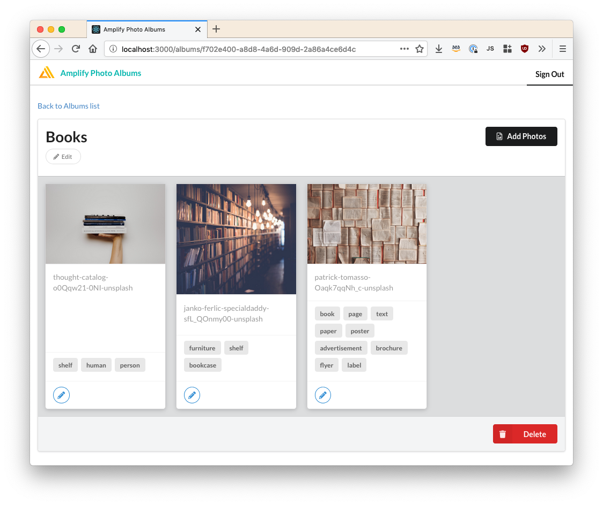
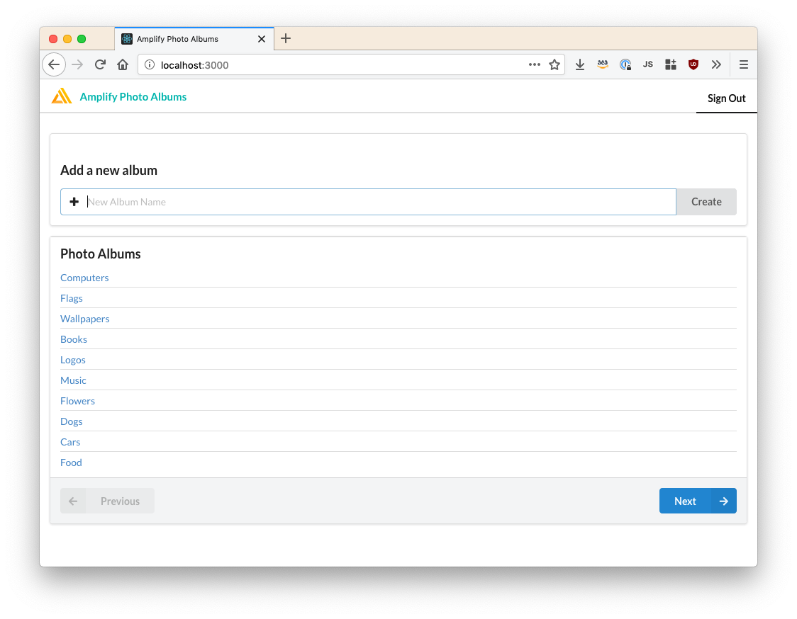
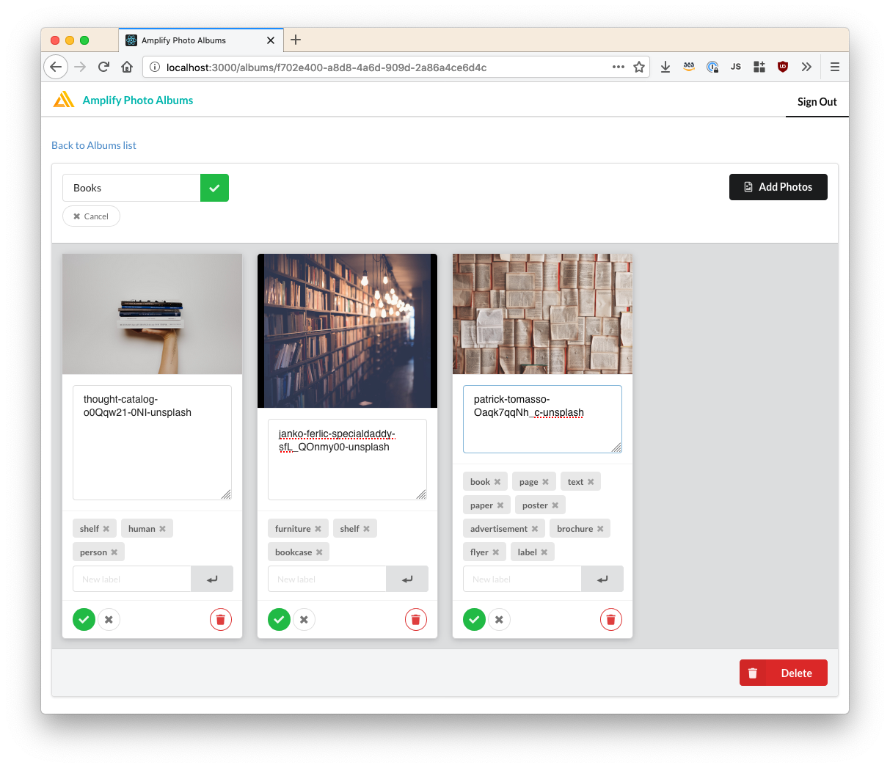

# Building a Photo Albums Web App in React



## Overview

In this tutorial, you will create a cloud-enabled "Photo Albums" app in React that lets users
browse & upload photos.

We'll use AWS Amplify and the Amplify CLI to quickly provision resources & connect them to our UI.

**By completing this tutorial, you will be able to**:

- Rapidly create & provisioning cloud services via [Amplify CLI](https://aws-amplify.github.io/docs/js/cli).
- Authenticate users via Amazon, Facebook, & Google via Amazon Cognito.
- Create a GraphQL API that uses Amazon DynamoDB as a data source.
- Handle API & HTTP errors.
- Create, read, update, & delete albums & photos via Amplify JS.
- Update the UI in real-time via Subscriptions.
- Upload photos to Amazon S3 & creating thumbnails via a Lambda.
- Automatically detect & add labels to photos via Amazon Rekognition.
- Deploy to S3 static web hosting behind the CloudFront CDN.
- Clean up & delete cloud resources.

# Part 1. Getting Started

## Step 1. Sign up for an AWS account

There are no upfront charges or any term commitments to create an AWS account and signing up gives you immediate access to the AWS Free Tier.

> [Create an AWS Account](https://portal.aws.amazon.com/billing/signup?redirect_url=https%3A%2F%2Faws.amazon.com%2Fregistration-confirmation)

## Step 2. Install the CLI

The Amplify Command Line Interface (CLI) is a unified toolchain to create, integrate, and manage the AWS cloud services for your app.

Install [Node.js (v8.x or greater)](https://nodejs.org/en/download/)
and
[npm](https://www.npmjs.com/get-npm), if they are not already on your machine.

```shell
npm install -g @aws-amplify/cli
amplify configure
```

## Step 3. Create a new app

We're using [Create React App](https://create-react-app.dev/), the de-facto starting point for React single-page apps.

```shell
npx create-react-app photo-albums
cd photo-albums
```

## Step 4. Initialize Amplify

```shell
amplify init
```

```console
Note: It is recommended to run this command from the root of your app directory
? Enter a name for the project photo-albums-e2e
? Enter a name for the environment dev
? Choose your default editor: Visual Studio Code
? Choose the type of app that you're building javascript
Please tell us about your project
? What javascript framework are you using react
? Source Directory Path:  src
? Distribution Directory Path: build
? Build Command:  npm run-script build
? Start Command: npm run-script start
```

## Step 5. Tutorial Dependencies

Inside your app directory, install Amplify JavaScript:

```shell
npm install aws-amplify
```

For this tutorial, we'll use `react-router-dom` for routing & `semantic-ui-react`
for reducing styling boilerplate:

```shell
npm install react-router-dom semantic-ui-react
```

Next, replace `src/App.js` with:

```jsx

```

Finally, run your project & we're ready to start adding in features!

```shell
npm start
```

# Part 2. Adding Authentication

## Step 1. Setup Social Providers

Before adding a social provider to an Amplify project, you must first go to that provider and configure an application identifier as outlined below.

- [Facebook Instructions](https://aws-amplify.github.io/docs/js/cognito-hosted-ui-federated-identity#facebook-instructions)
- [Google Sign-In Instructions](https://aws-amplify.github.io/docs/js/cognito-hosted-ui-federated-identity#google-sign-in-instructions)
- [Amazon Login Instructions](https://aws-amplify.github.io/docs/js/cognito-hosted-ui-federated-identity#amazon-login-instructions)

## Step 2. Add Auth

```shell
amplify add auth
```

```console
Do you want to use the default authentication and security configuration? Default configuration with Social Provider (Federation)
Warning: you will not be able to edit these selections.
How do you want users to be able to sign in? Username
Do you want to configure advanced settings? No, I am done.
What domain name prefix you want us to create for you? photoalbumse2e9a7842fd
Enter your redirect signin URI: http://localhost:3000/
? Do you want to add another redirect signin URI No
Enter your redirect signout URI: http://localhost:3000/
? Do you want to add another redirect signout URI No
Select the social providers you want to configure for your user pool: (Press <space> to select, <a> to toggle all, <i> to invert selection)Facebook, Google, Login With Amazon

You've opted to allow users to authenticate via Facebook.  If you haven't already, you'll need to go to https://developers.facebook.com and create an App ID.

Enter your Facebook App ID for your OAuth flow:  •••••••••••••
Enter your Facebook App Secret for your OAuth flow:  ••••••••••••••••••••••••••

You've opted to allow users to authenticate via Google.  If you haven't already, you'll need to go to https://developers.google.com/identity and create an App ID.

Enter your Google Web Client ID for your OAuth flow:  •••••••••••••.apps.googleusercontent.com
Enter your Google Web Client Secret for your OAuth flow:  •••••••••••••

You've opted to allow users to authenticate via Amazon.  If you haven't already, you'll need to create an Amazon App ID.

Enter your Amazon App ID for your OAuth flow:  amzn1.application-oa2-client.•••••••••••••
Enter your Amazon App Secret for your OAuth flow:  •••••••••••••

Some next steps:
"amplify push" will build all your local backend resources and provision it in the cloud
"amplify publish" will build all your local backend and frontend resources (if you have hosting category added) and provision it in the cloud
```

Next, provision to resources necessary to finish the authentication flow:

```shell
amplify push
```

```console
...
GraphQL endpoint: https://•••••••••••••.appsync-api.us-east-1.amazonaws.com/graphql
Hosting endpoint: https://•••••••••••••.cloudfront.net
Hosted UI Endpoint: https://•••••••••••••.auth.us-east-1.amazoncognito.com/
Test Your Hosted UI Endpoint: https://•••••••••••••.auth.us-east-1.amazoncognito.com/login?response_type=code&client_id=•••••••••••••&redirect_uri=http://localhost:3000/
```

## Step 3. Finish Social Providers Setup

Finally, finish configuring the Social Providers with your authorized domain:

> <https://aws-amplify.github.io/docs/js/authentication#finish-social-setup>

## Step 4. Create the Login Screen


Update `src/App.js` to include `Login` & `Navigation` components:

```diff

```

Create `src/components/Login.js`:

```jsx

```

Create `src/components/Navigation.js`:

```jsx

```

Create `src/useAuth.js`:

```jsx

```

The `useAuth` custom hook will help simplify some of our GraphQL calls in the future.

# Part 3. Adding a GraphQL API

## Step 1. Add API

```shell
amplify add api
```

```console
? Please select from one of the below mentioned services GraphQL
? Provide API name: photoalbumse2e
? Choose the default authorization type for the API Amazon Cognito User Pool
Use a Cognito user pool configured as a part of this project.
? Do you want to configure advanced settings for the GraphQL API Yes, I want to make some additional changes.
? Choose the additional authorization types you want to configure for the API IAM
? Do you have an annotated GraphQL schema? No
? Do you want a guided schema creation? Yes
? What best describes your project: Single object with fields (e.g., “Todo” with ID, name, description)
? Do you want to edit the schema now? Yes
Please edit the file in your editor: .../amplify/backend/api/photoalbumse2e/schema.graphql
```

## Step 2. Create the Schema

At this point, copy/paste this into `schema.graphql`:

```graphql

```

Next, provision our GraphQL API:

```shell
amplify push
```

```console
? Do you want to update code for your updated GraphQL API Yes
? Do you want to generate GraphQL statements (queries, mutations and subscription) based on your schema types? This will overwrite your current graphql queries, mutations and subscriptions Yes
```

Be sure to save the URLs:

```console
GraphQL endpoint: https://•••••••••••••.appsync-api.us-east-1.amazonaws.com/graphql
Hosting endpoint: https://•••••••••••••.cloudfront.net
Hosted UI Endpoint: https://•••••••••••••.auth.us-east-1.amazoncognito.com/
Test Your Hosted UI Endpoint: https://•••••••••••••.auth.us-east-1.amazoncognito.com/login?response_type=code&client_id=•••••••••••••&redirect_uri=http://localhost:3000/
```

# Part 4. Managing Albums



## Step 1. Creating an Album

Update `src/App.js` to include `NewAlbum`:

```diff

```

Create `src/components/NewAlbum.js`:

```js

```

## Step 2. Listing Albums

Update `src/App.js` to include `AlbumList`:

```diff

```

Create `src/components/AlbumList.js`:

```js

```

## Step 3. Album Pagination

By querying `listAlbums(nextToken: String)`, we can add pagination when there
are more albums than the `limit` default.

```diff

```

## Step 4. Showing an Album

Update `src/App.js` to include `AlbumDetails`:

```diff

```

Create `src/components/AlbumDetails.js`:

```js

```

Create `src/components/PhotoList.js`:

```js

```

Create `src/components/PhotoDetails.js`:

```js

```

Create `src/components/PhotoBox.js`:

```js

```

## Step 5. Deleting an Album

Update `src/components/AlbumDetails.js` to include `DeleteAlbum`:

```diff

```

Create `src/components/DeleteAlbum.js`:

```js

```

## Step 6. Editing an Album

Update `src/components/AlbumDetails` to call the `updateAlbum` mutation:

```diff

```

# Part 5. Adding Photo Storage

## Step 1. Add Storage

```shell
amplify add storage
```

```console
? Please select from one of the below mentioned services Content (Images, audio, video, etc.)
? Please provide a friendly name for your resource that will be used to label this category in the project: photoalbumse2e
? Please provide bucket name: photo-albums-e2e3e1979a24a04462f821a8090e45c0661
? Who should have access: Auth and guest users
? What kind of access do you want for Authenticated users? (Press <space> to select, <a> to toggle all, <i> to invert selection)create/update, read, delete
? What kind of access do you want for Guest users? read
? Do you want to add a Lambda Trigger for your S3 Bucket? Yes
? Select from the following options Create a new function
Successfully added resource S3Triggerebe09ed6 locally
? Do you want to edit the local S3Triggerebe09ed6 lambda function now? Yes
```

## Step 2. Customize the Lambda Trigger

Copy & paste these contents into your editor for `amplify/backend/function/S3TriggerXXXXXXX/src/index.js`

```js

```

Update `amplify/backend/function/S3TriggerXXXX/package.json` with:

```diff

```

## Step 3. Increase Lambda's Memory

Lastly, resizing images is a memory-intensive operation. Update
`S3TriggerXXXXXXX-cloudformation-template.json` with `"MemorySize": 1028` (or more),
per https://docs.aws.amazon.com/AWSCloudFormation/latest/UserGuide/aws-resource-lambda-function.html.

```diff
--- a/amplify/backend/function/S3TriggerXXXXXXX/S3TriggerXXXXXXX-cloudformation-template.json
+++ b/amplify/backend/function/S3TriggerXXXXXXX/S3TriggerXXXXXXX-cloudformation-template.json
@@ -50,6 +50,7 @@
                  }
          }
  },
+ "MemorySize": 1028,
  "Role": {
          "Fn::GetAtt": [
                  "LambdaExecutionRole",
```

## Step 4. Provision Storage

```shell
amplify push
```

# Part 6. Managing Photos



## Step 1. Uploading Photos

Update `src/components/AlbumDetails.js` to include `PhotosUploader`:

```diff

```

Create `src/components/PhotosUploader.js`:

```js

```

## Step 2. Editing Photos

TODO

## Step 4. Deleting Photos

TODO

# Part 7. Adding AI Labels to Photos

## Step 1. Add Predictions

```shell
amplify add predictions
```

```console
? Please select from one of the categories below Identify
? What would you like to identify? Identify Labels
? Provide a friendly name for your resource identifyLabels60fa3145
? Would you like use the default configuration? Default Configuration
? Who should have access? Auth users only
```

```shell
amplify push
```

## Step 2. Create Labels on Upload

TODO

## Step 3. Add Labels

TODO

## Step 4. Edit Labels

TODO

## Step 4. Remove Labels

TODO

# Part 8. Deploying

This project started locally, but for OAUth to work in production we need to differentiate our environments.

[`amplify env`](https://aws-amplify.github.io/docs/cli-toolchain/quickstart#setting-up-master-and-dev-environments) solves this.

## Step 1. Save Current `dev` Environment

```shell
amplify env add
```

```console
? Do you want to use an existing environment? Yes
? Enter a name for the environment dev
```

```shell
amplify push
```

Now, anytime `amplify init` is ran on this project the user will be able to skip most of the setup
and instead re-use the `dev` settings.

## Step 2. Create a `prod` Environment

Because the OAuth flow goes to the CloudFront instead of http://localhost:3000/, we need to
differentiate those settings from `dev`

```shell
amplify env add
```

```console
? Do you want to use an existing environment? No
? Enter a name for the environment prod
```

## Step 3. Add Hosting

```shell
amplify add hosting
```

```console
? Select the environment setup: PROD (S3 with CloudFront using HTTPS)
? hosting bucket name photo-albums-e2e-20190920211653-hostingbucket
? index doc for the website index.html
? error doc for the website index.html
```

```shell
amplify push
```

## Step 4. Update Auth Settings

Next, we need to update our sign-in & sign-out URLs:

```shell
amplify update auth
```

```console
What do you want to do? Add/Edit signin and signout redirect URIs
Which redirect signin URIs do you want to edit? http://localhost:3000/
? Update http://localhost:3000/ https://•••••••••••••.cloudfront.net/
Do you want to add redirect signin URIs? No
Which redirect signout URIs do you want to edit? http://localhost:3000/
? Update http://localhost:3000/ https://•••••••••••••.cloudfront.net/
Do you want to add redirect signout URIs? No
```

## Step 5. Update Social Providers

> https://aws-amplify.github.io/docs/js/authentication#finish-social-setup

## Step 6. Publish

Now we can publish our project to `prod`:

```shell
amplify publish
```

```console
✔ Uploaded files successfully.
Your app is published successfully.
https://•••••••••••••.cloudfront.net
```

# Part 9. Cleaning Up

## Step 1. List Current Resources

You can see the status of your project via `amplify status`:

```shell
amplify status
```

```console
Current Environment: dev

| Category    | Resource name          | Operation | Provider plugin   |
| ----------- | ---------------------- | --------- | ----------------- |
| Auth        | photoalbumseXXXXXXX    | No Change | awscloudformation |
| Api         | photoalbumse2e         | No Change | awscloudformation |
| Function    | S3TriggerXXXXXXX       | No Change | awscloudformation |
| Storage     | photoalbumse2e         | No Change | awscloudformation |
| Predictions | identifyLabelsXXXXXXX  | No Change | awscloudformation |
| Hosting     | S3AndCloudFront        | No Change | awscloudformation |

GraphQL endpoint: https://•••••••••••••.appsync-api.us-east-1.amazonaws.com/graphql
Hosting endpoint: https://•••••••••••••.cloudfront.net
Hosted UI Endpoint: https://•••••••••••••.auth.us-east-1.amazoncognito.com/
Test Your Hosted UI Endpoint: https://•••••••••••••.auth.us-east-1.amazoncognito.com/login?response_type=code&client_id=•••••••••••••&redirect_uri=http://localhost:3000/
```

## Step 2. Remove Cloud Resources

```shell
amplify delete
```

Listing resources should now be empty:

```shell
amplify status
```

## Step 3. Remove Local Resources

Lastly, remove `aws-exports.js` so that, in the future, `amplify init` can re-create it.

```shell
rm src/aws-exports.js
```
