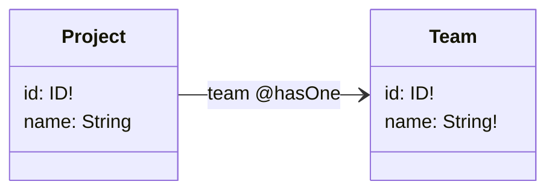

import { getCustomStaticPath } from '@/utils/getCustomStaticPath';

export const meta = {
  title: 'Using the Combine framework with Amplify',
  description: "Amplify's support for Apple's Combine framework",
  platforms: ['swift']
};

export const getStaticPaths = async () => {
  return getCustomStaticPath(meta.platforms);
};

export function getStaticProps(context) {
  return {
    props: {
      platform: context.params.platform,
      meta
    }
  };
}

# API GraphQL

This page is just here for testing purposes.

