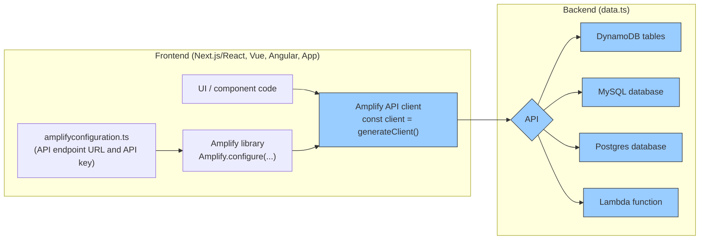

export const meta = {
  title: 'Set up Amplify Data',
  description:
    'Learn how to create a new cloud API that connects your app with new or existing data sources.'
};

export function getStaticProps(context) {
  return {
    props: {
      meta
    }
  };

}

Amplify Data allows you to build a secure, real-time API backed by a database in minutes. Define your data model with TypeScript and Amplify will deploy a real-time API powered by AWS AppSync connected to an Amazon DynamoDB database on your behalf. You can secure your API with authorization rules and scale to custom use cases with AWS Lambda.



## Building your data backend

If you've run `npm create amplify` already, you should see an `amplify/data/resource.ts` file, which is the central location to configure your data backend. The most important element is the `schema` object, which defines your backend data models (`a.model()`) and custom queries (`a.query()`), mutations (`a.mutation()`), and subscriptions (`a.subscription()`). 

```ts title="backend/data/resource.ts"
import { a, defineData, type ClientSchema } from '@aws-amplify/backend'

const schema = a.schema({
  Todo: a.model({
    content: a.string(),
    isDone: a.boolean()
  }).authorization([a.allow.public()])
})

// Used for code completion / highlighting when making requests from frontend 
export type Schema = ClientSchema<typeof schema>;

// defines the data resource to be deployed
export const data = defineData({ schema });
```

Every `a.model()` automatically creates the following resources in the cloud:
- a DynamoDB database table to store records
- query and mutation APIs to create, read (list/get), update, and delete records
- real-time APIs to subscribe for create, update, and delete events of records

The `a.allow.public()` rule designates that anyone authenticated using an API key can create, read, update, and delete todos.

To deploy these resources to your cloud sandbox, run the following CLI command in your Terminal:

```bash
npx amplify sandbox
```

## Connect your application code to the data backend

Once the cloud sandbox is up and running, it'll also create a `amplifyconfiguration.json` file which includes the relevant connection information to your data backend like your API endpoint URL and API key.


To connect your frontend code to your backend, you need to:

1. configure Amplify library with the Amplify client configuration file
2. generate a new API client from the Amplify library
3. make an API request with end-to-end type-safety

In your app's entry point, typically **main.tsx** for React apps created using Vite, make the following edits:

```tsx
import { Amplify } from 'aws-amplify'
import { amplifyconfiguration } from '@/amplifyconfiguration.json'

Amplify.configure(config);
```


## Write data to your backend

Let's first add a button to create a new todo item. To make a "create Todo" API request, generate the data client using `generateClient()` in your frontend code, and then call `.create()` operation for the Todo model. The Data client is a fully typed client, that gives you in-IDE code completion. To enable this in-IDE code completion capability, pass in the `Schema` type to the `generateClient` function.

```tsx title="TodoList.tsx"
"use client"
import type { Schema } from '@/amplify/data/resource'
import { generateClient } from 'aws-amplify/api'
import { client } from '@/utils/data'

const client = generateClient<Schema>()

export default function TodoList() {
  async function createTodo() => {
    await client.models.Todo.create({
      content: window.prompt("Todo content?"),
      isDone: false
    })
  }

  return <div>
    <button onClick={createTodo}>Add new todo</button>
  </div>
}
```

Run the application in local development mode and check your network tab after creating a Todo. You should see a successful request to a `/graphql` endpoint.

<Callout>

Try playing around with the code completion of `.update(...)` and `.delete(...)` to get a sense of other mutation operations.

</Callout>

## Read data from your backend

Next, list all your todos as well as refetch the todos after a todo has been added:

```tsx title="TodoList.tsx"
"use client"
import type { Schema } from '@/amplify/data/resource'
import { useState, useEffect } from 'react'
import { generateClient } from 'aws-amplify/api'

const client = generateClient<Schema>()

export default function TodoList() {
  const [todos, setTodos] = useState<Schema["Todo"][]>([])

  const fetchTodos = async () => {
    const { data: items, errors } = await client.models.Todo.list()
    setTodos(items)
  }

  useEffect(() => { fetchTodos() }, [])

  async function createTodo() => {
    await client.models.Todo.create({
      content: window.prompt("Todo content?"),
      isDone: false
    })

    fetchTodos()
  }

  return (
    <div>
      <button onClick={createTodo}>Add new todo</button>
      <ul>
        {todos.map({ id, content } => <li key={id}>{content}</li>)}
      </ul>
    </div>
  )
}
```

## Subscribe to real-time updates

You can also use `observeQuery` to subscribe to a live feed of your backend data. Let's refactor the code to use a real-time observeQuery instead.

```tsx title="App.tsx"
"use client"
import type { Schema } from '@/amplify/data/resource'
import { useState, useEffect } from 'react'
import { generateClient } from 'aws-amplify/api'

const client = generateClient<Schema>()

export default function TodoList() {
  const [todos, setTodos] = useState<Schema["Todo"][]>([])

  useEffect(() => {
    const sub = client.models.Todo
      .observeQuery()
      .subscribe({
        next: ({ items }) => {
          setTodos([...items])
        }
      })

    return () => sub.unsubscribe()
  }, [])

  async function createTodo() => {
    await client.models.Todo.create({
      content: window.prompt("Todo content?"),
      isDone: false
    })
    // no more manual refetchTodos required!
    // - fetchTodos()
  }

  return <div>
    <button onClick={createTodo}>Add new todo</button>
    <ul>
      {todos.map({ id, content } => <li key={id}>{content}</li>)}
    </ul>
  </div>
}
```

Now try to open your app in two browser windows and see how creating a Todo in one window automatically adds the todo in the second window as well.

<Callout>

You can also use `.onCreate`, `.onUpdate`, or `.onDelete` to subscribe to specific events. Review  [Subscribe to real-time events](/gen2/build-a-backend/data/subscribe-data) to learn more about subscribing to specific mutation events.

</Callout>

## Next steps

Success! You've learned how to create your first real-time API and database with Amplify Data. 

There's so much more to discover with Amplify Data. Learn more about: 
- [How to model your database table and their access patterns](/gen2/build-a-backend/data/data-modeling)
- [Secure your API with fine-grained authorization rules](/gen2/build-a-backend/data/authorization-rules)
- [Create relationships between different database model](/gen2/build-a-backend/data/data-modeling/#setup-relationships-between-models)
- [Add custom business logic to the GraphQL API](/gen2/build-a-backend/data/custom-business-logic)
- [Run search and result aggregation queries](/gen2/build-a-backend/data/search-and-result-aggregations/)
- [Connect to machine learning services](/gen2/build-a-backend/data/connect-to-machine-learning-services/)
- [Examples and solutions](/gen2/build-a-backend/data/examples-and-solutions/)
