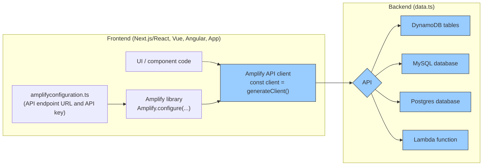
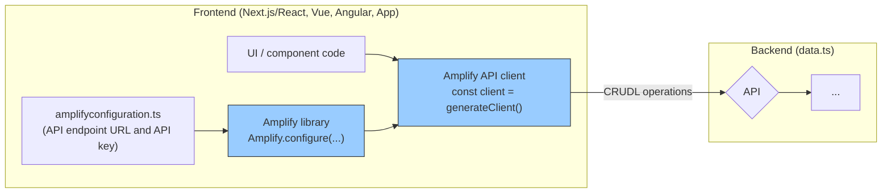

export const meta = {
  title: 'Set up Amplify Data',
  description:
    'Learn how to create a new cloud API that connects your app with new or existing data sources.'
};

export function getStaticProps(context) {
  return {
    props: {
      meta
    }
  };

}

# Setup API and database

Amplify Data allows you to create a new cloud API that connects your app with new or existing data sources. In this guide, we'll cover how to create a new API backend by DynamoDB tables. Skip ahead to [TK] to learn how to connect your app to existing data sources, such as Postgres or MySQL databases.



## Build your data backend
If you've run `npm create amplify` already you should see an `amplify/data/resource.ts` file, which is the central location to configure your data backend. The most important element piece is the `schema` object, which defines your backend data models (`a.model()`) and custom queries (`a.query()`), mutations (`a.mutation()`), and subscriptions (`a.subscription()`). 

```ts title="backend/data/resource.ts"
import { a, defineData } from '@aws-amplify/backend'

const schema = a.schema({
  // highlight-start
  Todo: a.model({
    content: a.string(),
    isDone: a.boolean()
  }).authorization([a.allow.public()])
  // highlight-end
})

export type Schema = typeof schema;
export const data = defineData({ schema });
```

Every `a.model()` automatically creates the following resources in the cloud:

- a DynamoDB database table to store records
- API endpoints to create, read (list/get), update, and delete records

The `a.allow.public()` rule designates that anyone authenticated using an API key can create, read, update, and delete todos.

To deploy these resources to your cloud sandbox, run the following CLI command:

```bash title="Terminal"
npx amplify sandbox
```

## Connect your application code to the data backend

Once the cloud sandbox is up and running, it'll also create a `amplifyconfiguration.js` file which includes the relevant connection information to your data backend like your API endpoint URL and API key.



To connect your frontend code to your backend, you need to:

1. configure Amplify library with the Amplify client configuration file
2. generate a new API client from the Amplify library
3. make an API request with end-to-end type-safety

In your app's entry point typically `page.tsx`:

```tsx title="page.tsx"
import { Amplify } from 'aws-amplify'
import { amplifyconfiguration } from '@/amplifyconfiguration'

Amplify.configure(config);
```


## Write data to your backend
Let's first add a button to create a new todo item. To make a "create Todo" API request, generate the API client in your frontend code, and then call `.create()` operation. 

To generate the API client in order to make API requests, use the `generateClient` function from `aws-amplify/api`. To enable in-IDE code completion on your API client, pass in the `Schema` type to the `generateClient` function.

```tsx title="TodoList.tsx"
"use client"
// highlight-next-line
import type { Schema } from '@/amplify/data/resource'
import { generateClient } from 'aws-amplify/api'
import { client } from '@/utils/data'

const client = generateClient<Schema>()

export default function TodoList() {
  async function createTodo() => {
    // highlight-start
    await client.models.Todo.create({
      content: window.prompt("Todo content?"),
      isDone: false
    })
    // highlight-end
  }

  return <div>
    {/* highlight-next-line*/}
    <button onClick={createTodo}>Add new todo</button>
  </div>
}
```

Run the application in local development mode and check your network tab after creating a Todo. You should see a successful request to a `/graphql` endpoint.

:::tip
Try playing around with the code completion of `.update(...)` and `.delete(...)` to get a sense of other write operations.
:::

## Read data from your backend

Next, list all your todos as well as refetch the todos after a todo has been added: (TK: validate if maybe we should use observeQuery)

```tsx title="TodoList.tsx"
"use client"
// highlight-start
import type { Schema } from '@/amplify/data/resource'
import { useState, useEffect } from 'react'
// highlight-end
import { generateClient } from 'aws-amplify/api'

const client = generateClient<Schema>()

export default function TodoList() {
  // highlight-start
  const [todos, setTodos] = useState<Schema["Todo"][]>([])

  const fetchTodos = async () => {
    const { data: items, errors } = await client.models.Todo.list()
    setTodos(items)
  }

  useEffect(() => { fetchTodos() }, [])
  // highlight-end

  async function createTodo() => {
    await client.models.Todo.create({
      content: window.prompt("Todo content?"),
      isDone: false
    })

    // highlight-next-line
    fetchTodos()
  }

  return (
    <div>
      <button onClick={createTodo}>Add new todo</button>
      {/* highlight-start */}
      <ul>
        {todos.map({ id, content } => <li key={id}>{content}</li>)}
      </ul>
      {/* highlight-end */}
    </div>
  )
}
```

## Subscribe to real-time updates

You can also use `observeQuery` to subscribe to a live feed of your backend data. Let's refactor the code to use a real-time observeQuery instead.

```tsx title="App.tsx"
"use client"
import type { Schema } from '@/amplify/data/resource'
import { useState, useEffect } from 'react'
import { generateClient } from 'aws-amplify/api'

const client = generateClient<Schema>()

export default function TodoList() {
  const [todos, setTodos] = useState<Schema["Todo"][]>([])

  // highlight-start
  useEffect(() => {
    const sub = client.models.Todo.observeQuery().subscribe({ items } => {
      setTodos(items)
    })

    return () => sub.unsubscribe()
  }, [])
  // highlight-end

  async function createTodo() => {
    await client.models.Todo.create({
      content: window.prompt("Todo content?"),
      isDone: false
    })
    // highlight-next-line
    // no more manual refetchTodos required!
    // - fetchTodos()
  }

  return <div>
    <button onClick={createTodo}>Add new todo</button>
    <ul>
      {todos.map({ id, content } => <li key={id}>{content}</li>)}
    </ul>
  </div>
}
```

Now try to open your app in two browser windows and see how creating a Todo in one window automatically adds the todo in the second window as well.

:::tip
You can also use `.onCreate`, `.onUpdate`, or `.onDelete` to subscribe to specific events. Review (TK...) for subscribing to specific mutation events.
:::

TK: Add summary + next steps
